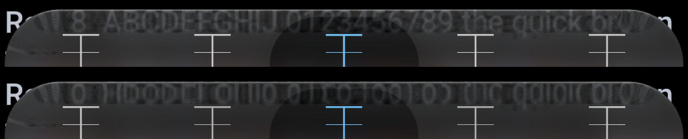
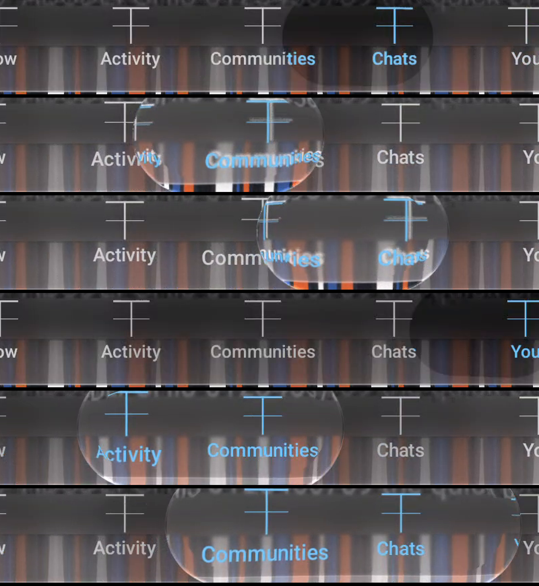

# liquidglass — the research record

**The optics in this library are measured, not styled.** This document is the complete record: the
instrument the measurements were made with, the model fitted from them, the mathematics of the V3
deformable selector as its controlling design states it, the code that implements all of it, the
tests that gate it, and the device results — including the one gate that fails.

Compiled 2026-09-14. Nothing here is marketing: every number carries its provenance, every failure
is reported as a failure, and no claim of parity with Apple is made anywhere in this repository.

!!! info "This page is generated"
    The source of truth is [`research/README.md`](https://github.com/shayann07/liquidglass/blob/main/research/README.md) in the
    repository, beside the material it describes. This copy rewrites its file links to point at
    GitHub, because the documentation site builds only from `docs/`. Regenerate it with
    `python research/tools/build_site_record.py`.

---

## Contents

| Part | What it covers |
| :-- | :-- |
| [0. How to read this](#0-how-to-read-this) | provenance classes, evidence rules, the document map |
| [I. The V3 model: the controlling design](#i-the-v3-model-the-controlling-design) | **the mathematics**: the two-disk body, containment, projection, dynamics, grasp, the endpoint algebra, source transport, the fold |
| [II. The instrument](#ii-the-instrument) | the calibration target, the capture protocol, the HDR decode, registration |
| [III. The measured model](#iii-the-measured-model) | the material equation, tint tables, bevel geometry, the four lens states |
| [IV. What measurement cannot settle](#iv-what-measurement-cannot-settle) | the identifiability derivation, the confidence ledger, the claims register |
| [V. The implementation](#v-the-implementation) | architecture, every source file, the shader pipeline, the public API |
| [VI. Verification](#vi-verification) | every suite, every test, what each one gates, the defects they found |
| [VII. Results](#vii-results) | device evidence, the gate table, frame timing, the soak |
| [VIII. Limitations](#viii-limitations) | what is unresolved, unmeasured, or authored |
| [IX. Reproduction](#ix-reproduction) | the commands, the fixture, the tools |
| [X. Index](#x-index) | every document and artifact, and where it lives |

**This file is the source of truth.** Its copy on the documentation site,
`docs/research/the-record.md`, is generated by
[`tools/build_site_record.py`](https://github.com/shayann07/liquidglass/blob/main/research/tools/build_site_record.py) — it rewrites the file links to GitHub,
embeds the two figures, and checks the result with `mkdocs build --strict`. Edit this file, then run
that script; do not edit the generated page.

**The authority for the V3 work is [`analysis/V3-MODEL.md`](https://github.com/shayann07/liquidglass/blob/main/research/analysis/V3-MODEL.md)** — the design
document this implementation was built from, reproduced in Part I with its mathematics intact. Where
this record and that document differ, that document wins, and Part I names every place the
implementation deliberately departs from it.

---

## 0. How to read this

### 0.1 Three provenances, never mixed

| Class | Meaning | Example |
| :-- | :-- | :-- |
| **measured** | read off the iOS 27 capture set through a known input, with a recorded method and a residual | `W = 0.6 R`; the tint opacity table; the resting-corner knots |
| **inherited** | an effective value carried from an earlier fit — it reproduces pixels, it is **not** a recovered physical property | the held outward map `1.3u − 0.29`; the optical band on the body |
| **authored** | a design constant chosen to make a candidate concrete | every spring in the selector; the straight-run fold strength `a = 0.8` |

Most of the *material* is measured. Most of the *motion* is authored, and says so.
[`analysis/v3/MODEL-DECISIONS.md`](https://github.com/shayann07/liquidglass/blob/main/research/analysis/v3/MODEL-DECISIONS.md) classifies every V3 parameter
individually.

### 0.2 What counts as evidence here

- Colour and distance are measured on **lossless screenshots over a known input**. Video is used for
  timing and motion only: its compression eats exactly the faint rim detail photometry depends on.
- A comparison against a different app or background is **never** a whole-image RMS.
- `FrameCompleted − IntendedVsync` is **completion latency**, not display presentation time, and is
  never relabelled as such.
- A two-minute soak is an observation over two minutes, not proof of a memory bound.
- A synthetic test can prove the shader implements a bad-looking equation; a good still can hide a
  broken release handler. Correctness, reference similarity and owner acceptance are three separate
  columns and none of them substitutes for another.

### 0.3 The stopping rule the work ran under

One primary implementation and **at most two targeted revisions per issue family**. An algebraic or
coding bug is repaired, never promoted into a new physical theory. After the bounded revisions the
verified components are kept and what remains is classified explicitly rather than tuned away. The
frame-time gate in Part VII is what that rule looks like when it costs something.

---

## I. The V3 model: the controlling design

Everything in this part is the model of [`analysis/V3-MODEL.md`](https://github.com/shayann07/liquidglass/blob/main/research/analysis/V3-MODEL.md), stated as it
states it. Section numbers refer to that document. The implementation notes at the end of each
subsection say what was built and where it departs.

### I.1 Frames, snapshots, and the identity invariant (§3)

The CPU controller works in dp and seconds. Geometry is converted once into a stable **bar-local
physical-pixel frame** whose origin does not follow the selector. Positions stay continuous floating
point: raster allocation and the recording pad round by their own contract; the selector's moving
optical origin does not.

Every presented frame consumes one immutable snapshot:

```
FrameSnapshot = { time, controllerState, actualBarGeometry, selectorGeometry,
                  layoutAndInkRevision, pageSourceRevision,
                  all source-to-bar transforms, resolved material parameters }
```

Layout, geometry, source capture, coverage, ink, material and diagnostics all refer to that one
snapshot. Sources are recorded before consumers; a changing page from a prior frame is never combined
with current geometry. For a destination point `p` in bar pixels, source map `Q`, source origin `o`,
recording pad `p_pad` and source scale `S`:

```
q_texture = S · [ Q(p) − o ] + p_pad
```

with all four quantities in named spaces. `pageScale`, `fieldScale` and `inkScale` are separate;
`inkScale` starts at one native physical pixel per texel.

> **Identity invariant.** If displacement is zero and paint styles match, moving or deforming the
> selector changes **no** icon's position. It only changes the aperture. Deforming a completed
> selector texture violates this invariant.

That violation was the shipped behaviour V3 replaces: the previous selector scaled a `graphicsLayer`
that also carried its content, so the label under the lens travelled with the lens.

### I.2 The body: the convex hull of two unequal disks (§4)

Five geometric state coordinates,

```
q = (cx, cy, L, r, k)
```

with `(cx, cy)` the horizontal bounding-box centre, `L` the separation of the two disk centres, `r`
their mean radius, and `k` half the signed difference of the radii. Then

```
rL = r − k                      rR = r + k
CL = (cx − L/2 − k,  cy)        CR = (cx + L/2 − k,  cy)
Body = convexHull( disk(CL, rL), disk(CR, rR) )
```

Three consequences the implementation leans on:

- The horizontal extrema are **exactly** `cx − (L/2 + r)` and `cx + (L/2 + r)`. End asymmetry never
  secretly moves the declared centre.
- The width is `L + 2r`, independent of `k`.
- The vertical extent is `cy ± (r + |k|)` — **not** `r`. Using `2r` as the full height when `k ≠ 0`
  is wrong, and doing so cost one real defect (Part VI.3, defect 8).

At `k = 0` the body is a capsule. Non-zero `k` gives a larger leading or trailing cap and sloping
sides, so `L`, `r` and `k` evolve separately and produce stretch, flattening, tail lag and arrival
bulge **without stretching the ink texture**. This is a reduced-order visual body; it is not a claim
of conserved fluid volume.

Feasibility requires

```
r − k ≥ rMin        r + k ≥ rMin
L ≥  2k + ellMin    L ≥ −2k + ellMin
```

The last two amount to `L > |rR − rL|` with a numerical margin, so neither disk contains the other
and the external tangents stay defined. Authored limits: `rMin = 4 dp`, `ellMin = 1 dp`.

The family is deliberately small: convex, C¹ but not C², and **it cannot draw a verified concave
neck**. That limitation is stated rather than disguised with a global blur or polygon wiggles.

#### The exact boundary query (§4.1)

Precomputed on the CPU:

```
delta = (rR − rL) / L
gamma = sqrt(1 − delta²)
nTop    = (−delta, −gamma)          nBottom = (−delta, +gamma)
ATop    = CL + rL·nTop              BTop    = CR + rR·nTop
ABottom = CL + rL·nBottom           BBottom = CR + rR·nBottom
```

The top and bottom boundary segments join the corresponding `A`/`B` points. The exposed left arc is
the part of the left circle with radial normal `nx ≤ −delta`; the exposed right arc has
`nx ≥ −delta`. For any point `p`:

1. Squared distance to each tangent segment via `t = clamp(dot(p − A, B − A)/|B − A|², 0, 1)`, nearest
   point `A + t(B − A)`.
2. For each disk, its radial projection is an eligible arc candidate **only if** its radial direction
   satisfies that disk's exposed-normal condition; the candidate distance is `abs(|p − C| − radius)`.
3. The smallest squared distance selects the feature. Inside/outside follows from membership in
   either disk or in the connecting tangent quadrilateral — their union is exactly the convex hull,
   and quadrilateral membership is four consistently oriented half-plane tests.
4. Signed distance `D` is negative inside; inward depth is `d = max(−D, 0)`. The outward normal is the
   selected arc's radial normal or the selected segment's `nTop`/`nBottom`. At medial-axis ties the
   normal is not unique — optics must already have faded to identity there.

The query is **constant work**: two circle lengths, two segment projections, a few comparisons, one
square root. It returns distance, normal, boundary point, feature identity and curvature **together**
(curvature is `1/radius` on an arc, zero on a segment), so nothing recomputes them separately in
three different shader strings. There is no CPU full-size distance transform per frame and no
per-pixel iterative angular maximisation.

*Why not a scaled capsule?* A scale changes the entire raster and cannot control cap shape
independently. *Why not a fluid solver?* It introduces many unmeasured degrees of freedom, numerical
boundaries and GPU work, for a deformation five coordinates express exactly.

**Implemented in** [`GlassSelectorGeometry.kt`](https://github.com/shayann07/liquidglass/blob/main/liquidglass/src/commonMain/kotlin/com/wexpa/liquidglass/GlassSelectorGeometry.kt)
(CPU, eligible-arc form) and
[`GlassBodySource.kt`](https://github.com/shayann07/liquidglass/blob/main/liquidglass/src/commonMain/kotlin/com/wexpa/liquidglass/GlassBodySource.kt)
(SkSL, even-capsule fold form). The two are written differently **on purpose** and scored against each
other and against a dense boundary oracle, so one shared algebraic mistake cannot pass both.

### I.3 Whole-body containment as linear inequalities (§5)

Build an **inscribed** convex polygon `P` of the allowed bar outline. For a circular end of radius `R`
and angular step `Δθ`, the maximum inward chord error is

```
error = R · [ 1 − cos(Δθ / 2) ]
```

and the step count is chosen from the radius and the density so this stays ≤ **0.2 physical px**.
Straight runs stay exact. Because the polygon is an *inner* approximation, its error makes the
constraint **conservative**: it cannot permit an unseen outward protrusion between tested angles.

A disk of centre `C` and radius `R` lies inside the half-plane `n·x ≤ b` exactly when `n·C + R ≤ b`.
Substituting the body's two disks turns every polygon plane into two rows that are **linear in q**:

```
nx·cx + ny·cy − 0.5·nx·L + r − (nx + 1)·k  ≤  b
nx·cx + ny·cy + 0.5·nx·L + r + (1 − nx)·k  ≤  b
```

**If both disks are inside a convex polygon, their whole convex hull is inside it.** That is strictly
stronger than testing the centre, a bounding rectangle, or a handful of contour points — all of which
the previous implementation did, and all of which let the shape escape between samples.

#### Position and velocity projection (§5.1)

After an unconstrained spring step `q*`, solve

```
min ½ (q − q*)ᵀ M (q − q*)     subject to     A q ≤ b
```

with the authored diagonal metric `M = diag(4, 4, 1, 1, 1)` in `(cx, cy, L, r, k)` order —
**a projection metric, not a measured mass**: preserving the centre is made somewhat more expensive
than relaxing the shape. Velocity is projected separately against the active static constraints:

```
min ½ (v − v*)ᵀ M (v − v*)     subject to     A_active v ≤ 0
```

which removes outward motion **without adding a bounce**. The feasible cone contains zero, so the
weighted speed cannot increase under this projection. For a moving limit the constraint becomes
`A_active v ≤ b′(t)`; if `A` itself changes, `A v ≤ b′ − A′q`.

On solver failure: render no infeasible body, retain the last feasible `q`, remove outward velocity,
log it, and mark the controller test failed. Repeated fallback is a defect to fix, not an accepted
animation mode. **There is no hard clipping of the final picture** — shape and position comply
*before* rendering, so the rim stays a rounded body.

**Implemented in**
[`GlassSelectorConstraints.kt`](https://github.com/shayann07/liquidglass/blob/main/liquidglass/src/commonMain/kotlin/com/wexpa/liquidglass/GlassSelectorConstraints.kt).
*Declared deviation:* the model permits a small active-set solver; an active-set implementation
stalled on multiply-infeasible requests, so the projection is a **dual NNLS** (Lawson–Hanson on
`G = A M⁻¹ Aᵀ`) with constraint generation and pruning. The model's stated criterion is correctness
and worst-case time, which this meets.

### I.4 Dynamics and distance response (§6)

Every scalar state follows

```
x″ + 2 ζ ω x′ + ω² (x − target) = 0
```

with values **and velocities** preserved on every retarget. The authored preset, with the bounded
tuning range the model allows:

| State / control | Seed | Allowed range |
| :-- | :-- | :-- |
| Tap centre ω, ζ | 22 /s, 1.0 | 18–28 /s, 0.95–1.1 |
| Shape modes `L, r, k` ω, ζ | 26 /s, 0.80 | 20–32 /s, 0.72–0.95 |
| Held formation threshold | 120 ms after an eligible DOWN | 100–180 ms |
| Held formation ω, ζ | 36 /s, 1 | 28–44 /s |
| Held size demand ω, ζ | 24 /s, 0.90 | 20–30 /s, 0.85–1 |
| Max velocity-driven extra `L` | 0.60 slot widths | 0.3–0.7 |
| Max radius reduction | 0.12 of base `r` | 0–0.15 |
| Max skew drive | 0.18 of base `r` | 0.10–0.25 |
| Release envelope ω | 18 /s | — |
| Grasp attachment ω | 40 /s | — |

With `S` the slot width, `v` the centre velocity and `a` the **pre-contact spring acceleration**:

```
u = |v| / (S · omegaCentre)          z = a / (S · omegaCentre²)

Ltarget = Lbase + 0.60 · S · tanh(u)
rtarget = rbase · (1 − 0.12 · tanh(u))
ktarget = −0.18 · rbase · tanh(z)
```

In this convention `k > 0` makes the right end larger, so acceleration to the right initially leaves a
larger **trailing** left end, and braking excites a larger **arriving** right end; the independent `k`
spring supplies the delayed shape response, and the whole trajectory is tested for mirror symmetry.
**Collision corrections are never acceleration input** — using them would amplify contact chatter into
shape kicks.

#### A numerical prediction made before any fitting (§6.1)

For a critically damped centre spring starting at rest a distance `D` from its target:

```
remaining(t) = D (1 + ω t) e^(−ω t)
v(t)         = D ω² t e^(−ω t)
vPeak        = D ω / e        at t = 1/ω
```

so the peak normalised speed is `D / (e · S)`, and the extra-length **targets** for 1, 2 and 4 slots
are ≈ `0.211 S`, `0.376 S` and `0.540 S`. The 90 % centre-travel time is `3.89/ω` ≈ 177 ms at ω = 22.
These are predicted drives before shape lag and contact — design predictions, **not** Apple time
constants — and the constrained trajectory is what must be compared visually.

#### Exact stepping (§6.2)

For a frozen target over `dt`, with `d = x − target`. Under-damped (`ζ < 1`), `a = ζω`,
`b = ω√(1 − ζ²)`, `E = e^(−a·dt)`:

```
dNew = E [ d cos(b·dt) + (v + a d) sin(b·dt) / b ]
vNew = E [ v cos(b·dt) − (a v + ω² d) sin(b·dt) / b ]
```

Critically damped (`ζ = 1`):

```
dNew = e^(−ω·dt) [ (1 + ω·dt) d + dt·v ]
vNew = e^(−ω·dt) [ (1 − ω·dt) v − ω² dt·d ]
```

A `ζ > 1` preset must use the real-root overdamped solution, never the under-damped square root. The
simulation clock has a maximum substep of **1/240 s**; input events are evaluated at their **actual
timestamps**, subdividing at event boundaries, and the display refresh interval is never conflated
with an input sampling interval. A 50 or 100 ms delayed frame runs the bounded substeps and renders
once; a suspension cancels the abandoned interaction rather than replaying a stale gesture. Future
pointer samples are never synthesised.

### I.5 Grasp, accommodation and release (§7)

One state owner: `Rest`, `PressPending`, `TapTravel`, `Held/Drag`, `Release/Settle`,
`Cancel/Lifecycle`. The model changes visual response, **not** who is allowed to select a tab: DOWN
gives a subtle press indication constrained inside the bar and does **not** set held protrusion; a
short tap selects once through the existing clickable and starts `TapTravel`; a sustained eligible
hold or a recognised horizontal drag enters `Held/Drag`; a drag commits **once**, from the driving
pointer's genuine terminal UP.

#### A grasp that survives size changes (§7.1)

With `A = (L + 2r)/2` the current half-width and a fixed normalised grasp `beta ∈ [−0.8, 0.8]`:

```
g = cx + beta · A          hence          cx = g − beta · A
```

If a hold is acquired away from the body, an attachment offset `o` with `g(t) = fingerX(t) + o(t)` is
initialised to preserve `g` **and its velocity**, then relaxed critically to zero at ω = 40 /s — so the
finger acts immediately without teleporting a remote selector. Width changes then happen around the
grasp, and the actual centre velocity is

```
vc = vg − beta · vA
```

which is what release carries. A navigation fling is decided by the **finger's** terminal velocity, so
a stationary finger does not fling a tab because the label under it is being accommodated.

#### Stable admission of nearby content (§7.2)

Candidates are judged against a **fixed base interaction aperture**, never against the already
expanded lens — otherwise growth admits content, which causes more growth. Start with the item
nearest the grasp and at most one adjacent neighbour; admit a neighbour when its icon centre is at
least 2 dp inside the base aperture, retain it until 4 dp outside. For the admitted, padded union
`[Bleft, Bright]`, `left = g − (1+beta)A` and `right = g + (1−beta)A` give directly

```
Arequired = max( Abase,  (g − Bleft)/(1 + beta),  (Bright − g)/(1 − beta) )
```

Seed padding 6 dp; maximum width `min(barWidth + 2·heldOverflow, 2.4·S)`. The size demand springs
toward `Arequired` **every simulation step**, including stationary-finger intervals. Changing
admission changes *targets*, never the current `q` or velocity.

#### The held release envelope (§7.3)

A protruding held body cannot be required to satisfy the tap envelope instantly on UP. For each
rest-bar plane, record the initial excess `d0 = max(0, A_j q − b_j)` and the outward support speed
`u0 = max(0, A_j v)`, and allow

```
a_j(t) = [ d0 + (u0 + omegaRelease · d0) t ] · e^(−omegaRelease · t)          omegaRelease = 18 /s
```

applied as `A_j q ≤ b_j + a_j(t)` with the matching velocity-derivative constraint. It starts at the
present excess, has initial derivative `u0`, may briefly continue existing outward motion, and decays.
**No new outward speed is introduced if `u0` was zero**, and ordinary tap travel never receives this
allowance.

**Implemented in**
[`GlassSelectorDynamics.kt`](https://github.com/shayann07/liquidglass/blob/main/liquidglass/src/commonMain/kotlin/com/wexpa/liquidglass/GlassSelectorDynamics.kt).
Four declared deviations, each with its reason, are in Part V.4.

### I.6 Exact image composition: replace complete endpoints (§8)

At one destination pixel, in one declared compositing colour space, with `B0` the opaque page/bar
material **without** semantic ink, `B1` the same material seen through the selector (also without
ink), `U0 = (c0, a0)` the ordinary premultiplied ink at its ordinary position, `U1 = (c1, a1)` the
selected ink at its **refracted** source position, and `m` the aperture coverage:

```
C0 = c0 + (1 − a0) · B0
C1 = c1 + (1 − a1) · B1
C  = (1 − m) · C0 + m · C1
```

That is the exact endpoint coverage equation. The implementation draws `C0` as the base and then the
fully composed selector endpoint with premultiplied output `(m·C1, m)`; ordinary source-over then
computes the equation exactly.

#### Why the obvious alternative is wrong (§8.1)

Mixing ink alone and alpha-overing it on separately mixed material gives

```
Cnaive = (1 − m) c0 + m c1 + [ 1 − (1 − m) a0 − m a1 ] · [ (1 − m) B0 + m B1 ]

Cnaive − C = m (1 − m) (a1 − a0) (B1 − B0)
```

The error vanishes only in special cases, and a moving rim changes both glyph coverage and material —
precisely where the cross term matters. **This is algebra, not a fit.** It is also the mechanism
behind the doubled label the owner rejected, and the reason V3 replaces complete endpoints instead of
laying an apparently sharp row over a blended background.

#### The source graph (§8.2)

```
current page P
    → ink-free bar material B0
    → ink-free through-source for the selector → selector material B1

one item layout → ordinary native-resolution ink U0
                → selected native-resolution ink U1

body geometry + source maps + U0/U1 + B0/B1 → endpoint compositor → final bar
```

The through-source contains the bar material over the correct raw page outside its outline, and
neither the selector nor either ink variant. **No capture may contain a consumer of itself.** Nested
maps do not commute — `Qbar(Qlens(p)) ≠ Qlens(Qbar(p))`, and tone, blur and rim shading do not commute
with arbitrary warps either — so the safe implementation keeps a bounded ink-free bar intermediate
from the same frame. Ordinary and selected ink are two cached paint variants of **one** layout, with
exactly one accessible/clickable row.

#### Native ink, alpha and the spectral split (§8.3)

Semantic ink starts as one monochrome geometric sample at native physical resolution, receives no page
blur and no wide/high-pass material operator, and is invalidated for text, font, density, palette,
layout and emphasis changes. The union-alpha RGB split is **not** correct per-channel transmission: if
a split is retained it must compose against the known endpoint material per channel,

```
C1_c = ink_c( Q_c(p) ) + [ 1 − alpha( Q_c(p) ) ] · B1_c
```

A white glyph found only by the red ray must not block green and blue through a maximum-of-three-alpha
value. Bulk ink dispersion therefore defaults to **zero**, and no broad label ghost may be excused as
a colour fringe.

**Implemented in**
[`GlassEndpointShaderSource.kt`](https://github.com/shayann07/liquidglass/blob/main/liquidglass/src/commonMain/kotlin/com/wexpa/liquidglass/GlassEndpointShaderSource.kt)
plus the endpoint path in `LiquidGlass.kt`: the material pass emits `(B1, 1)` when
`uEndpointAlpha = 1`, the ink pass emits `(c1, a1)` unmasked, both compose in one offscreen layer to
`C1`, and the aperture pass emits `(m·C1, m)` which source-overs onto `C0`.

### I.7 Source transport from the actual contour (§9)

With `b(ℓ)` the nearest boundary point by arclength, outward normal `n`, tangent `t`, curvature `κ`
(`n_ℓ = κt`, `t_ℓ = −κn`):

```
p    = b(ell) − d · n
Q(p) = b(ell) − s(ell, d) · n + tau(ell, d) · t
     = p + [ d − s(ell, d) ] · n + tau(ell, d) · t
```

`s` is **source depth**, not a displacement magnitude; a negative `s` samples outside the outline.
`tau` is an explicit tangential shift, initially zero. Differentiating:

```
p_ell = (1 − kappa·d) t                 p_d = −n
Q_ell = (1 − kappa·s + tau_ell) t − (s_ell + kappa·tau) n
Q_d   = tau_d · t − s_d · n
```

so in the local destination/source bases `(t, −n)` the Jacobian is

```
      ⎡ (1 − kappa·s + tau_ell)/(1 − kappa·d)      tau_d ⎤
J  =  ⎢                                                  ⎥
      ⎣ (s_ell + kappa·tau)/(1 − kappa·d)           s_d  ⎦
```

With `tau = 0` and no arclength dependence the principal factors are `Jt = (1 − κs)/(1 − κd)` and
`Jn = s_d`: **tangential stretch already follows from a normal-only map around a curved edge.**
Conversely, blending a straight and a corner profile introduces `s_ℓ` and therefore shear even when
`tau = 0` — the simplified factor alone cannot describe that transition.

The band joins identity before the inward normals meet: `W = 0.6 · min(rL, rR)`, which agrees with the
measured `0.6 R` convention for a symmetric bar.

#### The optional physical-consistency construction (§9.2)

If a small-slope single optical potential is asserted, `Q = p + ∇Φ` requires a symmetric Jacobian,
which a spatially varying normal-only map generally fails. For a profile reaching identity at `W(ℓ)`
one compatible potential is

```
Phi(ell, d) = − ∫_d^{W(ell)} [ s(ell, u) − u ] du        so   Phi_d = s − d
```

and the corresponding tangential contribution is `tau = Phi_ell / (1 − kappa·d)` (the upper-limit term
vanishes because `s(W) = W`). This shows how a physical-gradient model *would* generate extra
tangential transport when a bevel varies along its perimeter. **V3's default keeps `tau = 0`** — an
effective image map — because the evidence does not require the correction, and it is explicitly not
offered as an aesthetic slider.

### I.8 The three transport programs (§10)

| Program | Form | Provenance |
| :-- | :-- | :-- |
| Resting corners | `GlassRestMapTable`: 12 knots, linear except a Hermite last interval, identity beyond 0.8333 | **measured** (the `d < 6` reference-px extension is unmeasured and constant) |
| Straight runs | `f(u) = u + a(1 − u)³`, `a = 0.8` | **authored** |
| Held ink | `u + w(u)(0.3u − 0.29)`, `w` fading across 0.45–0.55 | inherited constants, authored connection |
| Arc/run blend | geometric, from the shape's own nearest-feature coordinate | authored |

The measured corner knots, at reference `R = 72 px`, `W = 43.2 px`:

```
U = [0.138889, 0.162037, 0.185185, 0.219907, 0.254630, 0.300926,
     0.347222, 0.439815, 0.532407, 0.625000, 0.729167, 0.833333]
V = [0.875903, 0.823079, 0.784259, 0.741898, 0.711296, 0.681921,
     0.661713, 0.642755, 0.649884, 0.681898, 0.745278, 0.833333]
```

**The straight-run fold.** For `u = d/W` on `0 ≤ u ≤ 1`, `s = W·f(u)`, identity beyond `W`. The profile
joins identity in value, first and second derivative, and

```
f(u)  = u + a (1 − u)³
f'(u) = 1 − 3a (1 − u)²
```

For `a > 1/3` there is exactly one turning point:

```
uFold = 1 − 1/sqrt(3a)              fMin = 1 − 2 / (3 sqrt(3a))
```

At the authored seed `a = 0.8`: **uFold ≈ 0.35450**, minimum source depth **≈ 0.56972 W**. The map
samples each destination once, and the same source landmark can appear at two destination depths
because `f` reverses orientation — so a second mirrored image must **not** be mixed on top, or the
fold is duplicated. If one parameter proves insufficient the model allows exactly one extra
coefficient, `f(u) = u + (a + b u)(1 − u)³` with `|b| ≤ 0.25a`, which still has one fold and a C²
identity join. That bounded revision was not needed.

**The continuous held ink map.** The inherited outward correspondence `sOuter/W = 1.3u − 0.29` carried
an ≈ 0.14 W jump at `u = 0.5` that the captures never established as a true discontinuity. V3 replaces
it with a single **coordinate** blend — not a blend of two glyph images:

```
w(u)     = 1 − smoothstep(0.45, 0.55, u)
fHeld(u) = u + w(u) · (0.3 u − 0.29)
sInk/W   = u + hOptical · ( fHeld(u) − u )
```

with `hOptical` moving continuously with the held material state.

### I.9 What a fold predicts, and how to sample it (§11)

Near a non-degenerate fold at `d*`, `s(d) = s* + ½ A (d − d*)² + …` with `A ≠ 0`, so a source landmark
at `s* + ε` on the two-root side appears at

```
dPlus/Minus = d* ± sqrt( 2 ε / A )
```

**The two displayed copies separate as the square root of the landmark's distance from the fold
minimum**, with opposite normal orientation. This is falsifiable, and it explains text appearing to
adhere and stretch at an edge *without any temporal lag*. A broad region with `s_d = 0` is a different
thing — it reads the same source row over a whole band and yields a constant strip; it is not a
substitute for an isolated turning point.

Footprint: the covariance of a linearly mapped unit output pixel is `Σ = J Jᵀ / 12`, and with
`J = [a b; c d]`,

```
T        = a² + b² + c² + d²
D2       = (a d − b c)²
sigmaMax = sqrt( ( T + sqrt( max(T² − 4 D2, 0) ) ) / 2 )
```

Large singular values mean minification and need filtering; small ones mean magnification and are
**not** a reason for a wide blur. Brightness is never multiplied by `1/|det J|`.

### I.10 The runtime contract (§13)

Per-frame CPU work is small and explicit: consume input and layout revisions; step the handful of
spring states on the common clock; refresh the bar polygon **only when its shape or size changes**;
project the five coordinates and the active velocities; compute two disk centres/radii, two tangent
normals, four tangent endpoints and inverse segment lengths; resolve transport, material and source
transforms into one snapshot. No per-frame full-screen re-record because the selector moved, no CPU
full-resolution distance transform for an analytic body, and **no layout pass per physics substep** —
substeps change numbers, not Compose nodes.

Per selector pixel: one constant-size geometry query, a short source-map evaluation, the existing
material work, one native ink fetch, and endpoint composition. A justified spectral split costs three
ink fetches; a selected edge pixel can cost four subpixel endpoint evaluations. **These are operation
counts, not millisecond promises** — the device decides whether the budget is met, and Part VII says
what it decided.

Uniform and data groups, by update cadence:

| Group | Examples | Cadence |
| :-- | :-- | :-- |
| Body geometry | `CL, CR, rL, rR`, tangent endpoints/normals | per displayed frame while moving |
| Bar geometry | outline, allowed polygon, render transform | layout or actual bar change |
| Source transforms | page origin/scale, ink origin/pad/scale, texture extents | source/layout revisions |
| Transport | role, `W`, measured-table selector, straight `a`/`b`, held optical amount | style/state |
| Material | frozen tint/kernel/path weights, rim parameters | style/state |
| Ink | source revisions, paint variants, emphasis layout | content/style/layout change |

---

## II. The instrument

### II.1 Why a calibration target, and not app footage

A glass panel is a function from the pixels behind it to the pixels on screen. Over a photograph or
an app screen that function **cannot** be recovered, because nobody knows what the input was. Over a
synthetic target every pixel is known by construction, so **one screenshot is an exact input/output
pair**, and the blur radius, the refraction band width, the tint curve, the dispersion and the
legibility response fall straight out of it.

Two targets, `calibration-target-light.png` and `calibration-target-dark.png`, 1170 × 2532 — exactly
the capture device's screen (iPhone 13, 3×, 60 Hz, iOS 27.0). They are in
[`datasets/calibration-targets/`](https://github.com/shayann07/liquidglass/blob/main/research/datasets/calibration-targets).

### II.2 The bands, and what each one inverts

| Band | Rows | What it yields |
| :-- | :-- | :-- |
| Hard black/white split | 0–260 | sampling direction — black left of x = 585, white right |
| Grey ramp | 260–430 | **displacement, directly**: `value = x · 255/1169`, so an observed value names the x it came from |
| Vertical stripes | 430–730 | blur radius, from surviving contrast at 4/8/16/32/64 px |
| Horizontal stripes | 730–960 | the same, in the other direction |
| Primaries | 960–1120 | dispersion (colour-managed — reference in-frame, not to the file) |
| Text | 1120–1580 | legibility at 11/13/15/17 pt |
| Checkerboard | 1580–1780 | blur cross-check at a known cell size |
| Grid | 1780–2132 | labelled in points, for locating anything |
| Tab-bar zone | 2132–2532 | dense detail exactly where a real toolbar lands |

### II.3 Capture protocol

Targets transferred at original quality only — a recompressed target measures the encoder, not the
glass. Reduce Transparency, Increase Contrast and Reduce Motion **off**; one run Light, one Dark; the
Liquid Glass transparency slider position recorded with every capture, because the material's opacity
is a user setting with a range and an opacity measured without knowing it means nothing. Brightness,
True Tone and Night Shift are irrelevant: a screenshot captures the framebuffer before the display
touches it.

**Screenshot anything measured for colour or distance. Record video only for timing and motion.**

### II.4 The decode correction that saved the dataset

Every screen recording is HDR: HEVC Main 10, PQ transfer (`smpte2084`), BT.2020, TV range. A plain
`-pix_fmt rgb24` decode emits the PQ signal as if it were sRGB, so white reads **127** and the grey
ramp follows the PQ curve (17→30, 51→54, 102→81, 153→100, 204→115). Nothing was dimmed on the phone;
the decoder was never told what it was decoding.

```
-vf "zscale=t=linear:npl=100,format=gbrpf32le,
     zscale=p=bt709:t=iec61966-2-1:m=bt709:r=full,format=rgb24"
```

Verified on an uncovered frame: grey-ramp residual **−0.14 ± 0.39 levels** (99.7 % within 1), white
exactly 255, the 4 px stripes at full 0–255 contrast, primaries within a few levels, stripe phase
shift 0 (corr 1.000). The output transfer must be `iec61966-2-1`; `bt709` leaves a +5.8 mean error.

**Two registration mistakes, recorded so they are not repeated.** The videos were first judged by the
*mean difference* over the whole frame and declared unusable; then by *exact-match fraction* (55 %,
median 0) and declared registered and undimmed. The second test was fooled because black pixels match
under any tonal transform and the target is about half black. The test that works on a lossy video is
**the fraction of pixels within 4 levels of the target, judged on textured pixels** — 97 % on an
uncovered frame. This error nearly threw away the best data in the set.

### II.5 The standing colour confound

Neutral greys return exactly (44 stays 44, 196 stays 196, black and white untouched). Saturated
colours do not, because the display is wide-gamut and the screenshot converts back to sRGB:

```
(255,0,0) → (234,51,35)        (0,255,0) → (117,252,76)
(0,0,255) → (0,0,245)          (255,255,0) → (255,255,84)
```

So greyscale measurement is exact and colour measurement must take its reference from an uncovered
region of the same screenshot. This is why the target is mostly neutral.

### II.6 The corpus

Six screen recordings over the target (1170 × 2532, 60 fps, HEVC, ≈ 45 000 frames), four stills that
register 1:1, a WebDriverAgent rig set at three tint positions, and reference app screenshots with
unknown backdrops (reference, not instrument). The slow drag is what makes the set valuable: the same
glass edge passes over stripes, text, checkerboard and grid in turn, so the displacement field is
measured hundreds of times at different alignments.

Toolchain facts that cost time before they were written down: ffmpeg is not on `PATH`; HEIC needs
`pillow-heif`; **GPU decode is slower than CPU here** (17.0 s vs 9.7 s for 900 frames, because frames
must be copied back and converted anyway); and never write a PNG per frame — 45 000 frames is 40 GB
and tells you nothing on disk.

---

## III. The measured model

Fitted by `tools/fit_model.py` and `tools/esf2.py`; numbers in `analysis/model.json`, tables in
`analysis/model_tables.md`, narrative in [`analysis/MODEL.md`](https://github.com/shayann07/liquidglass/blob/main/research/analysis/MODEL.md), raw record in
[`analysis/FINDINGS.md`](https://github.com/shayann07/liquidglass/blob/main/research/analysis/FINDINGS.md). Units: the phone is 3×, so px/3 = pt; luma is sRGB
0–255; `t` is the Tint Amount slider (0–100, default 50); `R` is corner radius, `W` bevel width, `d`
display depth inside an edge along the inward normal, `s` the backdrop depth actually shown at `d`.

### III.1 Two families of glass

- **In-app glass** (navigation pill, round buttons, app toolbar) follows the app's colour scheme
  strongly: Light lifts black to ≈ 105–179; Dark keeps black at ≈ 35 and pulls white down.
- **Shell glass** (Home Screen icons, dock, folders, App Library, Control Center tiles and backdrop,
  notification cards) takes its tone from the wallpaper and **ignores** Light/Dark. Between appearance
  twins of the same Home Screen only glyphs, labels and clock hands change (0.1–1.3 % of pixels); the
  glass numbers are identical.

**Library rule:** `appearance` is an input to in-app material tone and to filled panels, never to
shell glass. Shell glass is driven by the backdrop and by Tint Amount.

### III.2 The material equation

```
out = (1 − a(t)) · [ w(t) · B_fine + (1 − w(t)) · B_wide ] + a(t) · C + L
```

and — corrected 2026-09-12, FINDINGS 22 — the fine term is **one-dimensional, along the element**:

```
B = W(26 px, both axes) + w(t) · [ F(1.2 px) − L(along the bar, 26–44 px) ]
```

Measured on the Photos toolbar pill: an 8 px stripe *parallel* to the edge keeps 0.49 (dark) / 0.64
(light) of the material's transfer, flat from 9 px below the straight edge to 33 px; a 20-row band
*perpendicular* to it fits a single 26 px Gaussian to 0.4 levels rms with a fine share of 0.02; and
the detail stops within two rows at the stripe band's own edge, so nothing is averaged across the bar.
Content uniform along the bar cancels in the high-pass and is left to the wide kernel alone — which is
why a boundary running across a bar leaves no step.

**Open:** whether the sharp axis is the screen's x or the element's long axis. Both probes were
horizontal bars.

### III.3 The fitted constants

- `B_fine`: Gaussian σ ≈ 1–2.5 px (0.4–0.8 pt). `B_wide`: σ **26–38 px (≈ 10 pt)**. The earlier
  "≥ 70 px" was window-limited by the edge-spread estimate and is **withdrawn**.
- Fine share `w(t) = 0.8 (1 − t/100)^1.3` from the pixel fit; the shipped library uses
  `w = 0.95 (1 − t/100)^1.5`. Both give ≈ 0.34 at the default.
- Tint opacity `a(t) = 1 − (white − black)/255`:

  | t | a light | a dark |
  | ---: | ---: | ---: |
  | 0 | 0.435 | 0.416 |
  | 29–31 | 0.514 | 0.439 |
  | 50 | 0.565 | 0.451 |
  | 62 | 0.600 | 0.510 |
  | 86 | — | 0.655 |
  | 100 | 0.733 | 0.737 |

  Light rises early (concave), dark late (convex); both end at ≈ 0.73. Quadratics in `u = t/100`:
  light `a = 0.436 + 0.219u + 0.078u²`, dark `a = 0.421 − 0.122u + 0.442u²` — but **the dark opacity
  is read from the table, not the quadratic**, which overshoots by 0.02 at t = 50 (five levels over
  white).
- Tint colour and lift: **light `C = 241` (constant at every t), `L = 0`; dark `C = 0`, `L = 35`
  (31–39).** Check: dark t = 0 over white = 0.584·255 + 35 = 184 (measured 180); light t = 100 over
  black = 0.733·241 = 177 (measured 179).
- Consequence: at t = 100 the material over white still reads 247 (light) / 105 (dark); at t = 0 it is
  nearly clear, sharp glass. The single Gaussian one would fit across a hard edge
  (`σ = 1.2 + 39.4 (t/100)^3.3`) is **the two kernels mixing, not a real blur** — 16 px stripes keep
  36 % contrast at t = 50, where a 5.5 px blur would leave 3 %.
- Mixing in linear light fits no better than sRGB (RMS within 0.3 either way) and, implemented, lifts
  the material over black by 7–13 levels more than the phone. **Rejected; the sRGB blend stands.**
- The toolbar is its own role: light is white at `a = 0.552/0.570/0.579/0.595/0.667` (t 0/31/50/62/100),
  dark is black over `L = 35` at `a = 0.550/0.469/0.452/0.408/0.452/0.567/0.626`
  (t 0/29/35/50/62/86/100).

### III.4 Bevel geometry for any element

- **W = 0.6 R** — 0.55 ± 0.11 across icon R45→W30, folder R95→W55, dock R122→W50; the cover sheet
  R142→W90 gives 0.63. No cap is needed over the measured range 15–50 pt.
- Displacement is along the **local inward normal**; straight edges bend nothing along themselves
  (the dock's long edges pass vertical stripes undisturbed); sampling is **inward only**.
- The profile is the cover sheet's table scaled by W. Below R ≈ 15 pt it is unmeasured.

### III.5 The cover-sheet lens — the strongest geometric measurement in the set

Fully formed, `W = 90 px (30 pt)` against a sheet corner radius of 133–151 px, so `W/R = 0.63`.
Display depth `d` → shown source depth `s`, G channel, both targets, all three tints, both recorders:

| zone | d (px) | s (px) | in units of W |
| :-- | ---: | ---: | :-- |
| interior | ≥ 80 | d + 1 | identity from d = 0.9 W |
| stretched | 78 / 72 / 66 / 59 / 54 / 47 | 80 / 76 / 72 / 68 / 66 / 64 | d 0.52–0.9 W shows s 0.71–0.9 W: 2× magnification |
| fold | 25–47 | 62–64 | stationary seam at s = 0.70 W |
| mirrored | 25 / 20 / 17 / 8 / 5 / 3 / 0 | 64 / 66 / 68 / 72 / 80 / 84 / 88–96 | d 0–0.28 W shows s 0.71–1.07 W upside down |

Content 0–62 px (0.69 W) inside the edge is **never displayed**; content 62–96 px is shown **twice**;
nothing outside the edge is sampled. Dispersion appears only in the mirrored zone (R 5–7 px = 0.07 W
deeper than B), none in the stretched zone.

**When the lens exists:** not for the first ≈ 350 px of pull (identity only), fully formed at
350–600 px while the finger tracks the sheet, slightly relaxed beyond. Synthetic drags that commit the
sheet in 3 s show only a 2–4 px inward offset and **no fold**. Rule: lens strength 1 while
interactively tracked past ≈ 350 px; a committed animation is lens-free.

The dim below the sheet edge is multiplicative, measured identically at two tints in two recorders:

```
k = 1 − 0.311 · (1 − e^(−x / 450 px))          saturating at 0.706 from ≈ 700 px of pull
```

No blur below the edge.

### III.6 The lens of chrome at rest — arcs only

At the Photos toolbar's ends (R = 70), identical at t = 0/50/62, both appearances, both targets, 12
measurements with spread under 2 px: `s(d)` = 27, 26, 24, 23 (d 6–16), 24 (18–20), 25.5 (22), 27
(24–26), 29, 31, then identity from d = 32 — a plateau at 0.33 R over the outer third, easing to
identity by 0.46 R.

**Straight runs show nothing**: the dock's top edge leaves a block boundary 30 px inside in place, and
the toolbar's straight edge keeps stripe contrast flat from the rim. This corrected an earlier claim
that "chrome at rest shows no edge ring", which had been read off a straight edge over a *horizontal*
ramp and was blind to vertical displacement.

Implemented as `restSource(u)` with knots in `W = 0.6 R` — 0.68 at 0; 0.55 over 0.14–0.38; 0.64 at
0.62; identity from 0.76 — applied through a corner weight and the true radial normal. The library
then measures back 24, 20, 17, 15, 13, 11, 9, 7, 6, 4, 3, 2, 1, 0 against the phone's
25, 22, 17, 15, 13, 11, 9, 7, 6, 4, 3, 2, 1, 1, 1, 0 over d = 2–32.

### III.7 The tab-bar lens under a finger

Measured from the Phone and App Store drags in `LOLL8185`. While a finger holds the selection: the
whole bar grows ×1.05 about its centre and lifts +16/255; the resting indicator swells into a capsule
5 pt proud of the bar and 21 pt wider; the tab under it grows ×1.18 about its own centre. The lens's
interior shows the bar's output as it is, plus 0.11 of the raw content behind the bar and 1 % white.
Its band is the outer 0.5 W (0.3 R): a pixel at depth `u` shows the exterior from

```
s = 1.3 u − 0.29 W
```

and from 0.5 W inward content is shown where it is, with the source between 0.36 W and 0.5 W hidden —
a seam. Rim: a 3–4 px line of +68 over black top and bottom with a tail 16 → 1 over 15 px; a 2 px dark
step of −30 at the sides. The lens's content lags a frame while it moves.

**The bar and its lens are one surface.** Where the two outlines cross, the bar's edge bows out to
meet the lens rather than creasing: the silhouette stands 12 px above both outlines at the crossing
and rejoins the flat run about 40 px away — a polynomial smooth minimum at `k = 48 px (16 pt)`. The
lens is also **gel**: 13 px proud at rest, 7–8 px at 300 pt/s, about 5 % of its height, gained back
along the travel.

Its **colour fringe is small**: at the rim over black the channels separate by at most 16 levels on a
line peaking at 65 — about 0.45 px of displacement, blue just outside the line, red just inside. The
0.07 figure was fitted on the band, where compression magnifies the separation. Use **0.006**.

### III.8 System backdrops and shell roles

| Layer | Blur σ px (pt) | Tone |
| :-- | :-- | :-- |
| Control Center over app content | 23.2 (7.7) at t ≤ 50; 24 at 62; 27.5 at 86; 32–33 at 100 | gain 0.32; offset = 142 − 0.864 · mean luma behind |
| Control Center over Home Screen | 16–21 (5.5–7) | |
| App Library | 15–26 (5–9) | |
| Today view | 26–28 (9) | |
| Customize sheet | 30–40 (10–13) | 255 → 180 |
| Context menu | 28–29 (9.5) | gain 0.24, +48; screen behind dimmed ×0.52 |
| Spotlight | 62–80 (21–27) | filled panel, +17 levels in light |

The backdrop tint is adaptive to **content**, not to appearance. Tint Amount moves the system blur
only above t ≈ 60 and the tone by ≈ 10 levels at t = 100.

Shell elements at Tint 50 over the wallpaper (itself dimmed ×0.773 in Clear-icon mode): clear icon
R 45–83, σ 6–7 px, 14→67 and 197→165, bright rim on the top edge and a darker contour below; dock
R 122–136, σ 2.5–3.8, gain 0.85 lift 13, bending stripes over ≈ 100 px at the ends only; Control
Center tile R 105 with its outermost 1–5 px **not** lifted (a dark line); notification card R ≈ 60,
+29 on a 168 backdrop, flat, no edge.

### III.9 Measured timing

| Event | Measured |
| :-- | :-- |
| Round glass button press | +39 luma, ≈ 170 ms in, ≈ 200 ms out, held while down |
| Photos chrome show/hide | 16–66 ms (1–4 frames), no fade |
| Control Center formation | blur forms with pull progress; durations gesture-bound |
| Cover-sheet lens | forms past ≈ 350 px of tracked pull |

### III.10 Where the implementation landed against the phone

- Light appearance within ±6 levels at t = 0/50/100 over black and white; dark within +5 over black
  and 6–11 **low** over white. Edge profiles within 5 levels at every depth.
- The toolbar role renders and measures back within 4 levels at every slider position in both
  appearances (6 at the read-back dark t = 0).
- Pixel 7: within 2 levels of the JVM render at t = 0/50/100 in both appearances. Galaxy S24+: within
  2 levels at every sweep position for pill, buttons and toolbar, one outlier (dark t = 86 toolbar).
- Frame times with six panels re-rendering every frame: Pixel 7 21 ms median / 32 p90 / 44 p99;
  S24+ at 1440 × 3120 17 / 28 / 38 with GPU 7 ms median.

**The standing photometric residual:** the phone's tone responds more to brightening than to darkening
in the wide term. Neither a symmetric blur in sRGB nor in linear light reproduces that asymmetry. A
luminance-adaptive lift is the next candidate and is **not adopted**; the asymmetry stays open.

---

## IV. What measurement cannot settle

### IV.1 The identifiability result

For the restrictive physical model — smooth monotone top surface `h(d)`, flat lower interface,
homogeneous index `n > 1`, non-negative gap `g`, orthographic viewing, backward ray exiting through
the bottom:

```
alpha = atan(h')
beta  = asin( sin(alpha) / n )
theta = alpha − beta
gamma = asin( n sin(theta) )
s − d = h · tan(theta) + g · tan(gamma)
```

These require bottom transmission, `|n sin(theta)| < 1`, and no earlier sidewall exit; they cannot
silently continue through total internal reflection. For small slopes `alpha ≈ h'`, `beta ≈ h'/n`,
`theta ≈ (n−1)h'/n`, `gamma ≈ (n−1)h'`, so

```
s − d  ≈  (n − 1)(h/n + g) h'  =  d/dd [ (n − 1) h² / (2n) + (n − 1) g h ]
```

**Measuring displacement determines the derivative of an effective potential. It does not separately
determine `n`, `g` and `h`.** With `Psi(d) = ∫ (s − d) dd`, a whole family of height profiles

```
h(d) = − n g + sqrt( n² g² + 2n [ Psi(d) + C ] / (n − 1) )
```

reproduces the same observation for any `n`, `g`, `C` that keep it real and the geometry valid. The
earlier near-equivalence of `n = 1.5` and `n ≈ 1.845` on transmission observables **is** this
ambiguity, not a disagreement to be settled by fitting harder.

The same model carries a sign restriction: with `h' ≥ 0`, `h ≥ 0`, `g ≥ 0` on the transmitted branch,
`s − d ≥ 0`. **The measured held outward sampling violates it.** That does not prove no physical body
could do it — a curved underside or a different path could change the sign — but it does mean stronger
fitting of the same monotone cap cannot solve the problem.

A further consequence: a smooth ray path meeting one source plane transversely has a **continuous**
source coordinate; a fold changes its derivative, not its continuity. The old hard held seam is
therefore not a physical consequence of a smooth single path, and V3 treats any path change as
explicit image transport rather than a hidden discontinuity called refraction.

Finally, an operator with a negative high-pass lobe is an image-processing operation, not a
probability mixture of passive light paths. Authored tone, readability and highlight operators are
legitimate UI operations; hiding them inside an IOR or Fresnel knob makes the system harder to reason
about without improving the pixels.

### IV.2 The confidence ledger

| Proposition | Confidence | What would change it |
| :-- | :-- | :-- |
| Removing semantic ink from material inputs is architecturally necessary | High | an isolated source render proving no duplicate ink reaches any consumer |
| The exact endpoint compositor is required at partial coverage | **Algebraic** | only its opaque-background/coverage assumptions; it is not a fit |
| The existing callback and cancellation fixes should survive | High | a production input test exposing a concrete defect |
| A five-coordinate tapered body satisfies the motion complaints | High for containment and continuity; medium for Apple's extreme silhouettes | a reliable reference contour with a neck or bulge this convex family cannot draw |
| A spatial fold explains the described edge sticking | High as a mechanism; medium for the chosen profile | a known-source fixture with correct compositing but the wrong source ordering |
| Held expansion is caused by Apple's content-aware layout | **Unresolved** | these stills cannot settle causation; V3 implements the requested behaviour and labels it authored |
| A unique refractive index / thickness / viscosity has been measured | **Unsupported** | new independent constraints — not a prerequisite for V3 |

### IV.3 Claims that must not return under new names

- No recovered `n`, thickness, gap, viscosity or volume conservation. 1.845 is a gauge/model member.
- No constant resting plateau as a summary of the measured folded corner: the measured table, its
  unmeasured shallow extension and its localisation coverage are three different things.
- No "single branch / every gate passed" while the mirrored sheet branch failed or only a localised
  ring subset was scored.
- No physical ten-pixel held jump inferred from seam models that tied or both missed the data.
- No "a fold requires broad blur", no caustic brightness multiplier `1/|det J|`, and no claim that
  normal-direction compression by itself enlarges chromatic landmark separation — for a landmark,
  `Δd ≈ −Δs / s_d` where the local linearisation holds.
- No assumption that colour in a rim over black measures transmitted wavelength dispersion; no
  maximum-of-three-alpha union described as correct coloured transmission.
- No `scaleX = 1+e, scaleY = 1−e` "area preservation" — the product is `1 − e²`, and area would not
  establish volume anyway.
- No image-history lag, travel-distance law or exact Apple spring inferred from unordered stills.
- No absolute frame-budget success inferred from a relative timing pass, and no frame-completion
  counter described as measured presentation.
- **No "owner approved" label before the owner sees the actual final motion.**

### IV.4 Still not measured

Sheet material versus tint (confounded by the notification dim), the light-appearance sheet, glass
response to device tilt, elements with R < 15 pt, widget glass, in-app glass over a photographic
backdrop, the dock's 126 px ends, and the arc-to-run blend width.

---

## V. The implementation

15 245 lines of Kotlin across `commonMain`, `androidMain`, `jvmMain` and `jvmTest`, plus a 916-line
sample app. Everything optical is in SkSL — the dialect shared by AGSL (Android 13+) and Skia
(Desktop) — kept in Kotlin string constants so the JVM tests can compile and render the *same text*
the device runs.

### V.1 The pipeline, end to end

```
              ┌───────────────────────────────────────────────────────────┐
  page        │ liquidGlassSource(state)  →  one backdrop recording/frame │
  content     └───────────────────────────────────────────────────────────┘
                                    │  GraphicsLayer, recorded before consumers
                                    ▼
        ┌────────────────────────────────────────────────────────────┐
        │ Modifier.liquidGlass(state, style, shape, …)               │
        │   ├─ geometry: analytic SDF, or a sampled GlassPathField   │
        │   ├─ panel pass   (GlassShaderSource)    → material        │
        │   ├─ content pass (GlassContentShaderSource) → ink in glass│
        │   └─ endpoint pass (GlassEndpointShaderSource) → aperture  │
        └────────────────────────────────────────────────────────────┘
                                    │  RenderEffect, cached by uniform equality
                                    ▼
                         the composed frame on screen
```

- **One state, many panels.** `LiquidGlassState` records the backdrop once per frame; every panel
  samples the region beneath itself out of that single recording. `LiquidGlassScene` /
  `ProvideLiquidGlassState` put it in a composition local so `Modifier.liquidGlass()` needs no
  argument.
- **Padding is a contract.** The recording, the shader's `uPad`, the sampled distance field and the
  draw-back translate all take their pad from `GlassStyle.recordPad`, and that pad is a whole number
  of layer pixels **in the space the layer is recorded in**. A field rasterised one pixel off the pad
  moves the silhouette by exactly that pixel — which is why two test suites exist for it alone
  (`GlassPadContractTest`, `GlassFieldPadConsumerTest`).
- **Effects are cached by value.** All rendering-affecting state participates in effect-cache
  equality, so a moving selector does not rebuild a shader it could reuse, and no global mutable
  diagnostic override leaks across nodes.

### V.2 The source files

#### Optics and material

| File | Lines | What it owns |
| :-- | --: | :-- |
| `GlassShaderSource.kt` | 673 | **the panel shader.** Apple publishes no numbers — no blur radius, no index, no falloff exponent — so this is the measured model expressed as SkSL: the signed distance field, the normal, the refraction band, the two-kernel backdrop, tint, rim and contour. V3 added the body branch, the endpoint-alpha output and the edge fold |
| `GlassContentShaderSource.kt` | 212 | **the content pass**: an element's own content seen *through* its glass — the symbol a selection lens is crossing, what a magnifier is held over. V3 added the sharp single sample (`uInkSplit`) and the continuous held ink map (`uHeldInk`) |
| `GlassContainerShaderSource.kt` | 430 | fusing several panels into one field, with an unrollable member loop bounded by a declared array size |
| `GlassEndpointShaderSource.kt` | 94 | **the aperture pass** of the exact endpoint compositor: it emits `(m·C1, m)` so an ordinary source-over completes `C = (1−m)C0 + m·C1` |
| `GlassBodySource.kt` | 78 | the V3 body's geometry as **one shared piece of SkSL**, included by the panel pass, the content pass and the coverage mask — one distance field, one normal, one curvature, not three transcriptions that can drift |
| `GlassSourceMapSource.kt` | 92 | the source maps as one shared piece of SkSL: the rest map, the fold, the held ink map and the corner weight. The panel and content passes include the same text |
| `GlassNormalSource.kt` | 74 | the closed-form analytic outline normal **and the decision that selects it** (analytic shape, band under 0.75 of the inradius, no fusion), shared verbatim by the panel, content and container shaders — the Phase 3 shared-path repair |
| `GlassOklabSource.kt` | 71 | applying a highlight as lightness and chroma rather than as white, so a lit rim over a saturated backdrop does not read as a milky smear |
| `GlassMaterial.kt` | 136 | the measured material **as formulas**: the opacity tables, the tint constants, the kernel shares |
| `GlassRestMap.kt` | 166 | which source map the resting corner uses — `Legacy` (what shipped) or `Measured` (the fitted table) |
| `GlassStyle.kt` | 668 | the style surface: profile, band, depth, mirror, dispersion, kernels, tint, rim, shadow, `restMap`, and the three V3 additions `edgeFold`, `inkDispersion`, `heldInkContinuous` |
| `GlassMorph.kt` | 114 | `lerpGlassStyle` / `animateGlassStyle` — blending two styles for an element morphing between roles, with every field enumerated and the midpoint-snap behaviour audited |
| `GlassAdaptation.kt` | 127 | whether glass over a region flips to its light or dark style — **one decision per element**, because symbols drawn *on* the glass must flip with it |
| `GlassPathField.kt` | 223 | a signed distance field for a shape the shader cannot describe analytically |
| `GlassSquircleShape.kt` | 93 | superellipse corners, because a circular arc meets a straight edge with a visible curvature change |
| `GlassFallback.kt` | 77 | the material **without** a backdrop, for Android below API 31/33: the parts that do not need the backdrop, rather than a flat rectangle |

#### The V3 selector

| File | Lines | What it owns |
| :-- | --: | :-- |
| `GlassSelectorGeometry.kt` | 247 | the body `q = (cx, cy, L, r, k)`, its exact distance/normal/curvature query, its optical band `W = 0.6 min(rL, rR)`, and containment tests |
| `GlassSelectorConstraints.kt` | 476 | containment as linear rows, the inscribed polygon (chord error ≤ 0.2 px, cached and rebuilt only when the envelope changes), the dual-NNLS projection with constraint generation and pruning, and **analytic** protrusion (`signedDistance(centre) + radius` per disk) |
| `GlassSelectorDynamics.kt` | 822 | the authored preset, exact spring stepping, the mode machine, grasp with its attachment offset, content admission with hysteresis, the release envelope, and the substep loop |
| `GlassTabBarV3.kt` | 195 | the Compose adapter: one controller, one frame clock, one snapshot a frame. Everything that decides *what the body is doing* lives in the controller, which knows nothing about Compose |
| `GlassTabBar.kt` | 1270 | the component the material was measured against: the plate, the item row, the selector, the gesture handler, the callbacks and cancellation semantics, and the V3 opt-in |

#### Composition, state and hosting

| File | Lines | What it owns |
| :-- | --: | :-- |
| `LiquidGlass.kt` | 1234 | `LiquidGlassState`, `Modifier.liquidGlassSource`, `Modifier.liquidGlass` → `liquidGlassCore(…, body, endpointComposite)`, the uniform pack, the effect cache, the endpoint layer path, `GlassFuse`, diagnostics |
| `LiquidGlassContainer.kt` | 272 | one panel taking part in a container's merged field |
| `LiquidGlassScene.kt` | 148 | the composition local, `currentLiquidGlassState()` (which fails with a useful message rather than a null pointer), and the argument-free modifier overloads |
| `LiquidGlassCoverSheet.kt` | 105 | a cover sheet as iOS 27 draws one: an opaque surface whose bottom edge is a lens over *its own* content while the app beneath is dimmed by pull distance — the §III.5 measurements, implemented |
| `GlassInteraction.kt` | 188 | where the finger is on a panel and how far the press has come up, for the shader |
| `GlassScrollEdge.kt` | 110 | how the scroll edge effect dissolves content beneath floating chrome |
| `GlassGallery.kt` | 262 | a tuning surface — the material can only be judged against content worth refracting |
| `LiquidGlass.android.kt` | 396 | the Android actual: `RenderEffect`, the AGSL uniform binding, API gating |
| `LiquidGlass.jvm.kt` | 388 | the desktop actual: Skia `RuntimeEffect`, the same uniforms, so the tests render the shipped shader |

### V.3 The public API

```kotlin
// state and scene
class LiquidGlassState
fun rememberLiquidGlassState(background: Color, renderScale: Float = 1f, …): LiquidGlassState
fun LiquidGlassScene(state: LiquidGlassState, content: @Composable () -> Unit)
fun ProvideLiquidGlassState(state: LiquidGlassState, content: @Composable () -> Unit)
val LocalLiquidGlassState: ProvidableCompositionLocal<LiquidGlassState?>
fun currentLiquidGlassState(): LiquidGlassState

// the two modifiers
fun Modifier.liquidGlassSource(state: LiquidGlassState): Modifier
fun Modifier.liquidGlass(state: LiquidGlassState, style: GlassStyle, shape: Shape, …): Modifier
// …and the scene-scoped overloads that take no state

// style
data class GlassStyle(…)          enum class GlassProfile           enum class GlassRestMap
data class GlassLight(…)          data class GlassShadow(…)         object GlassMaterial
fun lerpGlassStyle(start, stop, fraction): GlassStyle
fun animateGlassStyle(…): State<GlassStyle>

// components
fun GlassTabBar(…)                data class GlassTabBarStyle(…)
fun LiquidGlassContainer(…)       interface LiquidGlassContainerScope     class GlassMember
fun LiquidGlassCoverSheet(…)      fun GlassScrollEdge(…)                  fun GlassGallery(…)
data class GlassSquircleShape(…)  data class GlassInteraction(…)          fun rememberGlassPressSource()
data class GlassSelectorSpec(…)   // the V3 preset, every authored constant exposed

// platform
expect object LiquidGlassSupport   object LiquidGlassDiagnostics
```

`GlassSelectorGeometry`, `GlassSelectorConstraints`, `GlassSelectorController` and the shader sources
are **internal**: the body is an implementation of a published behaviour, not a public geometry
library.

### V.4 What V3 changed, and the four declared deviations

**Enabled only where asked.** `GlassTabBarStyle.selector` is null by default; `GlassStyle.edgeFold`,
`inkDispersion` and `heldInkContinuous` default to the shipped behaviour; every existing consumer,
preset and measurement stays on the path it was verified on. `GlassTabBarStyle.V3(dark = true)` is the
measured material **plus** the two-disk body, the exact endpoint compositor, the straight-run fold at
`edgeFold = 0.8`, one sharp ink sample and the continuous held ink map. The bar's own measured
material, tint response, rim and resting-corner table are untouched, and **no measured constant was
added or re-fitted in this pass**.

New uniforms: `uBody`, `uBodyY`, `uBodyKind` (the body), `uEndpointAlpha` (opaque endpoint output),
`uEdgeFold` (the straight-run program), `uInkSplit` and `uHeldInk` (the content pass). The panel
shader's output became `float outAlpha = (uEndpointAlpha > 0.5) ? 1.0 : coverage;`.

The deviations from `V3-MODEL.md`'s seeds, each with the reason it exists:

1. **The grasp is bounded in pixels as well as normalised.** §7.1 fixes `beta` and lets width changes
   happen around it. Implemented literally, a body grown to two and a half slots puts its centre most
   of a slot from the finger holding it — and the tab a drag commits is decided by that centre, so it
   changed *what a drag selects*. `beta` is additionally clamped so `|beta|·A` never exceeds the base
   body's half-width, the same reach the capsule selector allowed.
2. **End asymmetry is carved out of the radius.** Half height is `r + |k|`, so aiming the mean radius
   at the full envelope *and* adding asymmetry on top puts the two in competition: the wall wins, and
   the velocity projection then damps every attempt to grow `k`. The radius target is
   `heldRadius·(1 − 0.12 tanh u) − |k_target|`, which keeps the declared envelope exactly and still
   lets the ends differ inside it.
3. **The deformation drive while held is the finger's own speed, not the body's.** A grasped body has
   no spring pulling its centre: the spring's acceleration reads zero exactly where the reference
   deforms most — at the end of the bar — and feeding back the body's own velocity closes a loop
   through the radius target that chatters at the substep rate. The drive is `−2ζω·v_finger`; the
   body's actual centre velocity is kept separately and is what release carries.
4. **The grasp clamp keeps the whole body inside the bar**, not just its centre inside the slot range.
   Without it, a wide held body dragged to the end is handed a centre it cannot have, and the
   projection — whose metric would rather change the shape than the centre — collapses the body to its
   minimum radius instead of stopping it at the end.

Two further implementation decisions, declared rather than silently taken: **the rim stays inside
`B1`** (ink composites over the rim, as it already did — §8.4 allows the other ordering, which was not
adopted), and **the selector node is laid out at a stable envelope** with the body floating inside it,
so the moving optical origin stays continuous while the raster allocation does not change per frame.

### V.5 What was deliberately not built

No recovered index, thickness, gap, viscosity or conserved volume. No tangential transport (`tau = 0`).
No image-history buffer, fixed-frame optical lag, caustic brightness multiplier or `1/|det J|`. No
change to the measured page kernel, tint response or rim photometry. No three-disk extension — nothing
in the references demanded a middle bulge two disks cannot express.

---

## VI. Verification

**122 declared test methods across 20 suites; 133 executed**, because `GlassTabBarV3GestureTest`
subclasses `GlassTabBarGestureTest` and re-runs its 11 ownership scenarios against the V3 selector —
so a visual model that changed how many callbacks a tap makes, or let a cancelled drag commit, fails
in *the same file* whatever it looks like. Last full run: **0 failures**, fresh with `--rerun`.

The suites render real frames on the JVM through the shipped shader text and score pixels. They do not
re-state the implementation's own expression and call agreement a proof: geometry is scored against a
**dense boundary oracle**, compositing against **synthetic compositions with known expected colours**,
and source maps against **independent coordinate-coded readback**.

### VI.1 The harness

| Harness file | Lines | What it does |
| :-- | --: | :-- |
| `GlassRender.kt` | 282 | renders the panel shader off-device exactly as `LiquidGlass.jvm.kt` does at runtime — same text, same uniform names, padded backdrop bound as `content`, panel inset by `pad` |
| `GlassSourceField.kt` | 286 | **reads the geometry of all three shaders as the source coordinate every pixel samples**: the backdrop is coordinate-coded and read back in two passes per axis (coarse in red at ~2 px per level, fine in green at 16/4 px), resolving to ≈ 0.016 px |
| `GlassEndpointRender.kt` | 269 | the three passes of the endpoint compositor, off-device, in the order the modifier runs them |

### VI.2 The suites, and what each one gates

**Geometry and algebra — before anything is rendered**

- `GlassSelectorBodyTest` (9): the analytic query matches a dense boundary oracle away from medial
  ties (≤ 0.05 px); at zero skew the body is exactly a capsule (1e-3); end asymmetry never moves the
  declared horizontal centre (< 1e-4 px in double precision); **the projection contains the whole
  contour, not just its centre**; a feasible request is returned untouched; velocity projection
  removes outward motion and never adds speed; the inscribed polygon is conservative at every radius;
  the spring steps exactly rather than by fixed increments (1 step vs 240 agree); the §6.1 critical
  centre prediction holds.
- `GlassGeometryTest` (8): bounds are never inverted; a panel over the backdrop has a region; the
  distance field is signed and zero on the outline; distance grows with depth rather than saturating;
  style interpolation hits both ends; edge parameters travel with the morph; decisions snap rather
  than blend; the shadow deepens with size and busy content.
- `GlassTabBarGeometryTest` (4): slots share the bar inside the inset; centres are symmetric; nearest
  index round-trips every centre and clamps the ends; a flick carries one item and never past the
  ends. *Two of these shipped as bugs in the app before the component existed.*

**Compositing**

- `GlassEndpointCompositorTest` (4): the composition is the complete endpoint equation to within **one
  output code level**; a coverage sweep stays exact at every partial aperture (20 000+ partial pixels,
  chain within two levels); **equal endpoints leave the image untouched at every coverage** — any
  silhouette appearing solely from duplicated alpha is a failure; ink keeps its own alpha when the
  split is off. The naive alternative is shown to differ by more than **8 levels** on the same inputs,
  so the cross term of §8.1 is demonstrated rather than asserted.

**Source transport**

- `GlassEdgeTransportTest` (8): the coordinate encoding itself is good to a hundredth of a pixel; the
  implemented straight map matches the declared profile (≤ 0.25 px); **the fold turns where the
  candidate predicts and nowhere else** (0.3545 W, minimum 0.5697 W, exactly one reversal); paired
  images separate as the square root of the landmark's offset — measured ratio **1 : 1.25 : 1.5** for
  offsets 4 : 6.25 : 9 px; the arc-to-run transition carries no seam (walked along the constant-depth
  offset curve, not along a scanline); turning the fold off leaves every existing consumer where it
  was; the held ink map is continuous through its connection band; the body's implemented map matches
  its CPU query with identical coverage.
- `GlassRestMapTest` (14): the knots are unique, finite, strictly increasing and end on identity;
  every join is continuous and the identity join has slope one on both sides; the compiled table is
  within a quarter reference pixel of the fitted reference on a dense grid; the orientation is one
  minimum with source inside display depth everywhere; the coordinate encoding round-trips; **the
  positional constructor prefix is unchanged and the default `restMap` is `Legacy`**; the generated
  shader text carries every knot; the panel shader reproduces the table at the reference size and the
  Vitals size at three render scales; **the three shaders sample from the same place**; legacy and
  held profiles keep their differenced normal for the record; the selector leaves the full fold and
  the held family untouched; formation blends without a pop; the candidate adds no discontinuity along
  the normal or across the corner/run transition and never samples outward; the candidate rim samples
  inward only over a hard boundary.

**Optics on rendered pixels**

- `GlassOpticsTest` (9): the rim samples outward; the closed-form normal is symmetric in both axes;
  refraction is continuous across the medial axis of a pill; rim softening spreads the compression
  line; tint as a medium keeps more backdrop structure; the dome field keeps refraction at the spine
  of a wide pill; the dark contour sits inside the coverage ramp; the highlight keeps chroma over a
  saturated backdrop; **half scale renders the same material as full scale**.
- `GlassMeasuredOpticsTest` (6) — each test is one claim the calibration captures made: the measured
  rim samples inward only; the fold shows content twice and hides the innermost band; the committed
  lens is only an inward offset; the measured tone over flat black and white; the adaptive lift reads
  light over dark content; the wide kernel sets tone without destroying stripes.

**Shader integrity**

- `GlassShaderTest` (8): the panel, content and container shaders compile in Skia — the same dialect
  the device runs — and **every uniform the host sets exists in the shader and every uniform the
  shader declares is set by the host**, in both directions, for all three; the content pass shares the
  panel shader's geometry; the member loop is bounded by the declared array size.
- `GlassPadContractTest` (3) and `GlassFieldPadConsumerTest` (5): `recordPad` is whole layer pixels at
  every render scale; the held profile records the outward sampling margin; the worked example rounds
  up in layer space; the sampled field at the record pad matches the closed form; **a field built one
  pixel off the pad moves the silhouette by that pixel**; reduced scale and held/fused geometry keep
  the silhouette.

**The controller, on the production class**

- `GlassSelectorControllerTest` (10): an ordinary tap stays inside the bar and never forms the held
  lens; a longer tap drives more extra length than a short one (matching §6.1 within 12 % of a slot);
  the trailing end lags going out and the arriving end bulges coming in; the same timestamps give the
  same geometry at **60, 90 and 120 Hz** (≤ 0.5 px); a delayed frame (50/100/1500 ms) produces no
  stale fling and no infinite state; a stationary finger still grows the body around the label it is
  over, then stops; a hold may leave the bar and recovers continuously on release; reduced motion
  keeps the body still and flat; a retarget mid-flight keeps the values and velocities it already had;
  **every substep is contained, not just every rendered frame**.

**The component, with real pointer plumbing**

- `GlassTabBarGestureTest` (11, re-run by the V3 subclass): a tap selects once through the item;
  tapping the selected tab is one callback and stays put; a drag that stops, holds and lifts commits
  the tab under the lens without a fling; a fast lift flings to the next tab; a cancel before slop
  selects nothing and releases; a cancel after crossing tabs selects nothing and settles back; a
  vertical scroll in a scrolling parent takes the gesture without a selection; a takeover after a
  fling leaves the committed selection; a second tap is a second callback; **a second finger taking
  over cancels the drag instead of committing with stale velocity**; with motion disabled a tap still
  selects once and a drag selects nothing.
- `GlassTabBarV3GestureTest` (3 + the 11 above): a quick tap never starts the held lens; an ordinary
  tap keeps the whole body inside the bar; a held drag forms the lens and deforms the body.
- `GlassTabBarMotionTraceTest` (4): the four replay traces are stable at every frame rate and agree at
  equal elapsed times; a hold before the lift does not fling and a fast lift does; the shipped rules
  *did* fling after a hold and snap velocity on a retarget (the regression, kept as a record); a
  re-press during the release retargets from the current value and velocity.

**Ink clarity, on the real component**

- `GlassTabBarInkTest` (4): **the selector's through-source carries no ordinary ink** (≤ 2 levels
  against the no-ink substrate, with a 30+ level control proving the measurement can see ink); moving
  the aperture does not move the ink it is over (≤ 0.25 px); the selected glyph is as sharp through
  the selector as drawn directly — within 0.5 px at render scale **1 and 0.25**; the selected item
  shows one glyph, not two.

**Presets and rendering references**

- `GlassTabBarStyleTest` (8): every preset constructs with its materials in place (the first build
  crashed on launch with an NPE from its own companion); **the V3 preset agrees with itself across
  every field that snaps at the morph's midpoint** — the §14 style-interpolation audit, as a test; the
  V3 preset leaves the measured optics alone; the resting inset has no optics; the held lens is clear
  with a lit edge and no bead; the lens sides are dark because the edge line is directional; the iOS
  27 preset only darkens the contour and brightens the highlight; the lens stands proud by the same
  amount above and below.
- `GlassTabBarLensRenderTest` (1) and `GlassCalibrationRenderTest` (1): render the measured held lens
  over the Phone app's bar from the iOS 27 recording, and render the measured chrome over the same
  calibration target the iOS captures used — so the capture toolchain can measure the library exactly
  as it measured the phone.
- `GlassCoverageDiagnosticTest` (2): the coverage silhouette is pad-invariant across scales, and
  diagnostics off leave the production path untouched.

### VI.3 The ten defects the tests found

None of these were found by reading the code.

1. **The constraint buffer silently dropped planes past its capacity** — a capsule bar needs about 110
   rows and it held 96. A dropped plane lets the body escape exactly where the plane was and snaps it
   back when the set changes. Overflow is now reported and treated as a solver failure.
2. **A release enforced only the planes already violated**, so the end of a release was a snap of up
   to **94 px in one frame**.
3. **A held finger that stopped kept its last velocity indefinitely**, inflating the body's length.
4. Content admission ran against a grasp of zero until a drag was recognised.
5. **A finger dragged past the end of the bar collapsed the body to its minimum radius**, because the
   projection metric prefers changing the shape to moving the centre.
6. **The frame loop keyed itself on its wake counter**, restarting — on every pointer event — the
   clock that every duration in the controller is measured on.
7. Idle was decided by distance to target, which a contained body never reaches, so the host asked for
   a frame forever.
8. End asymmetry consumed vertical envelope and was clipped to nothing.
9. The deformation drive fed back the size change it was producing and chattered at the substep rate.
10. The selected ink row was measured at the selector node's constraints instead of the bar's.

---

## VII. Results

Pixel 7, serial `28121FDH2006ZF`, 1080 × 2400 at density 420, refresh 90.3 Hz. The Phase 3 build the
owner rejected is the comparison baseline throughout.

### VII.1 The gate table

| Gate | Result |
| :-- | :-- |
| Owner outcome 1 — page content bends and stretches coherently into the bar's edge, straight runs included | **PASS** |
| Owner outcome 2 — icons and labels stay optically crisp through every selector state | **PASS** |
| Owner outcome 3 — a tapped selector deforms, stays contained, and does not become the held lens on DOWN | **PASS** |
| Owner outcome 4 — a held selector grows, follows, accommodates, and recovers continuously | **PASS** |
| Frame time, median ≤ 2 ms worse than baseline | **FAIL** — +3.5 ms |
| Frame time, p95 ≤ 10 % worse | **PASS** — ratio 0.96 |
| Two-minute soak | **PASS** |
| Owner visual acceptance | **PENDING** |

### VII.2 The two figures that carry the argument



- **`analysis/v3/figures/edge_v2_over_v3.png`** (above) — the same fixture, page and scroll position on both
  builds. Phase 3 shows the page text **upright and legible** through the bar's top run: the smeared
  duplicate that was rejected. V3 shows it **reversed and vertically stretched**, which is the
  structure Apple's reference frames 6686 and 6687 show at the same place. The comparison is
  **structural** — the backgrounds are ours, not Apple's, and no photometric claim is made.


- **`analysis/v3/figures/ink_v2_then_v3.png`** (above) — three Phase 3 frames then three V3 frames of the same
  held drag. Phase 3's labels are visibly doubled under the lens ("Activity" over "vity",
  "Communities" over "unities"). V3's are single and sharp, with local rim distortion and colour where
  the rim crosses a stroke — which is what the references do.

Playable real-time videos of every owner scenario, with labelled 4×-slowed diagnostic copies, are in
`datasets/device-captures/v3/`: short tap, long tap, held drag both directions, hard swipe both
directions, a page scrolling under a visible bar, the same long tap and held drag on the Phase 3
build, and the same set on Vitals itself. Mid-gesture frames are extracted into contact sheets,
because **endpoint screenshots cannot certify morphing**.

### VII.3 Frame timing — the gate that fails

Two builds alternated under the same scene and the same injected gesture trace (a lens dragged across
the bar and back, then a tap), warm-up plus six 30 s measured runs each, thermal and refresh state
recorded around every run, parsed by the same reader the earlier closeouts used.

| | total p50 per run (ms) | median | GPU p50 median | p95 per run (ms) | p95 median |
| :-- | :-- | --: | --: | :-- | --: |
| V3 | 16 / 28 / 29 / 30 / 29 / 30 | **29.0** | **8.0** | 40 / 101 / 105 / 106 / 101 / 107 | **103.0** |
| Phase 3 | 21 / 26 / 25 / 26 / 26 / 25 | **25.5** | **9.0** | 85 / 113 / 105 / 109 / 109 / 101 | **107.0** |

- **Median completion latency is 3.5 ms worse. The gate is 2 ms, so it fails.**
- p95 is 4 ms *better* — a ratio of 0.96 against a 1.10 limit.
- **GPU time is 1 ms cheaper.** The cost is entirely CPU-side.

Per stage, over the 720 frames each build's framestats retains:

| Stage | V3 | Phase 3 | Δ |
| :-- | --: | --: | --: |
| input handling | 0.82 | 0.94 | −0.11 |
| animation / frame callback | 5.65 | 5.08 | **+0.57** |
| traversal | 0.06 | 0.06 | 0.00 |
| draw recording | 2.24 | 1.61 | **+0.63** |
| sync | 0.17 | 0.16 | +0.01 |
| issue to swap | 3.49 | 3.49 | 0.00 |
| GPU | 12.32 | 11.80 | +0.52 |

About **1.2 ms of genuine extra CPU per frame** — the controller's simulation step and one more layer
recording — which amplifies to 3.5 ms of completion latency because both builds are already far over
a 90 Hz budget under a continuous drag and the pipeline is backed up.

**Two bounded optimisations were made and measured, in this order:**

1. The inscribed constraint polygons were being rebuilt from scratch on **every substep** — about a
   hundred planes, each a cosine and a sine, four times a frame and twice over — and protrusion was
   sampling a thousand contour points on every published state. Polygons are now cached and rebuilt
   only when the envelope changes; protrusion is exact and constant-work
   (`signedDistance(centre) + radius`). **+10.0 ms → +5.0 ms.**
2. The body is no longer rebuilt as an object in the substep hot path, and the selector's node is
   sized from the layout's actual widest body (`A = reach + baseHalfWidth`, exact for the bounded
   grasp) instead of an abstract ceiling. **+5.0 ms → +3.5 ms.**

**What was not done to make the number smaller:** no ink blurring, no reduced-resolution ink, no
removal of the requested morphology, no widening of the gate.

Absolute 90 Hz smoothness is met by **neither** build under a continuous lens drag; that is the
baseline's own limitation and it is unchanged. *Total pN is completion latency
(`FrameCompleted − IntendedVsync`), not a measured presentation time — this device reports no
presentation timestamps through `dumpsys gfxinfo`.*

### VII.4 Soak

Two minutes of injected gestures on the installed V3 build over a live page — page scrolls, lens drags
in both directions at two speeds, tab taps.

| | TOTAL PSS | GL mtrack |
| :-- | --: | --: |
| start | 419 MB | 137 MB |
| 60 s | 419 MB | 228 MB |
| end (120 s) | 440 MB | 254 MB |

**315 gestures, no crash, no ANR**, `MainActivity` still foreground at the end, every gesture
released. 10 533 frames: p50 16 ms, p90 25 ms, p95 32 ms, 2.2 % janky, 28 missed vsyncs — much better
than §VII.3 because a soak is a realistic gesture mix, not a continuous lens drag. Memory rises 21 MB
and its graphics share 117 MB: **an observation over two minutes, not evidence of a bound**, and no
allocation is attributed to any component.

The first attempt was lost when the device dropped off USB during its final `dumpsys`; it returned on
its wireless transport and the run above is the complete one.

### VII.5 Identities

| Artifact | md5 |
| :-- | :-- |
| `liquidglass-android-0.2.0-SNAPSHOT.aar` (local Maven) | `e3bdecb96a477b6cbf5a8c45f7575e54` |
| `analysis/v3/apk/sample-v3.apk` | `a019f38ca088949f84e2884b729da229` |
| `analysis/v3/apk/vitals-v3.apk` | `51e84d4c5d83425d395ca3dd61558093` |
| `analysis/closeout/phase3` build — the rejected baseline | `4ff67de091c47efdb12df974be269ed7` |

The installed build was verified by pulling `base.apk` back off the device: byte-identical to
`vitals-v3.apk`, `lastUpdateTime 2026-09-14 08:18:01`. No timing baseline is left installed.

---

## VIII. Limitations

In the order they matter.

1. **Frame time.** 3.5 ms of extra completion latency under a continuous drag, CPU-side, profiled per
   stage (§VII.3).
2. **The fold's strength is authored.** `a = 0.8` produces the right *structure* — one fold, page
   content reversed and stretched at the edge — but nothing fits it to Apple's own profile, and the
   references are over a different page.
3. **One measured corner size.** The resting-corner table was measured at 72 reference px and is
   carried as a 24 dp design unit **by convention**, not by a measured dp equivalence. Vitals' corner
   is 31 dp — a documented scale extrapolation. Its 28-of-246 mutual-localisation coverage is
   unchanged.
4. **Glass seen through glass is not reproduced exactly.** With an optically transparent selector over
   the bar, the selector's interior still differs from the bar beside it. Pre-existing `through`
   behaviour, identical on the capsule path, untouched by this pass.
5. **The rim is inside `B1`** — ink composites over the rim, not under it.
6. **No OS `ACTION_CANCEL` is injected.** The harness's cancellation is a consuming parent and a
   vertical-scroll takeover, which reach the same production decision. Stated, not hidden.
7. **No recovered physical constant**, and most of the dynamics is authored (§IV.1, §I.4).
8. **The material's brightening/darkening asymmetry** (§III.10) is unresolved.
9. **Reduced motion** disables the body's deformation, the held growth and the fling, and keeps the
   selection and cancellation semantics.
10. **Owner visual acceptance is pending**, and no capture substitutes for it.

---

## IX. Reproduction

```bash
# library suite, local publish, sample and Vitals
bash research/analysis/v3/tools/v3_build.sh
```

```bash
# device stills and videos, both builds
bash research/analysis/v3/tools/v3_capture.sh v3
```

```bash
# alternating frame timing, six runs each
bash research/analysis/v3/tools/v3_timing.sh
```

```bash
# two-minute soak
bash research/analysis/v3/tools/v3_soak.sh v3
```

```bash
# figures and numbers
python research/analysis/v3/tools/v3_compare.py
```

The deterministic device fixture, in both variants:

```bash
adb shell am start -n com.wexpa.liquidglass.sample/.TabBarFixtureActivity --ez v3 true
```

```bash
adb shell am start -n com.wexpa.liquidglass.sample/.TabBarFixtureActivity --ez v3 false
```

The suite alone:

```bash
./gradlew :liquidglass:jvmTest --rerun
```

Measurement tools are in `tools/` (fitting, lens profiles, device comparison) and in each packet:
`analysis/v3/tools/`, `analysis/closeout/phase2/tools/`, `analysis/inverse-v1/tools/`. The decode that
every video measurement depends on is in [`briefs/WHAT-WORKED.md`](https://github.com/shayann07/liquidglass/blob/main/research/briefs/WHAT-WORKED.md).

---

## X. Index

### X.1 The documents, in reading order

| Document | What it is |
| :-- | :-- |
| [`briefs/READ-ME-FIRST.md`](https://github.com/shayann07/liquidglass/blob/main/research/briefs/READ-ME-FIRST.md) | the capture brief: the targets, the settings, the screenshot-versus-video rule |
| [`briefs/WHAT-WORKED.md`](https://github.com/shayann07/liquidglass/blob/main/research/briefs/WHAT-WORKED.md) | what the dataset is, the HDR decode, the two registration mistakes, tooling limits |
| [`briefs/HANDOFF.md`](https://github.com/shayann07/liquidglass/blob/main/research/briefs/HANDOFF.md) | orientation for a new agent: repositories, raw material, weakest reasoning, traps |
| [`analysis/FINDINGS.md`](https://github.com/shayann07/liquidglass/blob/main/research/analysis/FINDINGS.md) | every measurement as it was established, numbered — the source for Part III |
| [`analysis/MODEL.md`](https://github.com/shayann07/liquidglass/blob/main/research/analysis/MODEL.md) | the fitted model and its corrections |
| [`analysis/OPTICAL-REASSESSMENT.md`](https://github.com/shayann07/liquidglass/blob/main/research/analysis/OPTICAL-REASSESSMENT.md), [`analysis/BUBBLE-CATALOGUE.md`](https://github.com/shayann07/liquidglass/blob/main/research/analysis/BUBBLE-CATALOGUE.md) | optical re-derivations and the reference-shape catalogue |
| [`analysis/THREE-PHASE-CLOSEOUT.md`](https://github.com/shayann07/liquidglass/blob/main/research/analysis/THREE-PHASE-CLOSEOUT.md) | the contract the three closeout phases ran under |
| [`analysis/closeout/phase1/PHASE1-HANDOFF.md`](https://github.com/shayann07/liquidglass/blob/main/research/analysis/closeout/phase1/PHASE1-HANDOFF.md) | the design Phase 2 implemented; the terminal status of every research card |
| [`analysis/closeout/phase2/PHASE2-HANDOFF.md`](https://github.com/shayann07/liquidglass/blob/main/research/analysis/closeout/phase2/PHASE2-HANDOFF.md) | implementation, A/B against the phone, the correction ledger |
| [`analysis/closeout/phase3/FINAL-HANDOFF.md`](https://github.com/shayann07/liquidglass/blob/main/research/analysis/closeout/phase3/FINAL-HANDOFF.md) | the shared-path gate, the gesture fixes, the build that was rejected |
| [`analysis/OWNER-FINAL-FABLE.md`](https://github.com/shayann07/liquidglass/blob/main/research/analysis/OWNER-FINAL-FABLE.md) | the owner audit that set the four outcomes |
| **[`analysis/V3-MODEL.md`](https://github.com/shayann07/liquidglass/blob/main/research/analysis/V3-MODEL.md)** | **the controlling technical design — the authority for Part I** |
| [`analysis/v3/V3-HANDOFF.md`](https://github.com/shayann07/liquidglass/blob/main/research/analysis/v3/V3-HANDOFF.md) | the V3 delivery packet |
| [`analysis/v3/MODEL-DECISIONS.md`](https://github.com/shayann07/liquidglass/blob/main/research/analysis/v3/MODEL-DECISIONS.md) | every V3 parameter, its provenance, and the declared deviations |
| [`analysis/v3/MANIFEST.json`](https://github.com/shayann07/liquidglass/blob/main/research/analysis/v3/MANIFEST.json) | machine-readable gates, identities, repository state, artifact listing |
| [`analysis/README.md`](https://github.com/shayann07/liquidglass/blob/main/research/analysis/README.md) | the map of the analysis tree |

### X.2 The three phases, in one paragraph each

**Phase 1 — decide, change nothing.** One optical change was supported: the shader's `restSource(u)`
predicted a flat 23.8 px source depth for display depths 6–16 px where the phone shows 38.1 → 28.0 px.
Against the same 190 measured landmark pairs it scored RMS 6.10 train / 6.80 validate, p95 13.7 / 14.7,
worst depth-bin bias 14.7 px — failing every geometry gate; the measured curve scores 0.36 / 0.92,
p95 0.87 / 1.37, worst bin bias 1.37 px and passes all of them. **A 7.4× landmark-error reduction on
withheld data.** Everything else was kept, because no candidate beat the shipping form on its own
gates. Three *measurement* defects were corrected: the "dark notch" was the toolbar glyphs (masked,
the dark 42.6-level notch is 11.8 and the light "+39 rise" is −6.6); the envelope-width gate was never
measurable (the 10 % carrier level lies below the noise floor); and an earlier gauge was not enforced.

**Phase 2 — implement and measure back.** The measured rest map went in behind `GlassStyle.restMap`,
defaulting to `Legacy`, with a rendered A/B against the phone, a same-APK device comparison of both
map settings, a motion audit with traces, and timing/allocation/cache work. One strict shared-shader
geometry gate was left open as Phase 3's condition.

**Phase 3 — close the gate, fix the handler, ship the review build.** `GlassNormalSource.kt` made the
analytic normal and its applicability decision one shared piece of SkSL for the panel, content and
container shaders, and the gate passed. Three interaction fixes landed: cancellation selects nothing
and every non-committed exit settles the lens from its current value and velocity; a drag commits
**once**, from the terminal sample of the driving pointer, with a second finger treated as
cancellation; retargets carry velocity and stops clear it. Adoption was not widened — 24/24 calibration
composites byte-identical to the pre-Phase-2 render. The API comment that equated 24 iOS points with a
measured dp was removed.

### X.3 Where the material lives

| Folder | Contents |
| :-- | :-- |
| `briefs/` | the capture brief, the decode guide, the agent handoff |
| `datasets/ios27-phone/` | the raw iPhone 13 / iOS 27 captures — **irreplaceable** |
| `datasets/mac-rig/` | the WebDriverAgent rig session at three tint positions |
| `datasets/device-captures/` | captures of our own builds: Pixel 7, S24+, Huawei, Xiaomi; timing, soaks, V3 videos |
| `datasets/calibration-targets/` | the two targets and their generation set |
| `analysis/` | measurements, models, decision records, delivery packets (`v3/`, `closeout/`, `inverse-v1/`) |
| `tools/` | the measurement and fitting tools the documents cite |
| `competitors/` | the eight competitor projects read for `docs/research/competitor-source-study.md` |

`analysis/MOVED.md` and `analysis/DELETED.md` record the 2026-09-14 tidy-up: 69 loose files filed by
kind, and 107 decoded `.npy` band stacks (63.5 GB) deleted because `tools/scan2.py` and
`tools/scan_pull.py` regenerate them from the videos that are still here.

### X.4 Related things outside this folder

| Where | What |
| :-- | :-- |
| `docs/research/` | the published write-ups — the same research, edited for the documentation site |
| `~/.m2/repository/dev/shayxo/liquidglass/` | the local Maven publish. `./gradlew publishToMavenLocal` writes it; the consumer app's `0.2.0-SNAPSHOT` resolves against it. Build output, not source — deleting it breaks that build until you publish again |
| Maven Central | `dev.shayxo.liquidglass:liquidglass`, released by tag since 0.1.0 |

---

*Compiled 2026-09-14 from the primary documents in this folder. Owner visual acceptance pending; one
performance gate failing; no parity claim; no approval claimed.*
