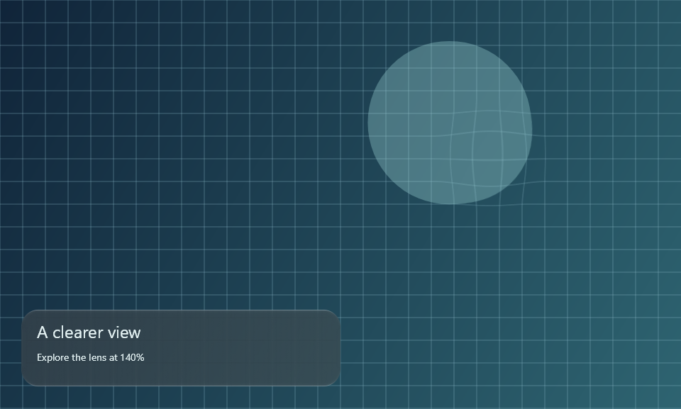

# LiquidGlass for .NET / SkiaSharp

Draw the production LiquidGlass shaders on an `SKCanvas`, without Compose, JavaScript or a browser.
`GlassPainter` owns shader compilation, uniform binding and the cached wide blur. Your application
owns the canvas, layout, input, accessibility and the pixels behind the glass.

This is an experimental, source-only adapter. Nothing is published to NuGet. The renderer targets
.NET 8; the runnable Windows Forms example targets .NET 10 / Windows 10 build 19041 or newer.
SkiaSharp is pinned to 4.153.1, with dependency locks in each project.



## Run it

From the repository root, install a .NET SDK and the .NET 8 runtime for the renderer checks.
The desktop example additionally needs the .NET 10 SDK and Windows Desktop runtime.

```sh
dotnet restore ports/dotnet/Checks/Checks.csproj --locked-mode
dotnet build ports/dotnet/Checks/Checks.csproj --no-restore
dotnet ports/dotnet/Checks/bin/Debug/net8.0/Checks.dll ports/dotnet/artifacts
```

The executable writes `verification.json` and example PNGs, and exits nonzero on failure. It compares
all four material profiles against independent JVM RGBA fixtures, compiles all three production
passes, and checks source mapping, ownership, cache invalidation and failed host recording.
Linux native assets are included in the checks project. Install `libfontconfig1` and a font such as
`fonts-dejavu-core` on Ubuntu to render the example's labels. Windows/Linux jobs run these checks in CI;
consult their result for the revision being used.

On Windows, run the interactive example:

```sh
dotnet restore ports/dotnet/WinFormsDemo/WinFormsDemo.csproj --locked-mode
dotnet run --project ports/dotnet/WinFormsDemo --no-restore
```

Drag the lens, use arrow keys to move it, and use plus/minus to change magnification. Native checkboxes
control dark glass, reduced transparency and contrast. Resizing rebuilds the backdrop and cancels a
drag. `-- --capture <directory>` saves four app-owned canvas snapshots and a host verification report,
then exits. Capture replay invokes the control's own mouse handlers; it never reads other windows
or moves the OS cursor. These phase images do not establish continuous timing or presented FPS.

On the maintainer's Windows checkout, `tools/dotnet-port.ps1` selects the private SDK and cache.
Build with that wrapper, then execute the DLL with the system `dotnet` when its runtime is needed.

## Add glass to a host

Reference `LiquidGlass.Skia/LiquidGlass.Skia.csproj` from your project. Keep `ports/skia/shaders`
alongside it: the build embeds those production exports. The built DLL does not fetch shader files
at runtime. For a Linux host, add the matching `SkiaSharp.NativeAssets.Linux` package and install
fontconfig/fonts. The dependency-free variant has no system font provider; a host using it must
supply its own font files when drawing text. Other platforms need their matching native assets.

```csharp
using LiquidGlass.Skia;
using SkiaSharp;

// Keep one painter per rendering thread/context, not one per frame or widget.
using var glass = new GlassPainter();
glass.SetSource(backdropImage); // borrowed opaque sRGB SKImage

// Draw the ordinary page first. Bounds are in backdrop/device pixels.
glass.DrawLens(canvas, SKRect.Create(360, 50, 180, 180), magnification: 1.4f);
glass.DrawSurface(canvas, SKRect.Create(30, 260, 300, 100), radius: 24,
    options: new(Dark: true, TintAmount: 50, Density: 1));
// Draw ordinary labels afterward; they keep their host layout and semantics.
```

The complete [Windows Forms host](WinFormsDemo/Program.cs) demonstrates one captured page shared
by a lens and a card. Its `SKControl` uses CPU Skia rendering. Move this painter into an existing
Skia draw callback to integrate it; adding a reference alone does not capture arbitrary UI widgets.

If your page already draws through Skia, the painter can own the snapshot:

```csharp
glass.RecordBackdrop(width, height, pageCanvas => DrawPage(pageCanvas), SKColors.Black);
// In the host's paint callback:
DrawPage(canvas);
glass.DrawSurface(canvas, cardBounds, 24, new(Dark: true));
```

Record again when the page changes, not when only a glass control moves. Exclude glass and overlays
from `DrawPage` to avoid recursive feedback. A failed recording leaves the preceding source usable.
This API records your drawing callback; it does not capture WinForms/WPF/MAUI/Avalonia widgets.

## Geometry, options and lifetime

| API / option | Contract |
| --- | --- |
| `SetSource(image)` | Borrows a live opaque sRGB image; caller keeps it alive until replacement/disposal. Never disposed by the painter. |
| `RecordBackdrop(...)` | Owns the new opaque snapshot. Replacing it or disposing the painter releases it. |
| `DrawLens(..., magnification)` | Continuous lens, 1–2.5 magnification. At 1 it is pixel-identical to the source. |
| `DrawSurface(..., radius)` | Rounded in-app material; one radius or four values in top-left, top-right, bottom-right, bottom-left order. |
| `Dark`, `TintAmount` | Default false / 50; tint is 0–100 and follows the production in-app calibration. |
| `Density` | Default 1; scales dp material constants. Bounds and radii remain physical pixels. |
| `Materialize` | Default 1, range 0–1. This is appearance, not a gesture controller. |
| `ReducedTransparency`, `IncreasedContrast` | Default 0, range 0–1; supply current host preferences. |
| `Dispose()` | Releases owned images, paint and compiled material. Idempotent; later use throws. |

Draw in the backdrop's coordinate system, with a top-left origin and matching pixel density. Use
an identity canvas matrix for device-pixel bounds; do not apply a logical-pixel scale a second time.
Canvas save/restore and paint state are preserved. Image edges clamp, including partly offscreen
surfaces. Radius and geometry must be finite and valid. Source colour space is the host's contract;
the adapter checks opacity but does not convert wide-gamut/HDR content into sRGB.

The wide tone image is cached per source and blur density. It has roughly 1/16 the source's pixel
area; a rebuild also needs a temporary surface. An owned recorded backdrop costs about four bytes
per pixel, before allocator/backend overhead. The CPU blur path is not a GPU performance claim.
Use/dispose each instance on its owning rendering thread. Recreate it and its source after context
loss if your host uses GPU-backed images.

## Lower-level passes and remaining gaps

`GlassEffectPass("material" | "content" | "endpoint")` exposes the same evaluated SkSL as Kotlin
and CanvasKit. `CreateUniforms()` returns fresh zero values. `CreateShader(values, children)` requires
every declared finite scalar/vector and live shader child; it rejects missing/unknown names and
returns a shader that the caller owns. `GlassPainter.ClearUniforms(...)` provides a clear-lens setup.
Follow the [compositing contract](../../docs/porting.md#combining-refracted-ink-with-glass) for custom
foreground/path effects. These low-level passes do not construct those layers for you.

Verified locally: Windows CPU rendering, the interactive Windows Forms host, four source profiles,
shared-source lens/card drawing and lifecycle checks. [Evidence and exact scope](../../review/atlas/dotnet-2026-10-10/README.md).
Windows/Linux renderer checks and Windows host compilation are in CI. macOS, GPU hosts, Android/iOS
SkiaSharp views, WPF, Avalonia and MAUI have not received native host verification here. SwiftUI,
Flutter, React Native, Qt and Unity still need their own integration. Navigation-selector dynamics,
automatic arbitrary-widget capture and portable refracted foreground are not supplied by this painter.
The full any-stack and iOS-parity goals remain open.

The adapter is Apache-2.0; see [LICENSE](../../LICENSE) and [NOTICE](../../NOTICE). SkiaSharp is MIT
and includes native third-party components. Preserve the NuGet packages' `LICENSE.txt` and
`THIRD-PARTY-NOTICES.txt` when distributing binaries. Do not edit generated SkSL here; regenerate it
from the Kotlin production source using the [shader export workflow](../skia/README.md#regenerate-do-not-hand-edit).
