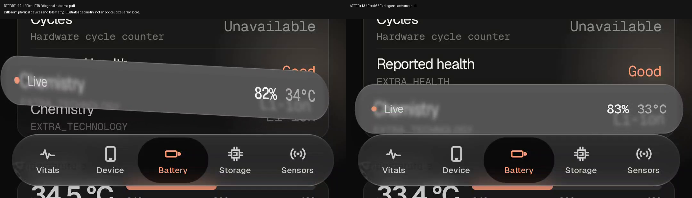
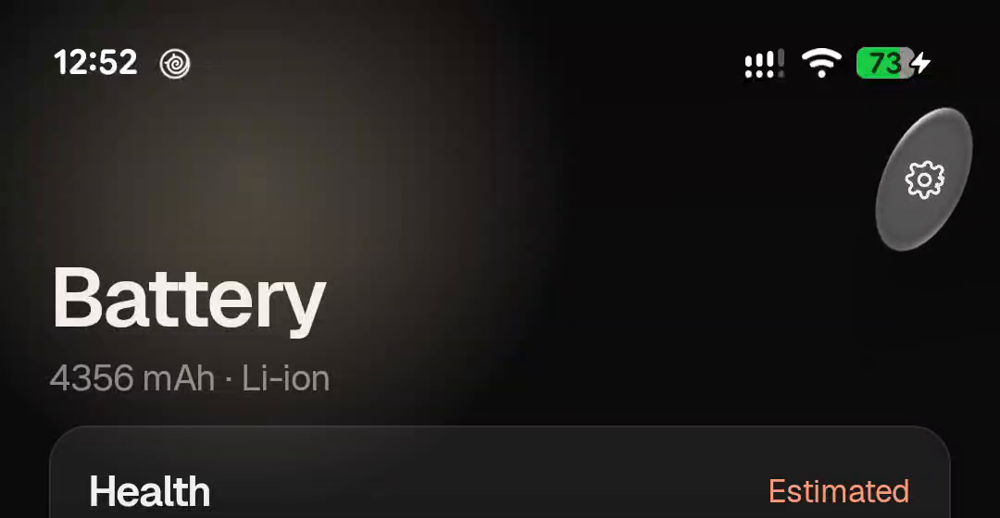
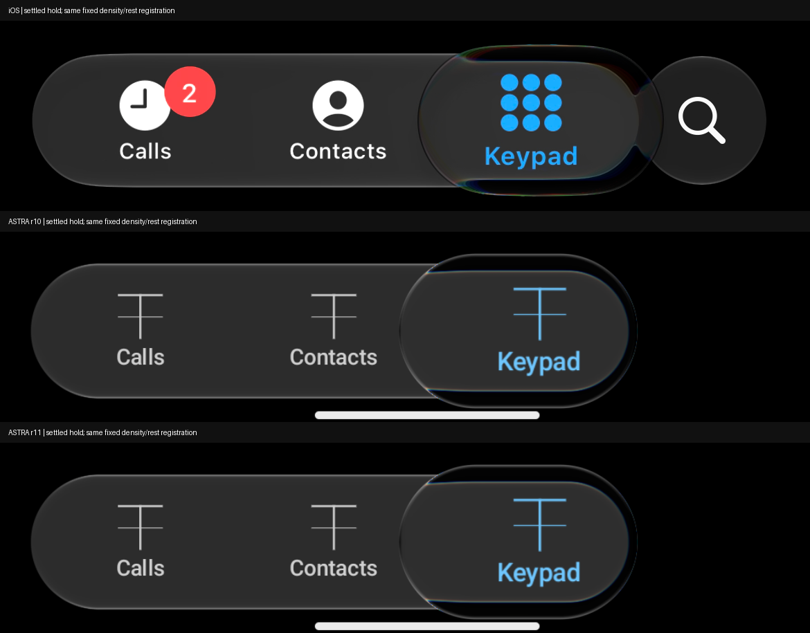

# ASTRA r13 final review - 2026-10-01

The owner selected Astra, then requested a bounded finish, GitHub publication and merger into
main. This delivery fixes the rejected whole-bar tilt and translation. It does **not** establish
1:1 iOS parity. Fable and Antigravity remain separately preserved alternatives.

## Behavior and integration

Pullable controls keep their layout centre, ordinary foreground and input coordinate frame
fixed. Only material drawing stretches. Long bars stay level; round controls retain directional
stretch. Shared perpendicular support widths, pre-spring resistance and viewport containment
bound extreme pulls. The Live pill no longer clips its expanding material. V3 retains its
pose controller, reduced squeeze and native selected ink; its selection intent can still move
the lens without moving the bar. Legacy defaults stay unchanged.

[Generic architecture and usage](../docs/generic-interaction.md) explains backdrop recording,
custom controls, navigation ownership, reduced motion, clipping, API semantics and local builds.
The aspect-ratio policy and finger-response gains are authored. Original recorded extents and
optical profiles constrain them but do not identify Apple's exact pointer response.

## Verification

| Check | Result |
| --- | --- |
| Focused geometry and pull tests | PASS: 12 |
| Fresh full library suite | PASS: 249, zero failures/errors/skips; 8m59s |
| Vitals JVM suite and Android assembly | PASS: 17; 1m40s |
| Private Maven dependency | PASS: resolved runtime AAR hash equals private publication |
| Physical Pixel 7 ending 6ZF | PASS: both Live-end diagonal pulls, full-height pull, settings diagonal pull, nav regrab; final root bar checked |
| Installed candidate | PASS: pulled APK SHA-256 equals labelled APK |
| Documentation site | PASS: strict build |
| Exact iOS parity | UNRESOLVED |
| Strict endpoint optical error | FAIL: 1.4256 code values against 1.0 limit; internal 1.5 tolerance is not this gate |

[Machine-readable tests](TEST-RESULTS.json), build logs and [installed identity](installed-identity.json)
are saved alongside the review. The debug APK is [Vitals ASTRA r13](https://github.com/shayann07/Vitals/raw/refs/heads/main/review/Vitals-ASTRA-r13.apk).
SHA-256: `68fbd61da1f08e368a10de7bcee3b99696043f8c613f0e689435f949bb1dc79a`.

## Visual evidence

R12.1 before uses Pixel FT8; r13 after uses Pixel 6ZF. Same class of diagonal extreme, different
physical phones and live telemetry: this demonstrates geometry, not a matched optical pixel score.
Normal labels stay level while the material grows around the fixed centre.

Videos: [left-end extreme](live-left-end.mp4), [right-end extreme](live-right-end.mp4),
[full-height pull](live-vertical.mp4), [settings](settings.mp4), [navigation regrab](regrab.mp4).
Actual injected event timestamps, schedules and native frame PTS are in `input-evidence/`.

The retained r11 optical comparison is historical evidence for the unchanged held-side optics,
not an r13 capture. Its neutral rim still differs from the original chromatic boundary.

## Performance

Unrecorded comparisons on the same Pixel 6ZF, 12s warmup and 16s gesture per build,
actual input timestamps and deduplicated HWUI frame records. One pair per scenario;
Live order r11/r13, nav order r13/r11. No refresh-rate change. Default glass cards off.

| Scenario | r11 median / p95 | r13 median / p95 |
| --- | --- | --- |
| Live full-width pull | 13.87 / 23.37 ms | 14.58 / 18.77 ms |
| Navigation shuttle | 15.82 / 21.51 ms | 16.33 / 21.95 ms |

Both pairs meet +2ms median and 1.10x p95 regression limits for this batch. This small sample
does not establish a speed improvement or thermal stability. HWUI completion latency is
neither photon latency nor pure GPU time. [Full results](PERFORMANCE.json).

## Remaining limits

- Rim chroma, source mapping and exact original input timing remain unresolved.
- Generic material transforms and V3 pose rendering remain separate, despite shared resistance
  primitives. External GlassPressSource lacks a generic drag-displacement channel.
- The standalone optical image is deformed after material rendering; this is an approximation.
- The strict endpoint gate still fails. Optional glass cards had poor earlier pacing and stay off.
- Below Android API 33, tinted fallback replaces the shader path. This delivery does not add iOS binaries.

## Preserved alternatives and provenance

[Preserved commit IDs and archive hashes](preserved-approaches.json) identify all four snapshots.
Each branch includes PRESERVED-APPROACH.md. Source bytes match the 2026-09-28 manifests, with
no modifications to competitors' working trees or indexes. Those snapshots were not newly tested.

| Approach | Library | Vitals |
| --- | --- | --- |
| Astra selected | [main](https://github.com/shayann07/liquidglass/tree/main) | [main](https://github.com/shayann07/Vitals/tree/main) |
| Fable | [preserved](https://github.com/shayann07/liquidglass/blob/main/archive/retired-workflows/2026-10-03/README.md) | [preserved](https://github.com/shayann07/Vitals/blob/main/archive/retired-workflows/2026-10-03/README.md) |
| Antigravity | [preserved](https://github.com/shayann07/liquidglass/blob/main/archive/retired-workflows/2026-10-03/README.md) | [preserved](https://github.com/shayann07/Vitals/blob/main/archive/retired-workflows/2026-10-03/README.md) |

Fable's retained directional lighting motivated renewed original-rim checks. Antigravity's signed
reversal concern was assessed rather than importing its preset wholesale. Sam Asante's MIT web
implementation was studied for separate displacement/chroma/sheen and bounded wobble; no third-party
production code was imported. Original-reference failures remain disclosed regardless of competitor claims.

Large original captures, intermediate APKs, exact baseline-relative source archives and private
conversation records remain local. This curated review publishes source, final APK, evidence and
reproducible input records, without copying credentials or the unfiltered private research corpus.
No release tags or Maven release are created by this delivery.
