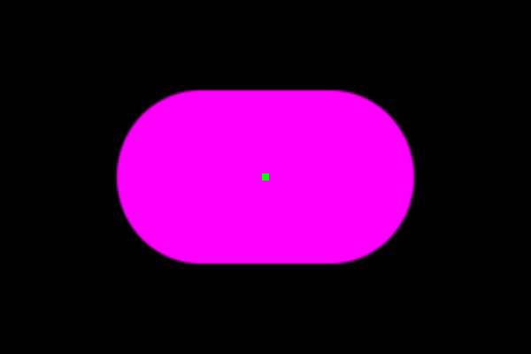
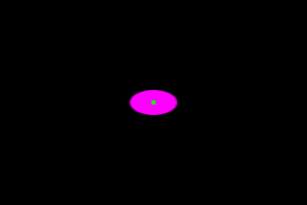

# ASTRA r14: subtle drag on large surfaces

Touch expansion and small-control drag stay unchanged. Large cards and status pills now
receive much subtler stretch through the shared `liquidGlass` modifier. No app-specific
card deformation was added. Layout, content and hit targets remain anchored.

The policy uses the unpressed longest side: unchanged through 80dp, smooth transition to
160dp, then one-fifth initial drag strain with a smooth 2dp total-extension cap. Compression
is reduced with extension. These thresholds are **authored from owner feedback**, not measured
Apple constants. Press growth, lighting, springs, navigation pose and Legacy defaults are unchanged.

[Generic architecture and usage](../docs/generic-interaction.md) explains integration and ownership.

## Terminal desktop verification

The actual Compose Desktop component received pointer down, extreme right/up/diagonal moves
outside its bounds, and release. Diagnostic coverage isolates material geometry; green marks
normal foreground. The fixture disables blur and uses half-resolution source recording.
It tests production pointer and drawing paths, not optical appearance or Android performance.

| Component | Held size | Right-pull size | Up-pull size | Foreground/release |
| --- | --- | --- | --- | --- |
| 56 x 56dp button | 70 x 70px | 90 x 48px | 48 x 90px | Fixed / restored |
| 320 x 180dp card | 334 x 194px | 336 x 192px | 332 x 196px | Fixed / restored |
| 350 x 44dp pill | 364 x 54px | 366 x 52px | 364 x 56px | Fixed / restored |

At fixture density 1, the large-surface change is only 2 pixels per full axis. Small controls
retain their stronger response. All three preserve press expansion; all three restore their
resting bounds within 1px on release. [Raw bounds](r14/desktop-metrics.txt).

| Calm press | Extreme right pull |
| --- | --- |
|  |  |
|  |  |

## Validation and failed probes

- Full library suite: **252 passed**, before the desktop diagnostic binding correction.
- Focused size/pull suite: **8 passed**; size policy and coverage diagnostics also passed after that correction.
- Final desktop interaction test: **1 passed**, covering three sizes and nine extreme moves; 1m26s build.
- App JVM suite: **17 passed**; final Android assembly and desktop compilation passed.
- Android AAR and desktop JAR resolution were checked against the private r14 Maven publication by SHA-256.
- Strict documentation build and app memory checks passed.

The first desktop probe found a missing `uDebugCoverage` binding on JVM; it is now wired,
matching Android. Its default remains zero. A cancellation probe was invalid because this
Compose 1.12 desktop test dispatcher's `enqueueCancel` is a no-op (confirmed in dependency
bytecode). It was replaced with normal release; cancellation is not newly verified here.
A later fixture run timed out; removing unrelated blur work made the final render test pass.
Failed logs/XML remain in the local `subtle-r14` evidence folder. None is relabelled a pass.
[Machine-readable results](r14/TEST-RESULTS.json), [desktop test report](r14/desktop-test.xml).

## APK and limitations

[Download Vitals ASTRA r14](https://github.com/shayann07/Vitals/raw/refs/heads/main/review/Vitals-ASTRA-r14.apk)
(debug review build; private library version `0.2.0-astra.14-SNAPSHOT`).
SHA-256: `3f26106a2267a4716829ae96613f3af83b0d7c96dd31a149813e880af1d8fcf9`.

No device was available. R14 has no new physical Android capture, installed-package verification
or performance measurement. The [r13 physical evidence and performance](ASTRA-r13.md) are
historical, not r14 results. Optical parity and the previously failing strict endpoint gate
remain unresolved. This revision does not establish iOS 1:1 parity. Fable and Antigravity
remain on their preserved branches listed in the r13 review.
