# Atlas and material stabilization — 2026-10-03

## Plan and acceptance gates

Scope: LiquidGlass and Atlas Studio only. Work from `dd52d12`; preserve measured
and legacy presets. No Vitals changes, subagents, computer-use plugin, paid bots,
tag-triggered release or claim of full iOS equivalence.

1. Capture the existing native desktop app. Revisit original iOS evidence and
   distinguish measured dimensions from authored pointer response.
2. Reproduce the split rim with a synthetic coordinate target. Give standalone
   magnifiers one continuous source map; retain the tab selector's specialized
   mapping. Test monotonicity, centre gain and edge continuity in rendered pixels.
3. Add an opt-in calm interaction with separate press and drag response. Check
   ordinary travel, extreme directions, reversals, cancellation and recovery.
4. Provide a small shared scene API that owns backdrop recording and defaults to
   the calm response. Keep the explicit state/modifier API compatible.
5. Simplify Atlas into a usable glass demonstration. Use real rendered backdrop
   content, consistent coordinates, resize-safe placement, accessible controls
   and deterministic terminal-driven native captures.
6. Run relevant regressions, the full library suite, desktop and Android builds,
   strict docs and link checks. Publish reproducible visual evidence and limits.
7. Update README, API/research/contribution/security/license provenance records;
   add free dependency/security automation and enforce passing PR checks.

Full 1:1 parity remains an evidence gate, not a promised outcome. A desktop render
cannot prove Android frame pacing or reproduce Apple's private compositor.

## Initial diagnosis

The Atlas loupe uses `GlassProfile.Held`, an intentionally specialized tab lens:
its material does not magnify while its foreground does. Its outer band has a
separate source map. Using it as a free magnifier creates mismatched backdrop/ink
behaviour. The former 1.67x foreground zoom and authored bright rim amplify this.
The historical pull/press preset is also different from the calm response now
requested. Existing model constants are not silently relabelled as iOS timing.


## Goal update: selector travel and other stacks

The owner distinguished selector travel from whole-bar strain and requested a route for other UI
frameworks. `GlassTabBarStyle.Calm()` now makes that separation explicit. The portable web preview
implements the continuous lens with a caller-supplied texture; the porting contract describes the
remaining host requirements. Native adapters for every stack are not implemented or claimed.

## Findings and changes

- **Magnifier:** the previous Atlas used `Held`, whose material/ink and interior/rim mappings differ.
  The new `Lens` map converges to identity with identity first derivative at its elliptical boundary.
  Material and foreground share the function. Existing held-tab optics remain separate.
- **Feedback:** generic `Calm` separates press growth from drag. Press uses critical springs and at most 3%
  scale / 2dp growth per edge. Drag resists progressively; large surfaces retain the 2dp total extension
  limit. These rates and gains are authored. Ordinary labels and hit targets remain anchored.
- **Navigation:** the calm selector ignores perpendicular travel for strain and speed-driven squeeze.
  The whole bar receives the shared material feedback with a reference-backed 1.05 press. The old
  1.05 label scale is disabled in this preset. A slower centre and separately sprung spine produce
  more deformation over longer trips.
- **Integration:** `GlassScene` owns one backdrop and exposes the scene-bound modifier. Advanced callers
  retain the explicit state API. Gesture-owning hosts may supply cumulative pull through `GlassPressSource`.
- **Atlas:** compact compositions, three backdrop modes, real magnification, explicit reduced motion,
  canvas-local bounds and no invented telemetry. Native capture reads only its own Skia buffer.

## Original reference used as a bound

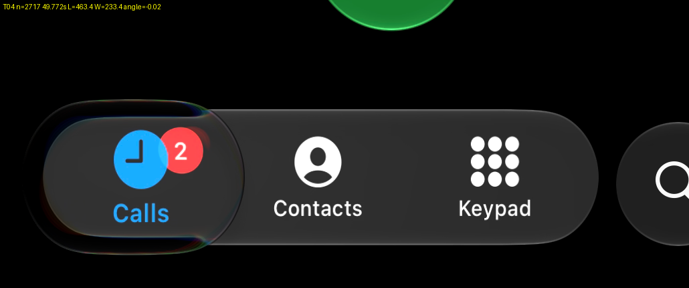

Owner-supplied `IMG_6756`, T04, frame n2717 at 49.772s, from the existing reference analysis. Its held
selector travels horizontally; this sequence does not establish a free-button off-axis squeeze law.
The yellow ellipse-fit width annotation is inherited analysis, not a trusted contour-width measurement:
it can overestimate the visible body. Do not fit pointer gain to that annotation.

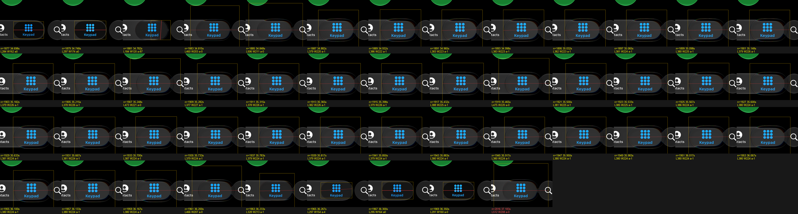

The earlier original-frame audit records a 186px bar and approximately 225px settled held height
(about 1.21 bar heights, +/-4px edge uncertainty), versus a 284×162px resting selector. This supplies
a conservative **1.23 bar-height** ceiling for the new synthetic hold tests. The new preset aims at
1.20. The initial 1.16 choice failed the original settled-height tolerance: 215.76px instead of 225±4px.
Restoring 1.20 gives 223.20px height and 345.19px width, within the original 225±4px and 350±10px bounds.
This chosen bound is not a universal maximum for all Apple materials or a measured finger trace.
The existing reference fixture preserves the previous T01 height fit independently.

### Whole-bar bound, measured separately

The selector-height audit above does not bound the surrounding bar. A fresh decode of the original
`IMG_6756.MP4` at PTS 20819/600 (34.698333s, rest) and 29863/600 (49.771667s, T04 extreme hold)
gives the following outer-body measurements. These are full-density 1170×440 crops at `(0,2092)`,
not resized contact-sheet tiles.

| Rest | Ordinary hold | Extreme hold |
| --- | --- | --- |
| 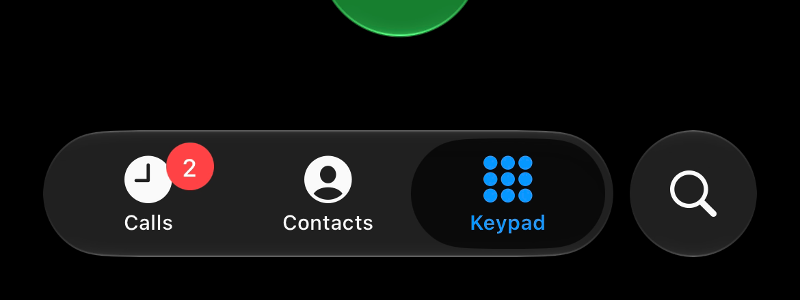 | 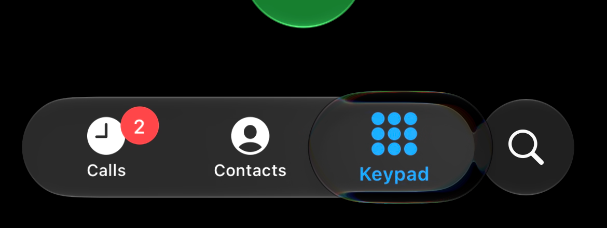 | 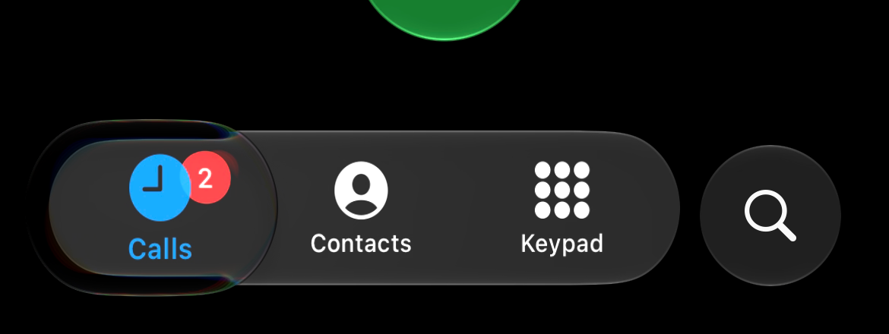 |

At unoccluded columns 400, 450, 500 and 550, thresholds 5/10/15 out of 255 give **186px** resting
height and **204–205px** held height. All four columns agree. The resting top/bottom rows are
191/376; the held top is 171–172 and bottom 375, relative to the crop. Thus most of the growth is
above the original bar. This contradicts treating the reference as a perfectly centre-symmetric
expansion. The current anchored material model is intentionally conservative; that asymmetric response
is still a parity difference, not silently dismissed as measurement noise. Neither frame reveals a
finger position, so these values cannot identify input gain or a timing curve.

The intervening ordinary hold at PTS 21019/600 (35.031667s) measures **196px**, rows 186–381,
at the same columns and all three thresholds. Its growth is approximately symmetric about the
resting centre. The extra extreme deformation is therefore 8–9px beyond ordinary hold, not the
full 18–19px beyond rest. This independently supports separating press from drag strain. The generic
Calm press alone gives 191.58px; a fail-first test rejected it against 196±1px. The navigation preset
now reuses the earlier rounded 1.05 scale, giving **195.3px**, on the material alone. Its label scale
stays 1.0. Generic cards retain 3%/2dp press growth. The Calm timing and all drag coefficients stay
unchanged; restoring normal touch amplitude must not increase drag sensitivity.

The portable Calm regression now uses the measured **205px** upper height as a separate bound. It
tests 72 pull directions, 10,000 logical-pixel excursions, and press/release frames with the 834×186px
bar at density three. Generic feedback peaks at **194.2524px**. With the navigation press override,
the maximum is **198.0169px**. A Kotlin test exercises the production deformation functions across
72 directions, six press amounts and five pull distances; independent capsule support gives
**198.01695px**. This passes a no-excess-stretch bound, but remains 6–7px below the original extreme
and does **not** establish matched iOS deformation. Twelve portable numerical tests pass, including
gradual viewport-limited press targets and unchanged generic defaults.

The visible foreground also changes in these originals. Isolating the unselected Contacts icon
at thresholds 160/200/230 gives the following bounds (the table uses threshold 200):

| State | Icon width × height | Icon bounds centre, crop pixels |
| --- | --- | --- |
| Rest | 69 × 69 | 479.5, 263.5 |
| Ordinary hold | 73 × 73 | 482.5, 262.5 |
| Extreme hold | 69 × 76 | 475.5, 251.0 |

The icon centre is 11.5px higher at extreme than at ordinary hold at all three thresholds; its
shape changes too. The outer-bar measurements therefore cannot be explained by symmetric growth
about a fixed centre alone. These are visible-pixel bounds, not proof of layout translation:
refraction, content scaling and control transforms are not distinguished by a screenshot. The
current implementation keeps layout and ordinary labels fixed. We do not
silently move labels to fit this frame or label the current result exact parity.

Reproduction requires ffmpeg with zscale and Python with Pillow. Decode each native timestamp
using the following filter, without resizing, then run the checked-in measurement tools:

```text
zscale=t=linear:npl=100,format=gbrpf32le,zscale=p=bt709:t=iec61966-2-1:m=bt709:r=full,format=rgb24,crop=1170:440:0:2092
```

```sh
python tools/measure_phone_bar.py review/atlas/reference-bar-rest.png review/atlas/reference-bar-held.png review/atlas/reference-bar-extreme.png
python tools/measure_phone_foreground.py review/atlas/reference-bar-rest.png review/atlas/reference-bar-held.png review/atlas/reference-bar-extreme.png
```

[Outer-body measurements](atlas/reference-bar-bounds.json) and
[foreground measurements](atlas/reference-bar-foreground.json) preserve threshold sensitivity.
The foreground tool uses a fixed ROI and connected bright neutral pixels, excluding labels and
the selected lens. This PQ-to-sRGB decode supports geometry, not display photometric calibration.
Native PTS were checked with ffmpeg `-copyts` and `showinfo`.

The actual Compose bar rendering also passes its five extreme-direction pulls, repeated outward
motion at an end anchor, release and fixed-layout assertions. Its software-rendered held state after
the pressure correction is shown below. This is an implementation proof over a synthetic backdrop,
not a like-for-like optical comparison with iOS:

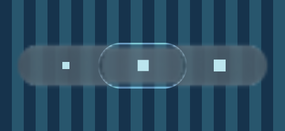

### Whole-bar sequence: the asymmetry is persistent

A second audit uses one continuous T04 episode rather than comparing its extreme with an earlier
gesture. Before/after rest both measure 186px, centred at y 283.5 in the same crop. Ordinary hold
measures 196px at that centre. During the prolonged drag the bar grows gradually to 205–206px and
its visible centre rises 10.5–11px, then both recover. This rules out a different resting placement
between the two gestures as the explanation for the previously reported asymmetry.

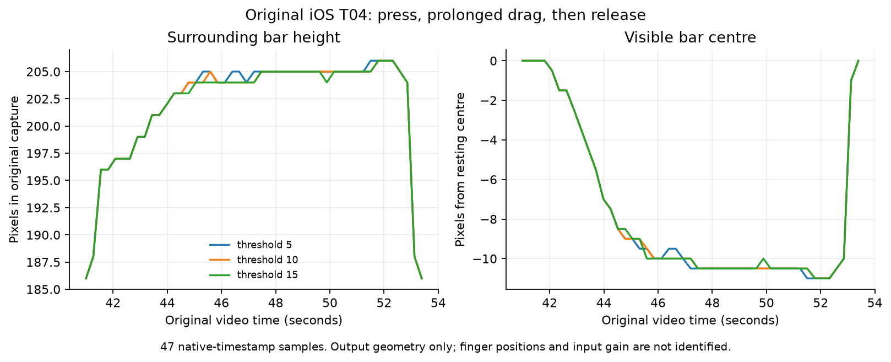

| Before, PTS 24601/600 | Late hold, PTS 31074/600 | After, PTS 32035/600 |
| --- | --- | --- |
|  | 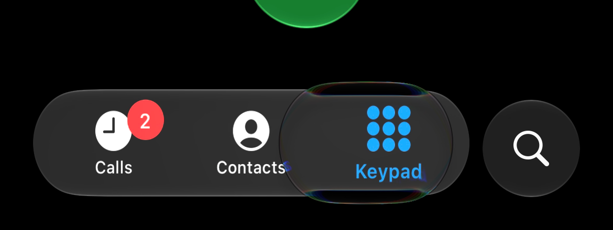 | 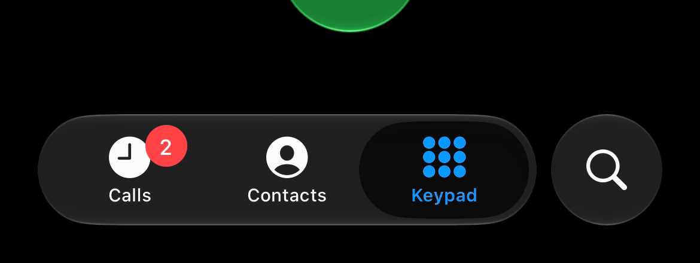 |

The trace contains 47 unscaled crops at native timestamps from 41.001667 to 53.391667s. At each
frame, 123 columns vote for top and bottom separately; this avoids treating the travelling selector
as the surrounding bar. All 141 threshold/frame combinations have a strict majority at both edges.
Thresholds 5/10/15 agree within one pixel. The sampled maximum is 206px; the earlier 205px test bound
remains a conservative chosen-frame bound, **not a proven maximum of the recording**. The current
198.017px model still undershoots the observed prolonged drag. Fixed layout bounds alone cannot
verify these changing visible boundaries, and a screenshot does not identify the underlying input
trajectory or whether the foreground movement comes from optics or a drawing transform.

[All samples, votes, timestamps and hashes](atlas/reference-bar-sequence.json).
To reproduce from the owner's original video, create an empty output directory and run (ffmpeg
with zscale, Python with Pillow; matplotlib is required only for `--plot`):

```sh
ffmpeg -copyts -ss 41 -t 12.5 -i research/datasets/ios27-phone/bubble/IMG_6756.MP4 -an -vf "select='not(mod(n,15))',zscale=t=linear:npl=100,format=gbrpf32le,zscale=p=bt709:t=iec61966-2-1:m=bt709:r=full,format=rgb24,crop=1170:440:0:2092,showinfo" -fps_mode passthrough output/frame-%03d.png 2> output/decode.log
python tools/measure_phone_bar_sequence.py output --output output/bounds.json --plot output/trace.png
```

The original video and intermediate crops remain research inputs; the three evidence crops above
are copied without resizing. This audit changes the next deformation target, not the completed
tap correction or generic card defaults. No new Apple timing constant is inferred from it.

### Paired bar dimensions: correcting the drag shape

The original T04 crop at PTS 31074/600 has a clear bar boundary at its central row 272: x63..895,
or 833px wide, with 206px height. Earlier sustained samples measure 205px high. The before/after
rest widths are 832–834px. These values reject a model that only adds height while retaining the
ordinary-held width: the previous implementation gave **872.98×198.02px**. The new transverse
probes are included in the sequence JSON; ROI-clipped rows and rows with protruding selected lenses
are not clean surrounding-bar widths and must not be fitted blindly.

The recommended navigation preset now uses `GlassPullShape.AreaPreserving`. A small bounded
log-strain couples lengthening with narrowing; the calibrated reference-sized fixture gives
**835.49×204.70px**, passing the independent rounded gates 834±4 × 205±1.1px. Its determinant is 1
before press and viewport limiting. The height gate retains the earlier selected-frame ceiling;
the width gate uses the clear late frame. Against that late frame itself the residual is +2.49px
width and -1.30px height. This is a conservative multi-frame fit, not an exact paired-frame match.
This is an **authored inference from observed dimensions**,
not a measurement of Apple's material area or constitutive physics. The selected 0.047 strain
bound and existing input resistance do not identify the missing finger trajectory.

The shared material modifier owns both policies. Generic cards retain `Adaptive` and their 2dp
extension cap; only the navigation preset opts into the relative law. Shear fades in log space on
wide bars, which stay level. No layout, hit target or ordinary foreground translation is added.
The same policy is available in the portable controller with `pullShape: 'area-preserving'`.
Both keep the existing critical timing, cancellation and reduced-motion handling.

The reference test failed first at 198.02px height. Focused Kotlin tests then passed with the new
paired dimensions, opposite/diagonal pulls, 72 directions, zero translation and a moderate-pull
gate that prevents early saturation. Thirteen portable math/controller tests passed, including
the same paired dimensions, release recovery, reduced motion and viewport outline containment
under both policies. Full renderer/desktop verification passed for this change at `124ae17`; the
successful `87e17a4` runs below precede it. The reference's 10.5–11px upward visible-centre shift
is still unmatched; the new dimensions alone do not establish full parity.

### Verified checkpoint: 124ae17

The full local run passed in **20m10s**: 330 library tests, **303 passed / 27 skipped / zero failures**,
both Atlas tests passed, and the Android sample assembled. The tests drive top, bottom, left, right
and corner pulls through the actual navigation input path, repeated outward motion, release and
fixed-layout assertions. The focused mathematical gates also passed; none of their tolerances changed.

[GitHub run 37237373943](https://github.com/shayann07/liquidglass/actions/runs/37237373943) passed
all seven required checks. Library and desktop tests both executed freshly, reporting **22m26.26s**
and **4m50.99s** respectively; the build reported **28m56s**. Hosted validation also passed
13 portable math/controller tests, 12 Skia tests and five browser tests. Reports and the log were
inspected, rather than treating a cache-restored result as a new execution.

| Ordinary hold | Upward extreme | Corner extreme |
| --- | --- | --- |
| 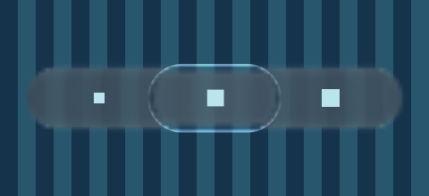 | 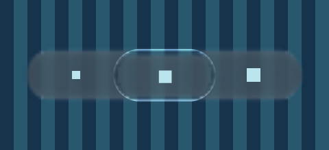 | 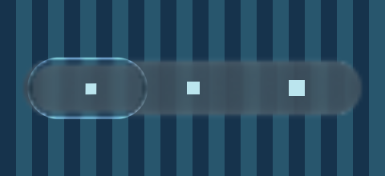 |

These are **480×220 Compose software-rendered** fixtures over the same striped source, with
quarter-scale backdrop sampling. The upward pull narrows the material relative to ordinary hold;
ordinary foreground and layout stay fixed. They establish rendered behaviour, not an iOS optical match.


Atlas then launched after the CPU tests finished, using Direct3D at **1920×1051**. The line-grid lens
has continuous detail through its interior; the scene and selected navigation ink are visible.
Static redraw submissions over 120 samples after ten warmups measured **9.3334ms median / 15.1117ms
p95 / 21.271ms maximum** ([raw timing](atlas/checkpoint-124ae17-native-timing.json)). The earlier
checkpoint measured 9.2794/12.2323/14.3365ms; this is not a controlled performance comparison or a
speedup claim. Neither run measures presented frames or native gesture latency.
[The Atlas corner capture](atlas/checkpoint-124ae17-extreme.png) is a separate software gesture test.

Full parity remains open, including the reference's asymmetric visible boundary, input/timing
identification, Android compositor precision and current physical-device verification.

### Asymmetric material drawing — 2026-10-08 candidate

Total size alone hid a persistent error. The original selected T04 frame (PTS29863/600,
`reference-bar-extreme.png`) has top rows171–172 and bottom375, with a resting centre at283.5.
A new independent edge test rejected the centred candidate before changing the implementation:

| Edge in original crop coordinates | Selected original | Centred candidate | Directional material candidate |
| --- | --- | --- | --- |
| Top |171–172px |181.15088px |170.73486px |
| Bottom |375px |385.84912px |375.43310px |
| Visible-centre displacement |about -10.5px |0px |-10.416px |

`AreaPreserving` now adds a drawing bias toward the resisted pull, capped at **5.6% of the
unpressed short side**. The existing matrix still gives835.49×204.70px. This is an authored
spatial fit below the selected10.5px displacement; no finger gain, timing or Apple rendering
mechanism is identified. Extending the same bounded law to other directions is an explicit
extrapolation. Ordinary press adds no bias; generic Adaptive cards/controls are unchanged.
The viewport applies its existing smooth resistance to this material offset after limiting strain.

Layout, pointer coordinates and ordinary foreground are outside the material transform. The
actual Compose pointer test compares ordinary icon pixel bounds before/after an upward pull,
in addition to its fixed layout/hit-target assertions. The selected lens still owns its travel
response separately. This does **not** reproduce the original unselected icon's visible warp;
that foreground optical difference remains open.

| Held | Upward extreme | Corner extreme |
| --- | --- | --- |
|  | 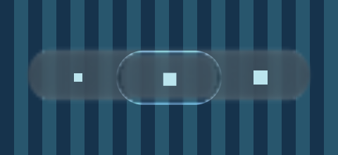 | 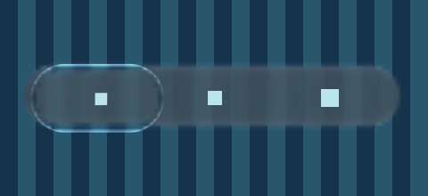 |

These are480×220 software Compose frames over a synthetic stripe source, not like-for-like
optical comparisons to iOS. The new Kotlin checks sample the full biased contour at every viewport
edge, preserve ordinary icon pixels and keep the chosen height/displacement bounds. **20 focused
Kotlin tests and13 portable math/controller tests pass.** The portable state now exposes
`offset:[x,y]`, applied after its centred matrix to material drawing only. Both bias and shape
recover on release/cancel and disappear under reduced motion.

All13 Skia tests pass after adding a navigation case to the actual rendering test. The existing
zero-centre/card-width assertions remain for generic cards; the navigation case instead checks its
bounded drawing offset and unchanged diagonal press dimensions. The initial run correctly failed
the old zero-centre assertion for that newly added navigation case; its raster tolerance remains0.5px.
Full local verification of implementation `06c91141806a11b4f0d79a2858053415f4714ded`
passed in **10m31s**: **305 library tests passed, 27 skipped, zero failures/errors**, both Atlas
tests passed, and Android sample assembled. XML suite durations sum to520.151s for the library
and100.684s for Atlas. These tests executed; they were not restored from cache.
The subsequent native launch completed in25s and its app-owned capture was inspected:


Direct3D,1920×1051; grid magnification is continuous and selected ink remains visible.
[120 static redraw submissions after10 warmups](atlas/checkpoint-06c9114-native-timing.json)
give **9.3877ms median,19.9661ms p95,23.1281ms maximum**. The p95 exceeds16.67ms;
this records submission work, not presented FPS, a controlled speed comparison or native gesture latency.
[Hosted build37674667084](https://github.com/shayann07/liquidglass/actions/runs/37674667084)
passed, together with all seven required checks: build, web, Skia, dependency review,
both CodeQL language jobs and docs. The newer foreground change below requires separate verification.

### Rejected assumption: ordinary ink must remain visibly fixed

Layout and hit targets need stable coordinates. That does not establish that visible glyph pixels
must stay fixed. The earlier three-frame measurements already contradicted that additional Astra
assumption. A fresh same-gesture audit now compares Contacts with independently measured bar geometry,
using the exact same47 crops and checking their SHA256 hashes. It does not fit a spring or pointer gain.

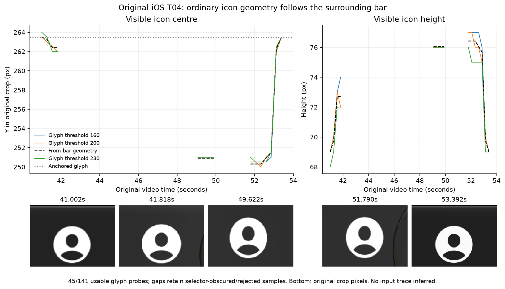

Of141 threshold/frame probes, **45 across15 frames** contain a usable neutral glyph. All96 rejected
probes remain in [the record](atlas/reference-foreground-sequence.json), with gaps in the plot.
Samples19,20 and40 are explicitly excluded after visual inspection: the selected lens covers part
of Contacts. The other rejections have no unique complete bright glyph in the fixed ROI.
The drawing prediction uses only the first-frame glyph and the independently measured bar:

```text
scaleY = currentBarHeight / restingBarHeight
predictedGlyphY = currentBarCentre + (restingGlyphY - restingBarCentre) * scaleY
predictedGlyphHeight = restingGlyphHeight * scaleY
```

Both centres use pixel extents; the bar's integer edge-index midpoint is converted with+0.5px.
Across all accepted probes, absolute centre-Y error is **0.2043px median /0.9570px maximum**;
height error is **0.2903px median /1.2903px maximum**. The fixed-glyph hypothesis instead has
**12.5px median /13.5px maximum** centre-Y error. Original icon dimensions/position recover on
release. The old three-frame measurement tool still reproduces its JSON unchanged after extraction
of a reusable measurement function.

This supports shared *visible vertical deformation*, not a claim about Apple's internal renderer.
X drift is measured but not explained; the ordinary and selected ink must still register correctly
through a moving lens. The production candidate deliberately retains fixed ordinary ink, so that
test currently protects an API contract rather than proving iOS foreground parity. The next change
must separate drawing-only navigation feedback from stable layout/hit testing and generic card text.

```sh
python tools/measure_phone_foreground_sequence.py .local/t04-motion \
  --bar review/atlas/reference-bar-sequence.json --exclude-frames 19 20 40 \
  --output review/atlas/reference-foreground-sequence.json \
  --plot review/atlas/reference-foreground-sequence.png
```

Pillow is required; plotting also needs matplotlib and numpy. Decode the original crops with the
T04 command above. No new production motion constant or timing claim is derived from this audit.

### Navigation foreground candidate

`GlassTabBarStyle.Calm()` now enables `deformItemsWithBar`. One shared drawing state publishes the
material's already animated and viewport-bounded transform; both ordinary and selected ink consume
it before selector optics. The selected row subtracts its node origin from the **bar** pivot.
No additional spring, layout translation, pointer remapping or generic card-text movement is added.
Other presets default to false; callers may set it false explicitly for fixed visible navigation ink.

The fail-first real-pointer regression expected a bounded upward glyph shift and found0px. The first
candidate fixed the shift, but a32px low-density glyph's threshold box quantized a small strain to
35px. Rather than fit motion to that aliasing, a new density-three fixture uses the original69px
glyph and834×186px bar. The small fixture still verifies visible displacement and stable layout.
The full-density fixture measures **69px rest,72px held,76px extreme**, compared with the original
69/73/76px and the recorded1.29px maximum threshold/edge residual. Held-to-extreme shift is **-12px**
against-11.5px; tolerance1.5px. Release recovers the exact original raster bounds.

| Held, software Compose | Extreme, software Compose |
| --- | --- |
| 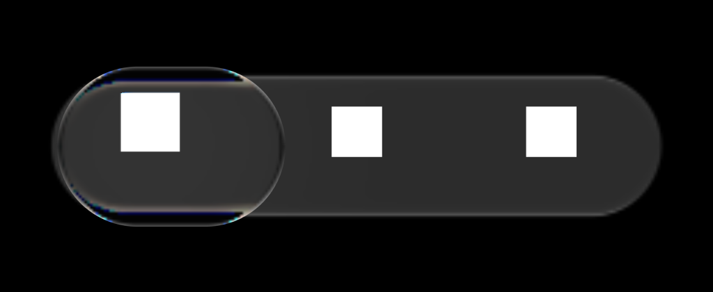 | 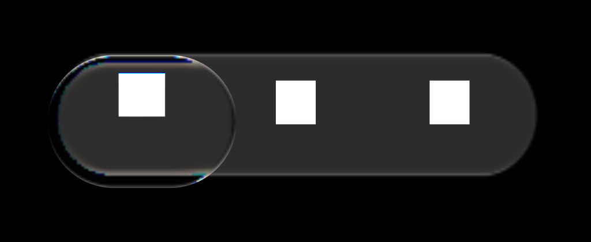 |

These use synthetic white square glyphs and quarter-scale backdrop sampling; they verify the
drawing envelope, not a complete optical match to iOS. A separate renderer test draws identical
ink in bar and shifted selector nodes across press, vertical pull and diagonal shear: all channels
register within1 level. All14 Calm gesture tests pass, including cancellation, fling and reduced motion.
Together with the growth/shape and full-density tests, **25 focused tests pass**.
Implementation `302e5e1e3c7a411c3ad17a41d1ada06b30dacbf4` passed full local verification
in **10m21s:307 library tests passed,27 skipped,zero failures/errors; both Atlas tests passed**;
Android sample assembled. Fresh XML durations sum to520.394s/97.037s for library/Atlas.


The subsequent native launch completed in14s; its1920×1051 Direct3D app buffer was inspected.
[Static redraw submissions](atlas/checkpoint-302e5e1-native-timing.json),120samples after10warmups:
**10.2552ms median /12.9977ms p95 /21.4913ms maximum**. This is neither presented FPS nor native
gesture latency or a controlled speed comparison. All seven required checks passed in
[CI 37678836069](https://github.com/shayann07/liquidglass/actions/runs/37678836069).
The build took 30m45s (Gradle 30m14s), with fresh library/desktop execution. The web job first
timed out during Ubuntu mirror downloads, before browser tests. Once the build finished, retrying
only that job passed in 48s; no product test failed and the successful build was not rerun.

### Avoiding duplicate held brightness


The Calm bar reused V3's reference-backed `heldLift` and also inherited generic `pressLift=0.04`.
`GlassTabBar` added the first to the style; `liquidGlass` added the second at draw time. The new
material regression combines both paths before rendering against the independent Phone plateau.
It failed at **54/255 versus 44±1**, then passed at **44/255** after setting the bar interaction's
additional `pressLift` to zero. Touch illumination, bar growth and all generic control presets
remain unchanged. This corrects duplicated ownership rather than refitting an optical constant.

As a separate original-frame check, the untouched interior patch `(330,250)` to `(369,284)` in
the full-density crops above contains only RGB `(32,32,32)` at rest and `(43,43,43)` in the ordinary
hold. Those decoded video values support the existing 44±1 held tolerance; they are not calibrated
display photometry. The extreme crop is excluded because its selector overlaps that patch.
The synthetic held-bar image above predates this brightness correction; it documents geometry only.

### Test scheduling failure and correction

The full local pressure run passed all **325 library tests** (298 passed, 27 intentionally skipped),
but failed overall after 19m20s: Atlas's interaction test exceeded six minutes while both CPU-rendering
suites ran together. The unchanged Atlas assertions passed alone in **3m28s**, including all scenes,
five extreme drags, recovery and reduced motion. Gradle now orders desktop tests after library tests
when both are requested. This adds no dependency for a desktop-only invocation and does not relax
timeouts, skip scenes or reduce render resolution. Native timing remains a separate measurement.
Hosted CI for the pressure correction `0e5b432` passed all seven required checks, including 325
library tests (298 passed, 27 skipped), both desktop tests, Android builds, twelve portable math
checks, six Skia tests and four browser checks. Its full build took 24m44s
([run 37189818625](https://github.com/shayann07/liquidglass/actions/runs/37189818625)).
This precedes the brightness and scheduling correction; their full run is recorded separately.
The brightness/scheduling revision `b1b5695` then passed all seven hosted checks in
[run 37191244540](https://github.com/shayann07/liquidglass/actions/runs/37191244540): 326 library
tests (299 passed, 27 skipped), both desktop tests, Android builds and portable/browser suites.
The hosted build took 15m22s. Its local serial run later lost its process handle without writing
a completion result; that local run is **not** counted as passed or silently restarted.

The corrected source also launches and captures its own native Direct3D buffer at 1920×1051:


The idle grid scene confirms that the lens and selected ink still render. It does **not** exercise
held feedback. This run's static forced-redraw submission times were **18.97ms median, 21.92ms p95,
27.19ms maximum**, from 120 samples after ten warmups ([raw result](atlas/brightness-native-timing.json)).
They are slower than the preceding 9.21/12.46/14.90ms capture, so no performance improvement or
presented-frame budget is claimed. These are separate desktop observations, not an alternating
controlled benchmark; Android performance remains unverified.

## Portable rounded surfaces

### Shared scene integration — 2026-10-08

The previous high-level painter still required hosts to build a separate motion controller and apply
its matrix around the correct pivot for every widget. `createGlassScene` now owns those connections
behind `addSurface`, `addLens`, timestamped `press`/`release` and one `draw` call. Layout and labels
remain with the host. The returned animation flag lets a settled surface stop requesting frames.
The browser and terminal examples now use this API.

Scene coordinates are logical pixels with an explicit pixel ratio. The source image and output canvas
stay in device pixels; tests check exact equality with independent painter calls at ratios 1 and 2.
Resize cancels stale gestures, reduced motion clears deformation, and appearance updates preserve
layout. Failed material drawing restores the host canvas. The scene borrows the source and owns its
painter/controller state; it does not own pointer listeners, a graphics context or backdrop capture.

The existing portable controller is bundled mechanically from its source, with a drift check.
There is no second maintained motion model. A runtime isolation test renders from the declared
package files in a separate directory with no sibling web checkout. Packaged LICENSE/NOTICE are
checked against the originals. The high-level APIs have strict-checked TypeScript declarations and
negative consumer cases. TypeScript 7.0.2 is a pinned development dependency, not runtime code.
No package was published; `npm pack --dry-run` confirms the runtime/type/license file list.


This inspected 640×360 software Skia render contains two lenses and two material surfaces over a
generated grid. It demonstrates the scene's production draw path, not a native desktop window,
gesture recording or Apple optical comparison. Reproduce with `npm run example` in `ports/skia`.
All **20 Skia tests**, **13 portable math/controller tests**, strict consumer type checks and strict
documentation build pass locally. All seven required checks passed at `014b16e` in
[CI 37732791140](https://github.com/shayann07/liquidglass/actions/runs/37732791140).
Hosted execution passed 20 Skia tests (12.43s), strict consumer types, 13 portable math tests and
all five browser tests (26.0s). The unchanged JVM/Atlas tasks were restored from the verified cache;
this was not a new Compose test run. The browser example exercises the new scene's input, source
replacement and context recovery. No browser tool was used locally.

| Held card through the scene API | Source replacement and restored context |
| --- | --- |
| 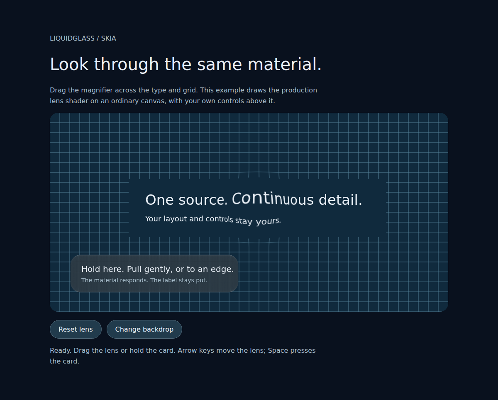 |  |

Both hosted Chromium images were inspected. They are browser-rendered fixtures, not native Atlas
or physical GPU performance evidence. The 27 skipped cases in the separate JVM suite were also
audited: all require the opt-in showcase-output flag, and are recorded as skipped rather than passed.

The scene is usable with any host that supplies a compatible CanvasKit canvas/image. Packaged native
adapters for other languages, arbitrary DOM/backdrop capture, automatic gesture arbitration and the
navigation selector controller remain outside this adapter. This advances the cross-stack requirement
without claiming those missing integrations exist.

The portable painter now exposes `drawSurface(canvas, bounds, options)` alongside `drawLens`.
It binds the production measured shader, supplies the in-app light/dark material and builds its
quarter-resolution wide tone image. Callers supply an opaque backdrop and keep their layout,
labels and input. The terminal and browser examples use the same API.


This is a 640×360 CanvasKit software render, not an iOS comparison or native GPU performance result.
Nine earlier portable checks plus the new Gaussian-scale check pass. The source/profile fixtures
still agree with independent JVM pixels within one channel level. Eighteen parameter fixtures come
from the actual Kotlin `GlassStyle.inApp` factory: both appearances at nine tint values. That test
caught alpha quantization and fine-share differences before the adapter was accepted.

An independent ramp probe caught an initial virtual-strip error: with a panel origin at `(80,80)`,
a requested wide sample at `(100,40)` returned `(85,172)`. Reserving the entire sharp-coordinate
range, including negative local coordinates, corrected the mapping. A sinusoidal input with period
64px and sigma 10px retains **0.6137** amplitude, against the Gaussian prediction **0.6176** (0.04
test tolerance for quarter sampling and 8-bit quantization). This verifies blur scale independently
of the implementation's filter call.

One tone image is retained per painter. Moving panels reuse it; source replacement invalidates it.
CanvasKit returns distinct JavaScript wrappers for the same native canvas, so cache identity uses
`isAliasOf`; reference identity alone would have caused a blur rebuild every frame. The allocation
regression checks that repeated wrappers allocate once, and reset allocates again. The temporary
surface inherits the target backend; production drawing performs no CPU readback. Different material
densities can replace the single cache. No bounded frame-time claim is made for live backdrop changes.

The edge audit caught a separate defect: a one-pixel opaque `(64,128,192,255)` source produced
`(4,8,11,15)` through the tone buffer. A bounded image draw lost coverage while being blurred at
quarter resolution. Drawing an edge-clamped source shader before blur preserves the opaque page.
The regression checks all four corners and the centre for five source sizes from 1×1 to 241×181
and three blur sigmas, within one code value. All **12 portable Skia tests pass** locally after
this correction. Sinusoid attenuation is now **0.6119**, still within the same independent
0.6176 ± 0.04 gate. The public painter also renders identical light/dark material (within one level) from a full-size
constant backdrop or the same color supplied as a single pixel. Source replacement and coordinates pass.
The equivalent hosted WebGL test also passes at `f179971` in the run recorded below.

The preceding surface integration at `a4ed995` passed all four hosted browser tests in
[CI run 37211059768](https://github.com/shayann07/liquidglass/actions/runs/37211059768).
These captures exercise the rounded material, held drag, backdrop replacement and context recovery:

| Rest after source/context replacement | Extreme held card, fixed foreground |
| --- | --- |
| 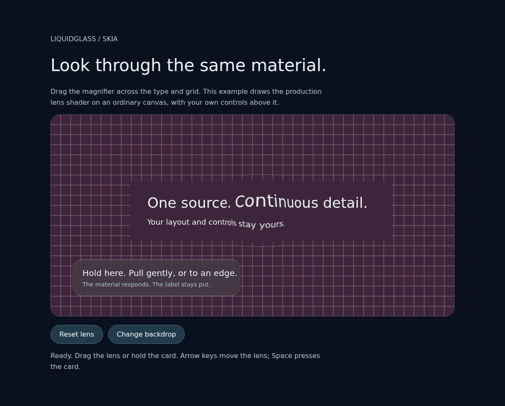 |  |

All seven required checks passed at `a4ed995`: 327 library tests (300 passed, 27 skipped, zero
failures), two desktop tests restored from the Gradle cache, Android builds, 12 portable numerical checks, ten Skia checks and
four browser checks. The build job took 23m41s.

These are headless Chromium WebGL captures of `a4ed995`, before the small-source edge correction;
they do not verify that later correction, a native physical GPU, or an Apple comparison. Software
tests and subsequent hosted results are recorded separately in [verification.json](atlas/verification.json).

Compiled shader uniform names, offsets and child bindings are now inspected once and reused. The
public layout API returns copies, so inspection cannot mutate later drawing. Named-input validation
and all rendered comparisons remain enabled. An alternating seven-batch CPU comparison against
`a4ed995` measured **105.047ms before / 13.100ms after** per 2,000 material bindings and native shader
creations/deletions (one warmup per version, Node 24.19.0 on Windows). This is approximately 52.5µs
versus 6.55µs per binding in this batch, not a whole-renderer speedup or an FPS measurement.
[Raw timings](atlas/portable-bindings-timing.json) retain every batch. Reproduce with
`node ports/skia/benchmark-bindings.mjs path/to/baseline-renderer.mjs`, saving the earlier renderer
from Git first; omitting the argument measures only the current implementation.

Both corrections passed all seven required checks at `f179971` in
[CI run 37212692991](https://github.com/shayann07/liquidglass/actions/runs/37212692991):
12 Skia tests, five browser tests and 12 portable numerical tests. Strict docs, dependency review
and both CodeQL languages pass. The build took 52s: unchanged Kotlin/desktop inputs reused Gradle
test outputs (`FROM-CACHE`), including 327 library tests (300 passed, 27 skipped) and two desktop
tests. This is valid reuse of the earlier suites, not a fresh native or physical-device execution.

## Desktop visual evidence

Both full-window images below are native Skia buffer captures on Windows, at 1920×1051, Direct3D.
The before image is from base `dd52d12`; the after image includes the new public APIs and calm bar.

| Before | After |
| --- | --- |
| 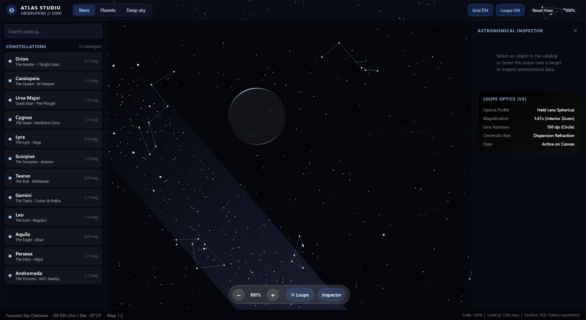 | 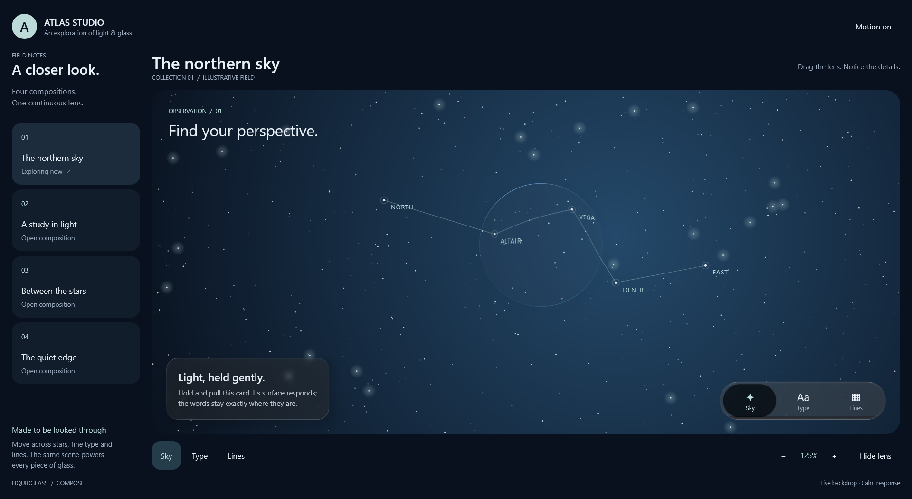 |


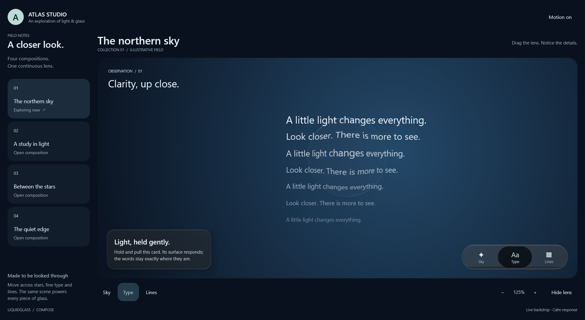

The typography follow-up was launched and captured again on native Windows Direct3D after the clock
fix. Its text now crosses the default lens position; the earlier placement left it over empty space.

The grid is a useful falsifier: its lines stay connected through the new lens instead of skipping an
inner annulus. A thin outer lighting highlight remains intentional; removing every highlight is not
the defect being fixed.

| Held navigation mapping used as a free lens | Continuous lens mapping |
| --- | --- |
| 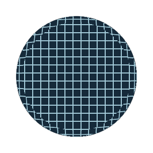 | 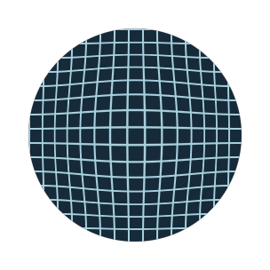 |

These two small images are production shader renders with identical synthetic input, not screenshots
of iOS. The ramp tests additionally check monotonicity, boundary identity and centre gain at three sizes
and four magnifications. The endpoint test checks material/foreground source agreement in rendered pixels.

The [extreme diagonal](atlas/test-extreme-diagonal.png), [type scene](atlas/test-scene-1.png) and
[recovered scene](atlas/test-recovered.png) are Compose test-renderer captures. They are deliberately
labelled separately from native window captures. They verify the app's actual pointer/control paths;
no physical Android performance claim follows from them.

### Whole-bar pull and throw follow-up

| Held | Full-screen upward pull | Full-screen corner pull |
| --- | --- | --- |
| 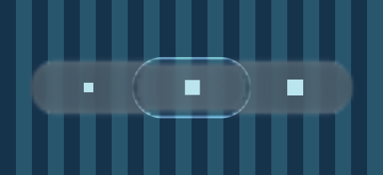 | 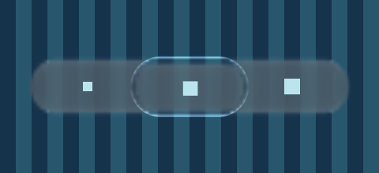 | 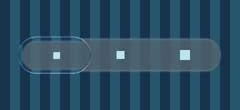 |

These are actual production navigation renders in the Compose desktop test harness, 480×220,
not iOS screenshots or native-window screenshots. The same pointer stays down while travelling
through ±2000px in both axes. The test checks unchanged layout/hit bounds, valid selector geometry
and release ownership. Labels stay anchored and the bar's long axis stays level. The captures
show the selected item changing on horizontal travel, without a free-button vertical squeeze.

An additional defect was found in inherited release dynamics: it zeroed the speed driving the spine.
The calm preset now uses the body's release speed for travel deformation while press formation
continues fading. In the authored 360px-bar trace, short/long held trips add 3.93/12.09px of half-spine;
released trips add 13.38/26.37px after the arrival refinement below. Both return to 78×58px rest. The original-reference 1.23-height
ceiling remains satisfied. [Raw traces](atlas/selector-travel.csv) preserve every sampled frame.
These figures characterize this model; they are not measured Apple motion rates.

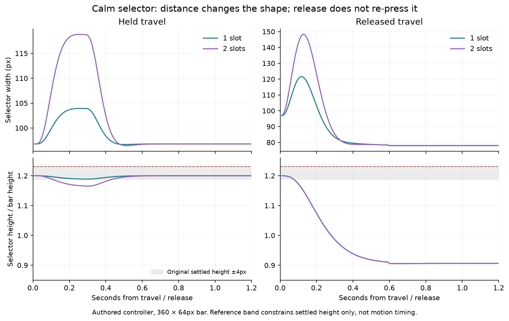

The gray band shows the original settled-height tolerance, scaled to this fixture; the red dashed line
is the conservative 1.23 ceiling. Motion timing is authored. A separate frame-cadence test initially
found a 6.82px difference at 100ms between 30Hz and 120Hz presentations of the same input stream.
The calm controller now integrates the preceding target up to each input's timestamp and ignores stale
presentation timestamps. Reversal and throw traces pass at 30/60/90/120Hz within 1.5px geometry and
0.015 formation. Waking after a stationary hold also resumes the frame clock from the input clock,
so the next move does not freeze while the display catches up with an idle interval. Historical
controller clock/rebase behavior is preserved outside the calm path.

### Resting-tap arrival: a missed phase

| Original transient arrival (IMG_6695) | Original settled rest (IMG_6701) |
| --- | --- |
| 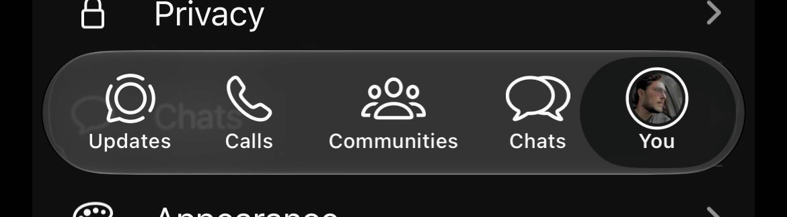 | 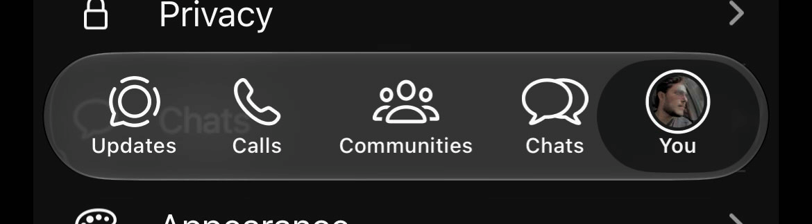 |

These existing decoded crops belong to the owner's untimed 6690–6701 tap sequence. They support
the ordered shape change; they are not timestamped finger samples. No exact colour or timing fit is
claimed from them, and adjacent stills are not independent holdouts.

The existing historical recovery test was not exercising Calm. Adding it revealed a failure: at
252px rest width, the four-slot Calm trace peaked at 457.64px but never compressed below rest.
Reducing shape damping from 0.72 to 0.45 and target half-spine gain from 0.55 to 0.42 slots restores
that phase without increasing the peak. It now reaches 450.63px, compresses to 238.08px (5.5%) and
settles at 252px. The one-slot peak is 327.88px. These are authored model outcomes; the test's broad
2.5–14% compression bound is a review constraint, not a measured Apple spring constant. Centre,
press and held-travel settings stay unchanged.

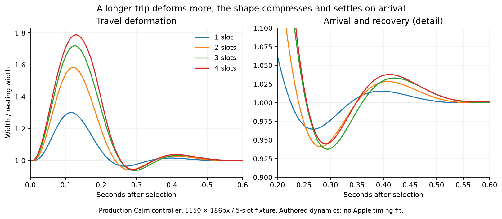

[Raw tap trace](atlas/selector-arrival.csv). All 38 focused controller/reference/lifecycle tests pass
after the correction, including cadence, idle resume, held extremes and throw recovery. The initial
failed Calm arrival check remains recorded in `verification.json`.

### Resting-tap arrival: paired recoil

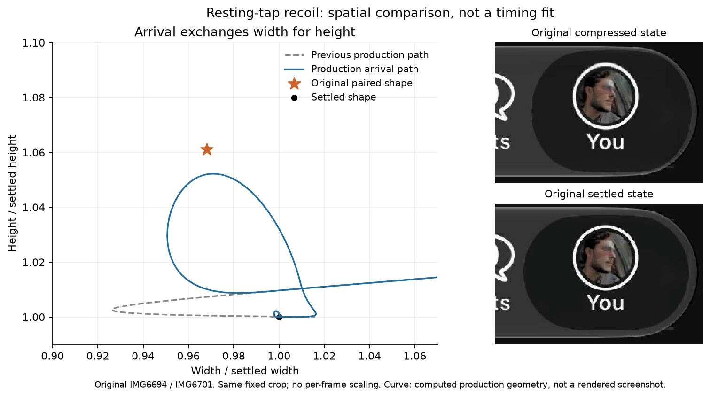

Original `IMG_6694` and `IMG_6701` supply two states from the owner's ordered arrival
stills. Fixed unscaled scan windows give median compressed/settled dimensions of **227.5×174px /
235×164px**: width ratio **0.968085**, height ratio **1.060976**. The record includes all sixteen
gradient probes per axis (luma and RGB at four positions), original hashes and exact scan windows.
The windows exclude neighboring Chats ink and the surrounding bar. These untimed stills identify
a paired shape, not a peak, frame rate, finger trace or spring constant.

The previous controller compressed width without appreciable vertical recovery. With the final
regression and the correction disabled, its closest paired state was **222.88×163.20px**, with
height ratio **1.007394**, failing the selected **1.060976±0.02** gate. The correction passes at
**222.55×170.41px**, ratios **0.967669 / 1.051907**. The fixture's settled geometry is 230×162px;
normalization avoids pretending it has the original's exact resting dimensions. The production path
in the figure is computed geometry, not a rendered screenshot. Its timing is not matched to iOS.

Calm opts into an internal `tapRecoilArea` policy. Only during resting-tap compression, the pressure
target exchanges a shortened spine for cap growth using the projected capsule area
`A = pi*r*r + 4*a*r`. For compressed half-spine `b`, the stable positive-radius solution is
`r' = A / (sqrt(4*b*b + pi*A) + 2*b)`. The existing pressure state approaches that target at an
authored rate of `max(tapPressureOmega, 4*tapSpineOmega)` (104/s in Calm). This is an approximation
to a geometric constraint, not an Apple fluid law, recovered timing, or faster touch response.
Positive travel elongation, held/throw response, historical presets and generic glass are unchanged.
The measured midpoint remains **329.7385×171.3598px**.

Two rejected candidates matter: multiplying the resting spine by pressure changed the already-fitted
midpoint, and ordinary transit pressure recovered height too late. An initial assertion also wrongly
treated `IMG_6694` as the minimum-width instant. The final test searches for a **joint** width/height
state after 95% travel and separately caps compression at the selected conservative width floor
`0.968085 - 0.02`. The observed minimum is **0.950639**. This floor is a chosen regression bound,
not a claim that the two stills establish Apple's maximum compression. Matching this calibration
pair is not independent validation of complete parity.

The broader focused run passed **57 tests**. The subsequent three-test arrival class also passed
with reversed one-to-four-slot trips at 30/60/90/120 Hz, subpixel shape agreement and unchanged
reduced-motion dimensions. The final negative control failed before restoration of the correction.
Implementation `8d9917a` passed full local verification in **10m 20s**: **309 library tests passed,
27 skipped, zero failures/errors; both Atlas tests passed; Android sample assembled**. The suite
reported 519.189s for the library and 98.647s for Atlas. Tests executed freshly.


The inspected native app-owned capture is 1920×1051 Direct3D. After CPU tests finished,
[120 static redraw submissions after ten warmups](atlas/checkpoint-8d9917a-native-timing.json)
measured **11.2165ms median / 19.8045ms p95 / 23.3515ms maximum**.
This resting capture verifies native launch/rendering, not the transient recoil; submission timings
are not presented FPS or input latency. All seven required checks passed in [hosted run 37683713350](https://github.com/shayann07/liquidglass/actions/runs/37683713350).
The build job took **22m19s** (Gradle **21m42s**); fresh library execution passed 309 tests with
27 skipped and zero failures in 17m23.81s. Both Atlas tests executed freshly and passed in 2m55.19s.
Skia, browser, dependency review, both CodeQL jobs and documentation also passed.

Reproduce measurements and the optional chart:

```sh
python tools/measure_tap_arrival.py review/atlas/reference-6694.png review/atlas/reference-6701.png \
  --output review/atlas/reference-tap-arrival.json \
  --trace review/atlas/tap-arrival-trace.csv --before-trace review/atlas/tap-arrival-before-trace.csv \
  --plot review/atlas/tap-arrival-comparison.png
```

Pillow is required; the optional figure additionally uses Matplotlib and NumPy.
[Raw reference scans](atlas/reference-tap-arrival.json) and
[production-controller trace](atlas/tap-arrival-trace.csv) are preserved separately.
The dashed [previous trace](atlas/tap-arrival-before-trace.csv) was sampled from the production
controller before the correction, using the same fixture and 480 Hz sampling. Each curve is
normalized by its own settled dimensions; neither curve contains recorded iOS timing.

### Held travel: two shapes instead of one frame

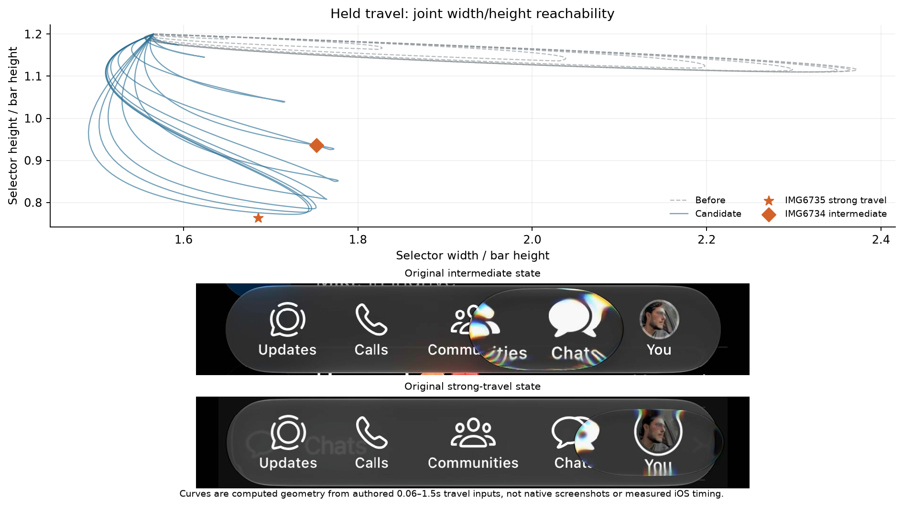

Original IMG6734/6735 contradict the previous held model's nearly constant height. Fixed unscaled
gradient scans give **326×174px** for the intermediate selector and **313.5×142px** for the
flattened selector, with a **186px** bar. These are bar-only crops `(0,108,1168,302)` of the
existing 1168×360 images. Every luma/R/G/B probe, signed edge window and crop hash is preserved
in the [intermediate](atlas/reference-held-intermediate.json) and
[strong-travel](atlas/reference-held-travel.json) records. Optical rim/ink ambiguity motivates
the authored ±6px regression tolerance; it is not a statistical confidence interval.

The prior Calm model reached 313.66px width with **215.46px height**, far from the flattened
original. The candidate uses a .28-slot held half-spine gain (previously .45), .47 maximum log
contraction (previously .10), and an authored 60/s pressure response only while contracting during
held travel. Ordinary 22/s press growth is unchanged. Contraction scales with material formation
to avoid collapsing an unformed press during immediate fast travel. The held spine follows
`s*(2-s)`, where `s=v²/(V²+v²)`, retaining intermediate breadth without raising maximum extension.
Off-axis selector gains remain zero: perpendicular pull belongs to the bar. Rates are authored.

Production-controller sweeps cover four-slot trips lasting an authored 60–1500ms at 480Hz after
a stationary hold. They reach **314.03×144.19px** and **326.03×173.93px**; minimum height is
**143.56px**, above the chosen 136px floor. Stationary held height recovers. These matched states
can come from different sweeps: this proves joint width/height reachability, not one matched iOS
trajectory. Both stills are now calibration data. The graph is computed geometry, not a screenshot.

| Rejected candidate | Result |
| --- | --- |
| .22 gain, .40 contraction, ordinary pressure rate | About 314×165px; too tall |
| .25 gain, .47 contraction, 60/s travel contraction | About 304×144px; too narrow |
| .28 gain, linear speed-to-spine response | Strong state passed; intermediate about 302×172px failed |
| Concave held response with shared safety limit | Both held states passed; lowering held gain clipped independent tap motion |

The last defect required a separate tap allowance. Calm retains its previous .45-slot envelope
for tap spring overshoot; controller clamp and render-node allocation use the largest declared
tap/held allowance. A fail-first test caught a 351.89→351.21px tap-width change. After correction,
all 481 sampled tap states match the previous curve within 0.001px. Midpoint remains
**329.73853×171.35977px**, paired arrival **222.55109×170.40918px**.

All 12 focused tests passed, covering ordinary press identity, early drag bounds, end anchors,
off-axis ownership, reverse/throw cadence and tap recoil. Full local verification finished in
**17m16s: 312 library passed, 27 optional showcases skipped, zero failures/errors; both Atlas tests
passed; Android assembled**. Library execution reported 851.847s and Atlas 163.227s, all fresh.
Implementation **820659d** passed all seven required checks in
[hosted run 37770922905](https://github.com/shayann07/liquidglass/actions/runs/37770922905).
Fresh library execution: 312 passed / 27 skipped / zero failures in 23m43.86s; both Atlas tests
passed freshly in 4m51.41s. The build job took 30m52s (Gradle 30m18s). The full report and build
log were inspected; neither JVM nor Atlas execution was restored from cache.


The app-owned 1920×1051 Direct3D capture was inspected after CPU tests finished. Its
[static redraw submissions](atlas/held-travel-native-timing.json) measured **8.1551ms median,
13.4829ms p95, 54.0905ms maximum** over 120 samples after 10 warmups. This verifies native launch
and resting rendering, not transient held motion, input latency, presented FPS or a controlled
speedup. Failed candidates remain in local logs; the next motion work needs independent trajectories.

Reproduce with Pillow; the optional plot also requires Matplotlib and NumPy:

```sh
python tools/measure_held_travel.py review/atlas/reference-6734-bar.png --state intermediate \
  --output review/atlas/reference-held-intermediate.json
python tools/measure_held_travel.py review/atlas/reference-6735-bar.png \
  --output review/atlas/reference-held-travel.json
python tools/plot_held_travel.py --trace review/atlas/held-travel-trace.csv \
  --before review/atlas/held-travel-before-trace.csv \
  --strong review/atlas/reference-held-travel.json \
  --intermediate review/atlas/reference-held-intermediate.json \
  --output review/atlas/held-travel-comparison.png
```

`GlassHeldTravelReferenceTest` emits the CSV under `liquidglass/build/reports/atlas/`.
The [before trace](atlas/held-travel-before-trace.csv) uses the same fixture and input sweep.

### Release attribution: the assumed rest still contains a lens

The inherited `GlassTabBarStyle.subside` comment called LOLL8185 CFR1944 an observed finger-up
and cited a367ms release. The research E7 record later separated a313.8ms raised-area measurement
from that fitted first-order duration, but retained CFR1968–1988 as trailing rest. Fresh decoding
of the hash-verified original contradicts that baseline:

| Inherited label | Exact native time | Original bar-only crop |
| --- | --- | --- |
| Finger lifted, CFR1944 | PTS19441/600 =32.401667s | 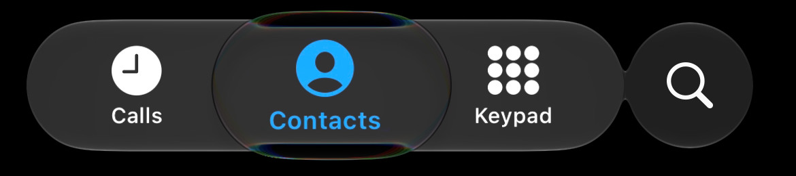 |
| Trailing rest starts, CFR1968 | PTS19681/600 =32.801667s | 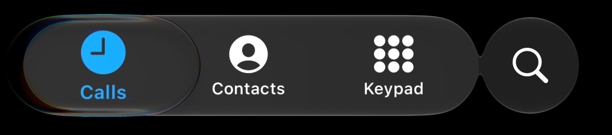 |
| Within trailing rest, CFR1980 | PTS19801/600 =33.001667s |  |

The latter two inherited rows report `raised_area=0` and no lens bounds, yet the original pixels
still show a large rim and refracted/magnified Calls icon. The selector has travelled from Contacts
toward Calls. A disappearing above-bar detector signal therefore does **not** establish a flat
resting inset or an isolated release-to-rest. No finger event is visible, so this does not prove
exactly when the owner released; it rejects the claimed calibration, not every possible release.

The [provenance manifest](atlas/release-attribution.json) retains the original source hash, exact
PTS, decoded image hashes, inherited rows, crop and reproduction command. The first-frame `showinfo`
PTS was checked against each inherited row. CFR labels were not divided by60 and silently treated
as native source indices. A trial interpretation as native indices landed in an unrelated App Store
traverse around41–42s and was rejected. Only the matched native-time crops above are public evidence.

The source comment now calls the existing historical spring an **authored compatibility baseline**.
No release constant changed on this evidence. Earlier research remains preserved as history;
its314/367ms attribution must not be reused as a verified release target. The next timing fit needs
an inspected sequence that actually settles to a resting inset, with a defensible gesture boundary.

### Additional held shapes: audit the frozen model

The 820659d correction was calibrated with IMG6734/6735. Three other original stills,
IMG6727/6728/6729, were measured afterward against the **unchanged, already verified** production
trace. These frames were inspected historically; they were not used to choose the 820659d gains.
They are an additional spatial audit, not independent timed validation.

| Original bar-only crop | Median measured width × height | Full probe ranges | Frozen model's closest paired state |
| --- | --- | --- | --- |
| 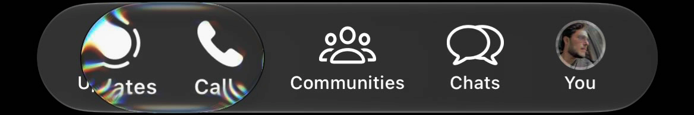 | 309×188px | Width307–309; height188 | 309.07×184.13px: within existing6px gate |
| 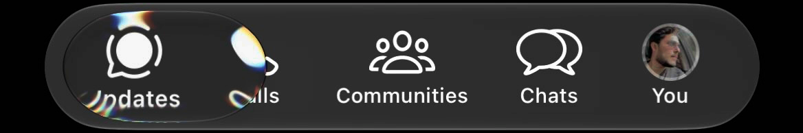 | Width unresolved; height161.5px | Width294–308; height159–163 | Not scored: side glyph contamination exceeds the existing tolerance |
| 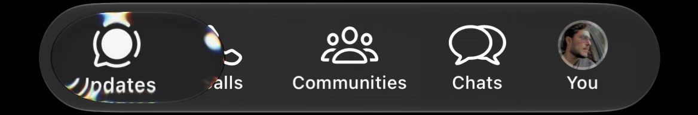 | 290×154px | Width289–292; height152–154 | 289.87×153.50px: within existing6px gate |

The [measurement tool](../tools/measure_held_validation.py) records every fixed-window RGB probe,
input-image hashes, the frozen trace hash and the selected authored samples in the
[audit data](atlas/held-travel-validation.json). It does not widen the tolerance or silently
drop disagreeing probes. Reproduce with:

```sh
python tools/measure_held_validation.py review/atlas review/atlas/held-travel-trace.csv --output validation.json
```

No motion constant changed from this audit. The accepted pairs occur at different positions and
speeds in the authored sweep. Finding them establishes **shape reachability only**; it neither
reconstructs the original gesture nor proves its contour, timing, release state or optical identity.
Width and height alone remain insufficient. The original JGEY2190 dataset has timestamped frames,
but its inherited rim detector drops the body during release and its glyph track is tab-quantized;
those tracks must not be treated as a measured finger trajectory. The next motion comparison needs
an inspected, continuous contour track before changing rates from those data.

### Native motion phase captures

The initial [phase sheet](atlas/native-motion-phases.png) is historical evidence. Its timing
method is superseded by the dispatcher correction below; the native images remain preserved.

Atlas's opt-in `atlas.motionCapture` mode exercises the real sample through its own Compose AWT
mouse component. It does not retarget the controller, set selection directly, move the OS cursor
or capture another window. Layout bounds in root pixels determine input coordinates, converted
once by the native content scale (1.25 here). The ordinary sample selection callback and layout
observer verify Sky→Lines taps, Lines→Sky held drags, extreme-corner selection and fixed bounds.
The library implementation is unchanged from **820659d**.

The inspected run saved 16 native Direct3D snapshots: rest, four tap phases, a stationary hold,
three held-travel phases, four release phases, two ±4000px corner pulls and recovery. Navigation
layout stayed at `(1515,804,350,80)` pixels. The visible bar deforms mildly within this fixed
layout; held selectors travel and recover. These 350×80 desktop controls are not a pixel-aligned
comparison against the original 1044×186 iOS fixture. Mouse delivery also does not replace
physical touch verification.

The first approach was rejected: a screenshot after every phase paused input for roughly 1.4s.
Deferring PNG encoding did not solve it; native bitmap readback itself was slow. Each final phase
therefore starts a fresh gesture replay, with **no preceding screenshot during that gesture**.
PNG encoding is deferred until input completes. The contact sheet keeps source pixels unscaled
and follows CSV order, not filename sorting. It is not a continuous video.

The CSV records actual times, not requested delays. For example, the requested 25ms tap snapshot
started rendering 30.4ms after UP but its redraw submission took **122.8ms**. The 70ms snapshot
began at 76.2ms and took 19.4ms. Those replays are not interchangeable samples of one ideal timed
curve: first scene-switch/JIT/render work can change the result. Other sampled redraws took
8.4–31.9ms; readback took 1.35–1.52s. These are diagnostic submission/readback durations, not
presented FPS or end-to-end input latency. A subsequent diagnostic failure made the 122.8ms result provisional. It must not be treated
as an established renderer bottleneck; see the corrected paired runs below.

All native selection/layout assertions passed in the 1m3s run. The earlier stale observation
through a deferred composition side effect was replaced by observation at the sample's actual
selection callback; images had already shown selection changing. No library behavior was patched
to satisfy the playback. The separate desktop/Android regression run is recorded in the ledger.

[Original PNGs, events and metadata](atlas/native-motion-2026-10-08/) are preserved together.
[Reproduction commands](../WORKSPACE.md#native-motion-diagnostics) use only the private wrapper
and application-owned capture mode. The [plotter](../tools/plot_native_motion.py) needs Pillow.

### Native diagnostic correction: isolate redraw from playback

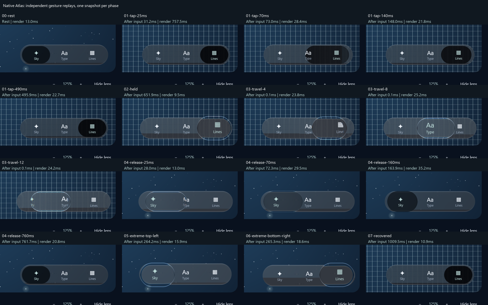

Turning off readback exposed a flaw in the measurement tool: forced native redraw could flush
the Compose coroutine dispatcher and re-enter its own playback continuation. That run raised
`ConcurrentModificationException` / `CoroutinesInternalError`, delivered a drag after release
and failed the Sky selection assertion. Its [event trace](atlas/native-motion-swing-2026-10-08/rejected-compose-dispatcher-events.csv)
is retained as a rejected run. It is not evidence of a glass rendering or gesture-controller defect.

Static and motion diagnostics now run on the plain Swing dispatcher. Explicit guards reject
capture re-entry and invalid pointer transitions. Metadata reports whether assertions completed;
bitmap cleanup also covers metadata/encoding failures. The desktop-only coroutine dependency is
the same 1.11.0 already supplied at runtime by Compose. Library behavior is unchanged.

Both corrected runs passed selection and fixed-layout assertions, produced 16 phase records,
and passed a separate event-sequence audit with the pointer released at the end:

| Corrected own-window run | First scene-switch submission | All sampled submissions | Readback | Duration |
| --- | ---: | ---: | ---: | ---: |
| Native snapshots | 757.5ms | 9.5–757.5ms | 2546.9–3664.7ms | 1m32s |
| Readback disabled | 59.9ms | 8.3–82.3ms | None | 39s |

An earlier corrected no-readback run measured 74.2ms for the first scene switch. This variation
and the snapshot overhead preclude a controlled speedup or renderer-cause claim. In the final
sheet, the requested 25ms phase begins rendering 31.2ms after UP, but its submission takes 757.5ms;
the image can therefore look farther progressed than the later nominal phase. **Requested delay
is not visible frame time.** These are independent native snapshots, not a presented-frame trace.

The [corrected static Atlas screenshot](atlas/native-motion-swing-2026-10-08/static.png) was also
inspected at 1920×1051 Direct3D. Its 120 submissions after ten warmups measured 15.781ms median,
18.9464ms p95 and 23.9217ms maximum. This verifies the corrected capture path, not interactive FPS.
CSV, metadata, all images and static timing are kept in the [corrected evidence directory](atlas/native-motion-swing-2026-10-08/).

The preceding playback implementation **078357d** passed all seven required hosted checks in
[run 37812243775](https://github.com/shayann07/liquidglass/actions/runs/37812243775). Library tests
were restored from their verified 820659d cache; both Atlas tests ran freshly in 5m7.41s. The build
job took 6m55s (Gradle 5m59s). The dispatcher correction0e5c1d6 subsequently passed all seven required checks in run37822979856.
Fresh library:312 passed/27 optional showcases skipped/zero failures in13m31.84s; both Atlas tests
passed freshly in2m15.39s. Build job18m24s; Gradle17m49s. Reports were inspected.

### Resting-tap midpoint: height was late

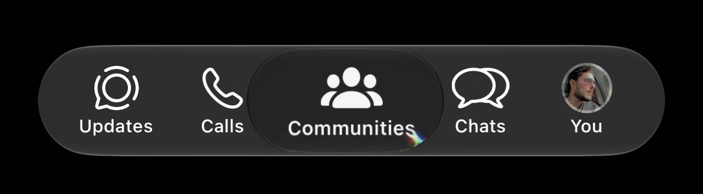

The earlier arrival correction above still left the selector too flat midway through the trip.
This original owner-supplied 1170×324 crop shows 171–173px height in six clear central columns.
Seven horizontal scans give 325–328px width, with centre about 574px; approximate settled centres
189/981 place it at 48.6% of the trip. These are selected cross sections, not a complete silhouette
fit. The conservative rounded test gates are 172±4px high and 330±12px wide at phase 0.487.
The fixture retains the inherited rounded 186px bar height although this crop spans about 184px.

| Same production controller fixture / phase 0.4911 | Width | Height | Reference gates |
| --- | ---: | ---: | --- |
| Before this correction | 336.41px | 162.96px | Height fails |
| Height response alone | 344.81px | 171.36px | Width fails |
| Separate transit response and reduced spine gain | 329.74px | 171.36px | Both pass |

The cause was cascaded optical-formation and pressure springs: the geometric height lagged until
too late in the trip. Calm now drives a separate critical transit-pressure spring from the existing
movement target. Its authored rate is 45/s; target half-spine gain falls from 0.42 to 0.36 slots because
the taller end caps also add width. Centre motion, optical formation, held/released pressure and
historical presets are unchanged. This is a spatial fit, **not recovery of Apple's timing**.

The separate 1150×186px fixture now peaks at 429.27px on a four-slot trip, compresses to 232.87px
(7.6% below its 252px rest width), then recovers. The one-slot peak is 319.88px. These replace the
earlier authored outcomes above; that earlier plot and CSV remain labelled historical evidence.
Fifteen focused controller/reference tests passed, including held/throw behavior, endpoint bounds
and shape recovery. The subsequent complete runs passed locally and on GitHub at `87e17a4`:
328 library tests (301 passed, 27 skipped, no failures), both Atlas desktop tests and the Android
sample build. The local run took 20m35s. All seven required checks passed in
[CI run 37234834817](https://github.com/shayann07/liquidglass/actions/runs/37234834817); its build job
took 17m37s, with fresh library/desktop test execution (13m19.44s / 2m24.98s reported by the suites).
Twelve Skia tests, twelve portable math tests and five hosted browser tests also passed.

Reproduce the original pixel measurements with Pillow installed:

```sh
python tools/measure_tap_midpoint.py review/atlas/reference-6698.png
```

[Raw measurements and source hash](atlas/reference-tap-midpoint.json).
The `GlassTapPhaseReferenceTest` compares the production controller at the closest spatial phase,
checks containment on every step, and requires return to 162px resting height. It does not compare
colour, native GPU motion or elapsed time. This single still was used to tune the authored model;
it is not an independent validation set or evidence of full 1:1 parity.


This fresh 1920×1051 Direct3D capture reads Atlas's own render buffer. The library and desktop test
processes had finished before capture. Static forced redraw submissions measured 9.2794ms median,
12.2323ms p95 and 14.3365ms maximum over 120 samples after 10 warmups
([raw timing](atlas/checkpoint-87e17a4-timing.json)). These are neither presented FPS nor input
latency. The difference from earlier observations is not a controlled performance improvement.
The screenshot is a resting frame; the phase-specific correction is scored by the controller test.

| Atlas extreme corner drag | Navigation corner pull |
| --- | --- |
| 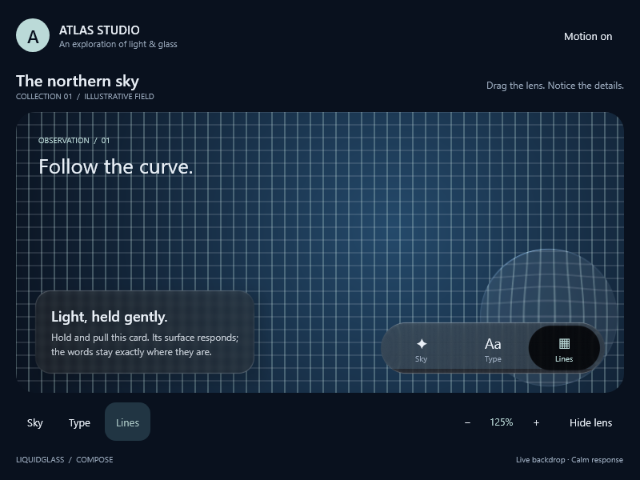 | 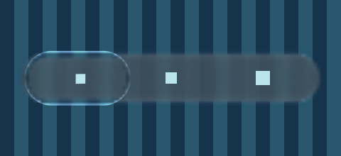 |

These two current gesture captures come from desktop Compose software tests (800×600 Atlas;
480×220 navigation fixture with quarter-scale backdrop). They verify rendered containment and
stable layout in the tested paths, not native GPU gesture latency or matched Apple optics.

### End-anchor travel: movement outside the bar is not selector travel

The original T04 crop above and the owner's distinction between bar squeeze and selector travel
prompted an additional audit at the end anchors. The centre was already bounded, but the shape
still used raw finger speed. Reversing between two positions far beyond the same end therefore
stretched and squeezed a selector that had nowhere left to travel.

| 360×64px controller fixture, saturated left anchor | Before | After |
| --- | ---: | ---: |
| Maximum width change from the settled hold | 72.47px | 0.00px |
| Maximum height change from the settled hold | 7.30px | 0.00px |

The new regression initially failed. Calm now differentiates the bounded grasp target, using the
same anchor function for shape-driving speed and centre tracking. Both samples use the current
grasp offset, preventing a change in the shape itself from masquerading as finger velocity.
Further outward, reverse-outward and diagonal motion beyond a saturated anchor introduces no
new selector travel. Returning inside the tab range resumes deformation; raw selection intent and
whole-bar feedback keep their separate roles. The right-anchor test also records zero change.
This is a causal correctness check, not a fitted Apple pointer-speed measurement.

All 39 focused controller/reference/lifecycle tests pass, including the original height and arrival
gates. The short/long held and released travel measurements above remain unchanged. The actual
Compose navigation test also checks 12 in-flight frames beyond the left anchor, rather than waiting
for a wrong shape to recover before taking a screenshot. It passes in 52.46s; the production fling
test passes in 5.72s. The combined full build for this correction is pending.

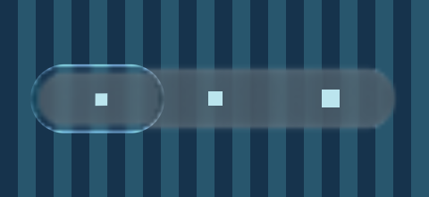

This is a 480×220px Compose software-renderer capture with quarter-scale backdrop sampling. Its
selector is at the left anchor and the pointer keeps moving between x=-2000 and x=-4000. The bar's
layout bounds and valid selector geometry are asserted throughout. This is not a matched iOS render.

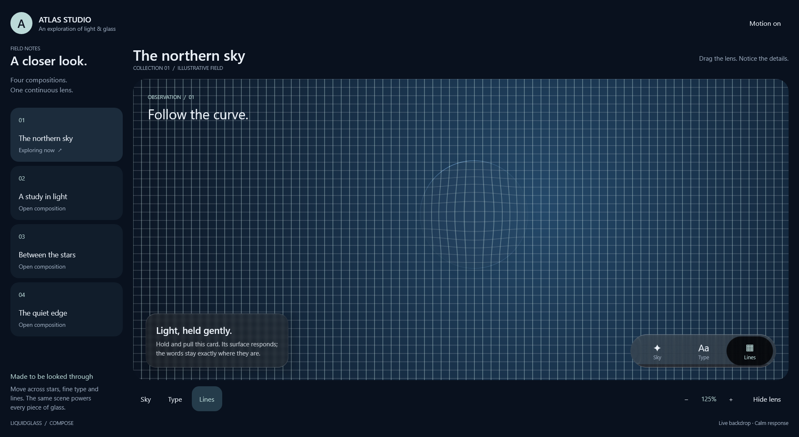

The current Atlas application also launched and captured its own 1920×1051 Direct3D buffer.
The line-grid magnifier retains a continuous interior. Static redraw submissions over 120 samples
after ten warmups measured median 10.83ms, p95 14.66ms and maximum 18.31ms;
[raw timings](atlas/native-end-anchor-timing.json). These are not presented frames or input latency,
and the static native capture does not itself verify the edge gesture covered by the component test.

### Portable production rendering

`ports/skia` exports the evaluated production material/content/aperture shaders and provides a
CanvasKit adapter. Its terminal tests compile all three, render all four material profiles and
compare against independent JVM-generated premultiplied RGBA fixtures. Maximum channel difference
was 1/255 in each profile (mean 0.00098–0.00214 levels). This establishes software-backend agreement
for those fixtures. It does not verify every style, platform integration, browser GPU or navigation host.

The [web preview capture](atlas/web-preview-ci.png) is from headless Chromium in GitHub Actions.
The dependency-free GLSL lens and full Skia shader kit are separate integration choices.

The high-level `createGlassPainter` removes manual uniform binding for clear lenses. Its tests move
round and nonsquare lenses over a coordinate ramp, check page registration and centre gain, replace
the source, preserve the host transform and verify borrowed-image lifetime. It owns no gesture or
platform capture policy. `npm run example` produces the following grid using that same public API:

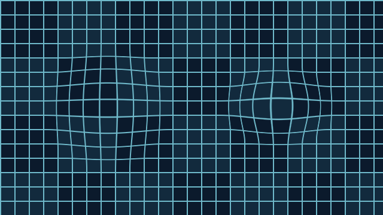

This is a terminal CanvasKit software render, not a browser screenshot or an Apple reference. The
left lens uses 1.25× centre magnification; the right uses 1.6×. The example has no Compose dependency.

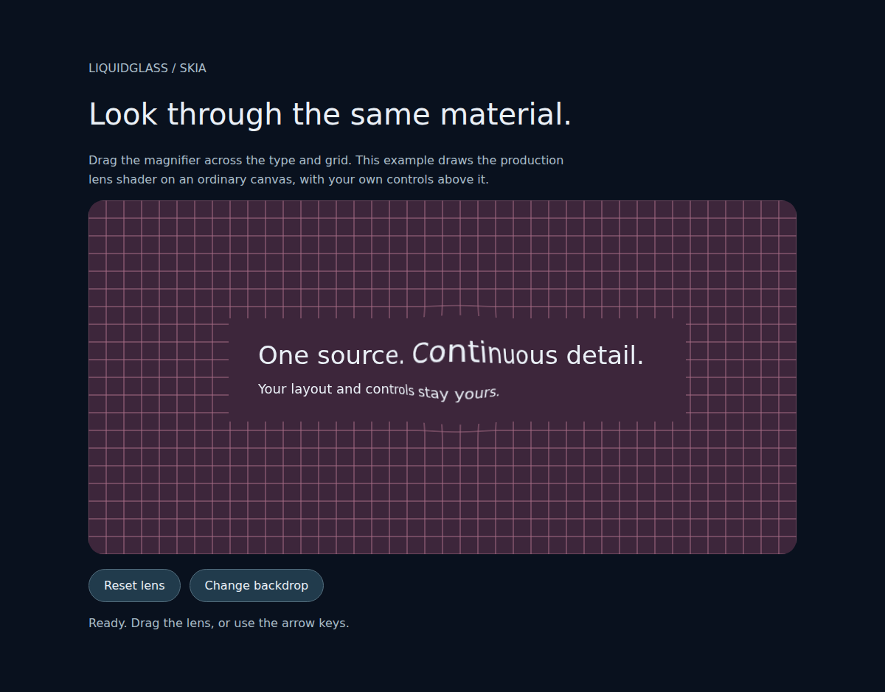

The browser follow-up at `13e62fd` passed in [CI run 37151905671](https://github.com/shayann07/liquidglass/actions/runs/37151905671).
It explicitly creates a Skia WebGL surface and verifies keyboard/pointer movement, reset, source
replacement and exact rendered restoration after simulated context loss. All three browser tests pass,
including the separate lightweight WebGL renderer. This is headless Chromium evidence, not a physical
GPU performance measurement or verification of Safari, Firefox, mobile WebViews or native framework bindings.

## Verification at this stage

[Machine-readable results](atlas/verification.json).

- Focused optics and calm tests passed, including the shared material/foreground mapping and extreme
  perpendicular selector pulls. Short and long navigation trips produce different shape extents and recover.
- Full library run: 313 tests, 285 passed, 27 skipped, one new fixture expectation failed. It inherited the
  legacy capsule's grasp offset; pose navigation selects from finger intent. After correcting that fixture,
  all 14 calm gesture tests passed. The complete corrected build then passed in
  [CI run 37128280319](https://github.com/shayann07/liquidglass/actions/runs/37128280319), 22m23s.
  The later [CI run 37131042764](https://github.com/shayann07/liquidglass/actions/runs/37131042764)
  ran 316 library tests: 288 passed, 27 skipped and the new bar-render fixture exceeded its three-minute
  software-rendering timeout. That failure is retained in the record. The fixture now uses quarter-scale
  backdrop sampling and a six-minute budget, with the same full-size coverage, gestures and assertions.
  The corrected focused run passed all 50 tests, including the actual bar capture in 124.10 seconds,
  14 navigation gesture tests, original-height matching, cadence and idle-resume regressions.
  The complete correction passed in [CI run 37148115654](https://github.com/shayann07/liquidglass/actions/runs/37148115654):
  319 library tests, 292 passed, 27 explicitly skipped, zero failures; build job 12m50s. Web, Skia,
  dependency review, strict docs and both CodeQL languages also passed at `a7a929f`.
  The painter, test-cache declarations and Type-scene placement also passed in
  [CI run 37149121490](https://github.com/shayann07/liquidglass/actions/runs/37149121490) at `6d23039`:
  319 library tests, 292 passed, 27 skipped, zero failures, plus desktop tests and Android builds.
  Build job 16m45s; all seven required checks passed. The combined arrival-shape and Skia browser revision
  `13e62fd` passed [CI run 37151905671](https://github.com/shayann07/liquidglass/actions/runs/37151905671):
  320 library tests, 293 passed, 27 skipped, zero failures; two desktop tests and Android builds passed.
  Build job 12m57s. All seven required checks passed, including four Skia renderer tests and three
  hosted browser tests. The earlier arrival-only run was cancelled when this combined revision superseded it.
- Actual Atlas desktop tests: 2 passed. Earlier 60-second timeout runs are failures, not passes; the final
  fixture has an explicit six-minute budget for software rendering and completed in 165.5 seconds.
- Android sample assembled successfully. No physical-device verification of this revision.
- Four portable math tests and three CanvasKit production-renderer tests passed. The initial browser
  run passed interactive/keyboard checks but failed context restoration. The event-order correction passed
  the complete hosted browser job in run 37131042764, including context restoration and keyboard input.
  Local headless
  browser launch was blocked by automatic approval review (`blocked by policy`, no detailed reason).
- Strict documentation build passed. Repository-link verification and hosted checks are recorded when complete.

## Portable motion follow-up

Non-Compose hosts previously received only settled deformation math. `createCalmInteraction` now
provides timestamped press and bounded cumulative pull, cancellation, resize, viewport containment,
idle-resume and reduced-motion reset. It owns no UI events or timers. Its matrix deforms material
about the original centre; ordinary labels and hit targets stay in their host layout. This is
whole-surface feedback, not a port of the selector travel controller or its illumination.

Ten portable numerical tests pass, including independent 30/60/90/120/144Hz drawing schedules,
maximum finite over-pulls, all four edges and diagonal outline containment. Five CanvasKit tests pass;
the new test applies the controller to the production shader, measures centred rendered coverage,
checks the large-card envelope, and verifies exact pixel recovery after release. All four material
profiles retain maximum channel error 1/255 against independent JVM fixtures. The browser demo now
uses the controller for an anchored card with pointer/Space input and live reduced-motion changes;
all four hosted browser tests pass at `4ba6112` in
[CI run 37154026144](https://github.com/shayann07/liquidglass/actions/runs/37154026144), browser job 43 seconds.
The initial reduced-motion image comparison at `1f8f611` failed because keyboard focus decoration
intersected the canvas screenshot's rounded corners. The corrected check excludes that decoration
only during pixel comparison, still asserts keyboard focus, and preserves the real demo's focus ring.
Exact material recovery remains required; no image tolerance was loosened.
The combined revision also passed all seven required checks: 320 library tests (293 passed,
27 skipped, zero failures), two desktop tests and Android builds. Its full build took 12m45s.

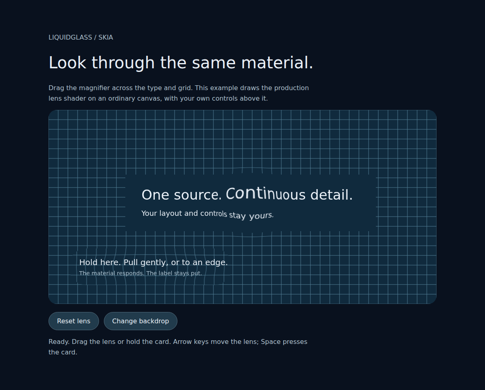

This is hosted Chromium WebGL evidence. The small matrix response affects the lower card while its
label stays anchored; the upper lens remains an independently movable magnifier.

These tests verify the authored portable contract. They do not turn Calm timing into an Apple
measurement or establish native bindings for every stack. The endpoint quantisation limitation at
that revision is addressed for Desktop Calm by the follow-up below; Android/legacy remain unchanged.

## Endpoint precision follow-up

The original endpoint pipeline rounded the composed material/ink into an 8-bit intermediate before
applying aperture coverage. The separate-input path combines premultiplied ink with material in float
and applies coverage before one output write. It is opt-in through Desktop Calm navigation.

| Same independent endpoint equation | Worst output-level error | Strict one-level gate |
| --- | ---: | --- |
| Legacy composed intermediate | 1.4256 | Not met |
| Separate material/ink inputs | 0.9569 | Met |

Both use the original 18 combinations of three pages, two ink patterns and three outlines:
199,788 visible pixels, including 11,124 with fractional coverage. The oracle starts at the
rendered material and ink outputs, evaluates source-over in double precision, and reads coverage
from output alpha. It does not measure optical fidelity to Apple, display colour transforms, or
rounding from the final framebuffer write. The old gate and its 1.5-level quantisation budget remain
reported explicitly; no tolerance was increased to admit the new path.

The CanvasKit independent-input test also passes at 0.9668 levels over rounded, asymmetric and pose
outlines, with 1,376 fractional pixels. It verifies that the lower storage region stays transparent.
All six portable Skia tests pass, and all four production profiles retain at most 1/255 channel error
against the independent JVM reference pixels.

### Native failure found and corrected

The first Compose integration sampled an ink strip by adding a vertical offset inside the shader.
Its numerical and uncropped component tests passed, but the actual Direct3D capture lost the selected
"Lines" label: the strip lay outside the window and its dependency was invisible to Skia's filter bounds.

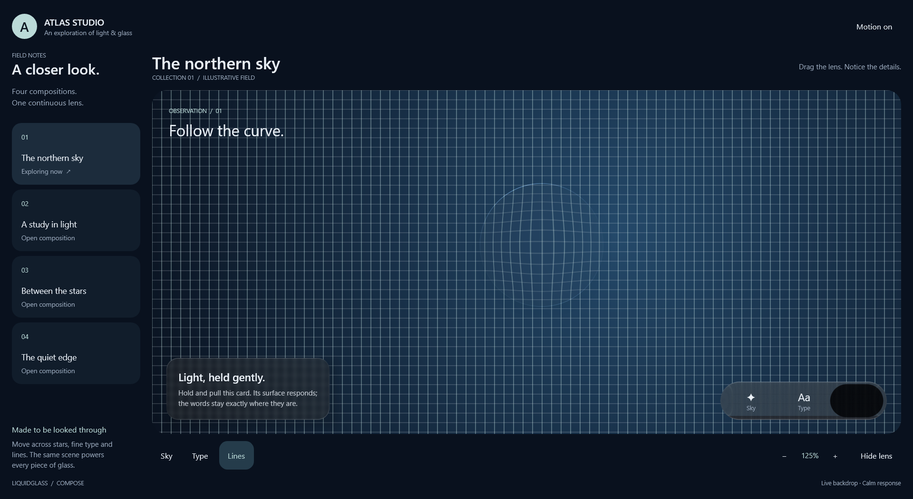

The corrected implementation declares the ink translation as an image-filter input. The final
shader samples both material and ink at the same coordinate. This follows the zero-radius
[Skia RuntimeShader contract](https://api.skia.org/classSkImageFilters.html); it also has a regression
that draws the production filter graph through viewport clipping at every edge.


These are full native Atlas render-buffer captures at 1920×1051. The corrected capture measured
120 forced redraws after ten warmups: median 9.21ms, p95 12.46ms, maximum 14.90ms
([raw timing](atlas/endpoint-native-timing.json)). This is static redraw/submission cost, not
presented FPS, a performance improvement, or touch latency. No CPU renderer test was running
simultaneously with that capture.

The endpoint recording now has twice its previous area, before backend allocation overhead.
Material and semantic-ink layers retain their existing resolution. No per-frame readback or bitmap
upload is added. Android's Java API currently exposes one dynamic RuntimeShader input, so it retains
the existing composed intermediate and its known precision limit. The portable ABI adds a required
`ink` child and `uInkStrip`; the [host contract](../docs/porting.md#combining-refracted-ink-with-glass)
documents binding, coordinates, ownership and clipping. Free magnifiers do not use this compositor.

The full local suite was intentionally stopped after the failed native capture, before a completion
result; it is not reported as passed. The corrected source passes 25 focused JVM tests, including
all 14 Calm gesture tests, extreme bar pulls, the endpoint gates, clipped filter inputs and the
generated-shader identity check. The Android sample assembles successfully. The complete library
and desktop suites then passed at `fdae281`: 323 library tests (296 passed, 27 skipped, zero
failures), plus both desktop tests. The local run took 22m54s. All seven required GitHub checks
passed in [run 37168022770](https://github.com/shayann07/liquidglass/actions/runs/37168022770);
the full build job took 18m13s, with the library suite reporting 16m38.38s and desktop 3m22.55s.
That run also passed all four hosted browser tests. No current physical-device verification is claimed.

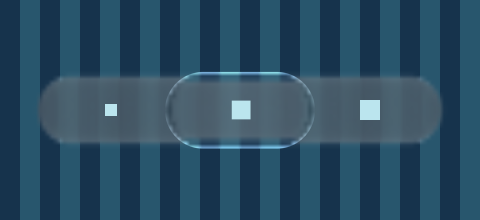

This last image is a 480×220 Compose software-rendered fixture with quarter-scale backdrop
sampling and native-resolution semantic ink, not a physical-device or native-window capture.

## Native redraw cost

120 forced redraw submissions after ten warmups, 1920×1051, Direct3D:

| Scene | Median | p95 | Maximum |
| --- | --- | --- | --- |
| Sky | 9.36ms | 18.66ms | 29.10ms |
| Lines | 11.99ms | 16.68ms | 17.93ms |
| Type (follow-up) | 10.09ms | 13.72ms | 19.69ms |

Raw [sky timing](atlas/after-desktop-timing.json), [line timing](atlas/native-lines-timing.json) and
[type timing](atlas/native-type-timing.json).
The sky capture overlapped the CPU test run; the line capture followed it. These measurements are
native static-scene redraw/submission cost, **not presented frame times, FPS, interaction latency or
Android performance**. They do not establish a 60Hz guarantee. No before/after speedup is claimed.

## Repository and licensing

Main requires `build`, `docs-site`, `web`, `skia-port`, `dependency-review`, `codeql-java-kotlin` and
`codeql-javascript-typescript`, bound to GitHub Actions.
The one-review, strict branch-update and resolved-conversation requirements are preserved. Force push and
deletion remain prohibited. Dependency security fixes and private vulnerability reporting are enabled;
secret scanning/push protection were already enabled. Dependabot and CodeQL use free public-repository
features and standard hosted runners. Actions are pinned to exact upstream commit references;
automation does not approve or merge dependency updates.
Runner images are explicitly pinned to Ubuntu 24.04 to avoid an implicit OS migration during verification.
Gradle declares the portable shader/fixture files as test inputs so edits invalidate cached verification;
renderer evidence is a declared output for both library and desktop tests.
An intentional shader-only edit made the source-identity test rerun and fail; restoring the exact
bytes restored the successful cached result. The perturbation was removed before committing.
The build workflow now permits Gradle cache writes on same-repository pull requests as well as main;
forks remain read-only. This follows the [action's cache setting](https://github.com/gradle/actions/blob/main/docs/setup-gradle.md#using-the-cache-read-only)
and [GitHub's branch/PR cache isolation](https://docs.github.com/en/actions/reference/workflows-and-actions/dependency-caching#restrictions-for-accessing-a-cache).
It is intended to avoid repeatedly rendering unchanged tests on later updates; no measured CI speedup
is claimed until a successful cache save and subsequent cache hit are observed. Run 37154921387 at
`15cd8bf` passed all seven checks and saved the updated Gradle task cache. Its slower 26m28s full build
still ran 320 library tests (293 passed, 27 skipped) and both desktop tests successfully; this is a
cache-save observation, not evidence of a speedup. CodeQL still forces
an uncached compilation so its analysis sees the source.

Original source remains Apache-2.0 with preserved third-party attributions. The research screenshots
are owner-supplied evidence, not bundled runtime assets or a license for Apple UI assets.

## Remaining requirements

### Portable integration follow-up: bundled defaults

`createGlassPainter(CanvasKit)` now supplies the production shader strings itself. The browser and
terminal examples no longer load three files before creating a painter; advanced callers retain the
explicit-source overload. No optics, motion or shader constants changed. A generated 101,857-byte ES
module contains the three exports; this trades bundled source bytes for less host setup and no shader
fetch lifecycle. It makes no claim about reducing CanvasKit runtime size or rendering cost.

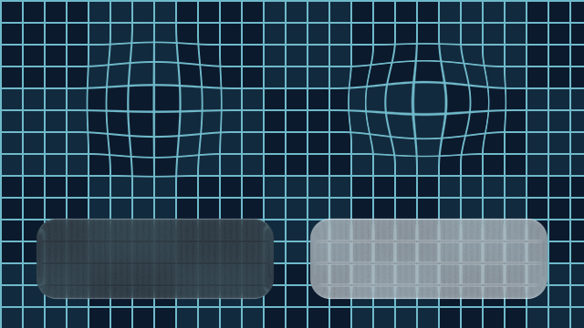

This is a 640×360 terminal-rendered CanvasKit example, not a native desktop or browser GPU capture.

The default-call regression first failed with missing shader sources. After the change, it renders a
nonuniform backdrop through a lens and a rounded surface and compares the complete buffers exactly
with the explicit-source path. All **13 local Skia tests passed** and the terminal example rendered.
The package's root export is exercised by the test. `npm test` also rejects a stale generated module;
the unchanged JVM test separately checks the source exports against the actual Kotlin shaders.
[Hosted CI at 7906d9d](https://github.com/shayann07/liquidglass/actions/runs/37300220285) passed all
13 Skia tests, 13 portable math/controller tests and five browser tests, including the example with
bundled defaults. The build passed in 31s with library/desktop tests **FROM-CACHE**. The full
Compose/native checkpoint above is reused for unchanged code; no new physical or desktop application
run is claimed for this API edit. All seven required checks passed, including CodeQL.

Full 1:1 Apple parity is **not established**. Separate-input desktop/CanvasKit composition passes the
strict endpoint gate; the historical and Android path remains above it.
The new calm timing is authored; whole-bar extreme gestures need further matched original-frame comparisons.
Universal native bindings, complete web host/compositor integration, presented-frame motion performance,
and current physical-device verification remain incomplete. The active goal is not marked complete.

## Newly labelled Phone recordings: preserve the failing baseline

The [live audit](../research/analysis/MOTION-2026-10-08.md) now includes complete native indexes
for both new recordings, fixed-window RGB probes and unchanged production-controller traces.
A short tap reaches329x204px against a186px bar; a long tap has a396x159px cross-section.
Authored40..240ms contact alternatives do not recover the paired dimensions at comparable
travel phases. No numerical library tuning has been accepted from this evidence yet.

[Original crops, comparison plot, caveats and reproduction](atlas/new-motion-2026-10-08/README.md).
The comparison is between optical cross-sections and model bounds, not a complete contour or
input-timing fit. This new evidence takes precedence over earlier assumed tap containment.
Exactf24634d CI37830422383 passed all seven required checks. Library and Atlas tests were
restored FROM-CACHE of verified0e5c1d6; build1m31s/Gradle58s, not fresh test execution.

## Coupled resting-tap area — 2026-10-09

The labelled Phone sources reject the earlier assumption that all tap motion stays within the bar.
Calm now springs projected area and derives radius from its actual horizontal spine: short trips
become rounder, long trips flatten, and arrival can exchange width for height. The default historical
path and held/bar/card constants remain unchanged. Existing paired-shape tolerances were retained.

[Implementation, original comparisons, native screenshots and reproduction](atlas/phone-tap-volume-2026-10-09/README.md).
The three selected source pairs pass their spatial gates; an additional early long frame remains
12.80px too wide. Parameters are authored, and original timing/full contours remain unresolved.

Local verification:317 library tests passed,27optional exports skipped,0failures; both Atlas tests
passed; Android assembled; total12m11s. Native16-phase capture passed selection, extreme corners,
recovery and fixed-layout checks. Startup layout capture was corrected after a rejected run caught
asynchronous window maximization. The final static1920x1051 Direct3D capture has13.386ms median /
23.336ms p95 forced-redraw submission, not presented FPS. The separate CPU-controller benchmark and
all failed attempts are preserved in the packet/live log. Full1:1 iOS parity is not established.

## Phone endpoint landing — 2026-10-09

Calm now transfers endpoint deceleration into spine compression while coupling radius to area.
This reaches the original narrow-body/large-cap pair without giving the selector perpendicular
squeeze. Ordinary holds and middle landings preserve their previous response; reduced-motion
interruption discards stored deformation. The [landing packet](atlas/phone-throw-2026-10-09/README.md)
preserves source probes, rejected experiments, authored gains, native images and exact limits.

Completed local verification:323library passed/27optional skips/zero failures, both Atlas tests
passed, Android assembled,21native phases passed and inspected. Full1:1 remains open: source
centre overshoot, continuous contour/optical comparison and original input timing are unmatched.

## Endpoint contact and rejected inset appearance — 10 October 2026

Consecutive bilateral originals keep the endpoint-facing edge within2px while the inner edge
moves43–44px. Calm now recovers that leading edge and derives its centre from the changing
width. The [motion packet](atlas/phone-edge-2026-10-09/README.md) preserves calibration and the
remaining curvature mismatch. The owner correctly rejected its initial native dark-disc caps:
optical formation faded while the whole-body resting tint still covered the page beyond the bar.
The [material correction](atlas/inset-material-2026-10-10/README.md) confines tint/lift to an
independent cached mask of the actual bar shape, transformed with its shared drawing state.

The corrected native rest is pixel-identical; both endpoint caps preserve the page. The first
packed-mask attempt failed native GPU cropping and remains rejected. Full verification covers
329library passes/27optional skips,2Atlas passes and Android assembly after targeted uniform-list
and Android-overload repairs.20portable Skia tests/types pass. No physical device or full1:1,
owner acceptance, presented-frame rate or every-stack integration claim is made.

## Native boundary replay and .NET host — 10 October 2026

The [33-phase Atlas replay](atlas/all-gestures-2026-10-10/README.md) adds every drawable-window edge
and corner, sustained held reversals and middle-tab landing/recovery. Both Atlas tests and native
selection/layout checks pass. All app-owned images were inspected. Window boundaries are distinct
from a physical phone screen; snapshots and concurrent test/capture timings do not prove continuous
iOS motion, the complete reference envelope or presented-frame performance.

The [native .NET packet](atlas/dotnet-2026-10-10/README.md) demonstrates production SkSL on SkiaSharp
with a source-only painter and real Windows Forms host. Four JVM profile fixtures match exactly;
ten native check groups and the app-owned drag/resize replay pass. The painter shares a backdrop
across lenses/cards and can own a host-drawing snapshot. Windows/Linux renderer CI, Windows host
compilation, C# CodeQL and NuGet dependency updates are added. Those new hosted checks await this
checkpoint's push. Other native hosts, .NET selector dynamics and arbitrary-widget capture remain
open; Compose plus these bindings is not declared universal-stack completion.
