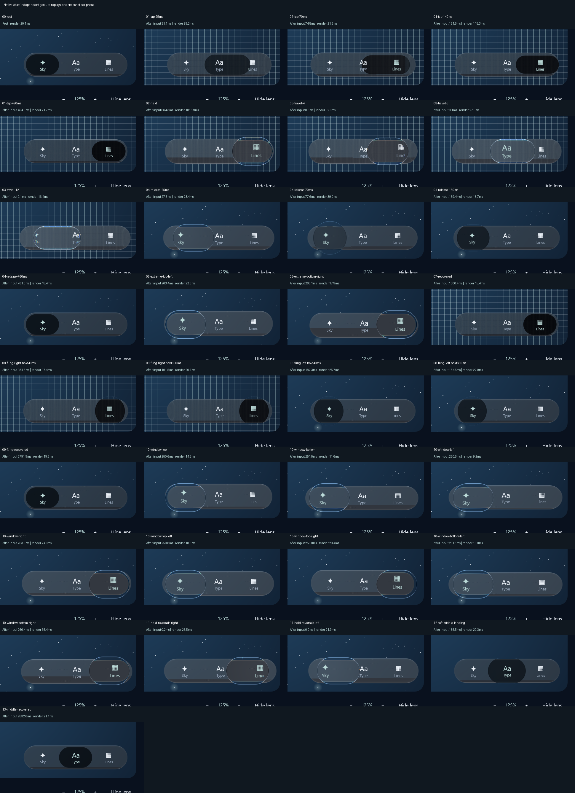

# Native Atlas: all window boundaries and additional gestures

The earlier diagnostic exercised only two far-outside diagonal pulls. This packet adds the eight
actual drawable-window boundaries, sustained held reversals and a soft middle-tab landing. The
production library and shaders are unchanged from `5a81393`; only the app-owned replay expanded.

**33 phases passed selection and fixed-layout checks; both Atlas tests passed.** The Gradle queue
completed in 5m11s. All phase images were visually inspected. Boundary pulls remain bounded on
screen; held reversals retain refracted labels; the soft throw selects Type and returns to the
resting inset. The corrected material does not paint dark caps outside its bar during recovery.
The thin body rim and incomplete recovery-shape/optical match remain visible and unaccepted as 1:1.

Each PNG is an app-owned crop from the Direct3D window at scale 1.25. Input uses only the app's AWT
component. The eight new targets are the four edges and four corners of its drawable area, each
reached through 20 gradual moves. The original 4000px diagonal stress cases are retained separately.
Three/four held sweeps reverse direction without intermediate screenshot readback. Middle landing
and recovery have separate captures.

This establishes native coverage of those authored gestures, **not the original phone's continuous
timing, force, full contour or surrounding optical behavior**. The app-window boundary is not a
physical phone screen or an OS-owned screen area. The original iOS reference-envelope calibration
still needs its broader continuous-motion/optical audit. No new measured constant was inferred here.

The suite and capture ran concurrently, so timing is not uncontended performance evidence. Each
phase starts from its own replay because readback is slow. The first held forced redraw took
1815.9ms; nominal phase labels are not actual display times. [Events](events.csv) retain timestamps
and readback costs. Do not interpret them as presented FPS or an accepted input-latency result.

[Verification](verification.json) contains test totals, source/frame hashes and limits.
[Capture metadata](capture.json) identifies backend and initial layout. All 33 individual native
crops are beside this file. Reproduce with the [workspace diagnostic](../../../WORKSPACE.md#native-motion-diagnostics),
always using a new output directory. The broader goal stays active in [PROGRESS.md](../../../PROGRESS.md).
