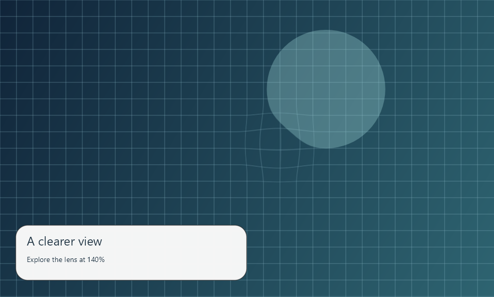
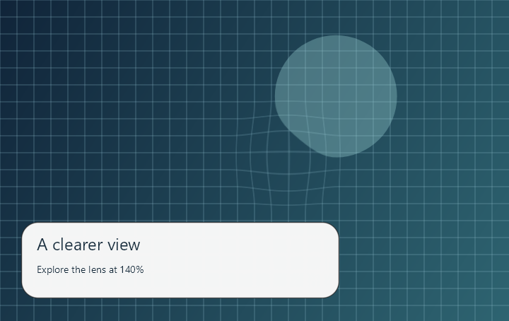
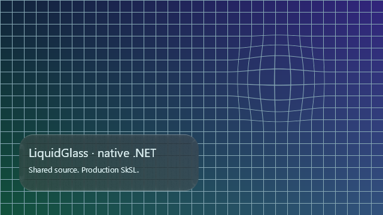
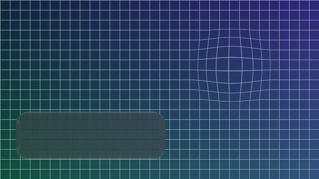
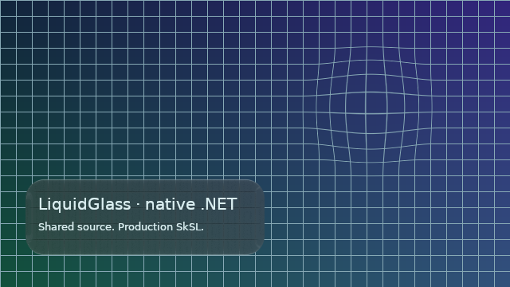

# Native .NET rendering and Windows Forms host

The new source-only adapter embeds the production SkSL in a .NET 8 library. It draws directly on
SkiaSharp's native `SKCanvas`, with no Compose, browser or JavaScript runtime. A .NET 10 Windows Forms
example supplies the page backdrop and real control input. [Run/build guide](../../../ports/dotnet/README.md).

| Native control: dark glass | After dragging and reducing transparency |
| --- | --- |
|  |  |

Four native canvas snapshots were inspected. They show the continuous lens over a grid, a blurred
dark card, relocation after the control's mouse-handler replay, a reduced-transparency light card,
and a resized source. Text is ordinary host ink outside the glass transform. The native controls
around the canvas are not included in these app-owned surface snapshots.

The Windows Forms project builds with zero warnings/errors. Its replay passed drag selection and
mouse capture release, then rebuilt the source on resize. The first attempt targeted .NET 8, but
the current pinned Views package provides modern .NET 9/10 targets; the demo now explicitly targets
.NET 10 Windows. Warnings were not suppressed. Public preference properties declare their designer
defaults after the new WinForms analyzer rejected missing serialization metadata.

The renderer executable passed **10 check groups** on Windows / .NET 8.0.31 / SkiaSharp 4.153.1:

- All three production passes compile and match the embedded source.
- Each of the four profiles matches independent 128×128 JVM RGBA fixtures with **maximum channel error 0**.
- Invalid uniforms, missing shader children and disposed effects fail explicitly.
- Identity lens pixels, zoom gain, source orientation, monotonic mapping and canvas state pass.
- Borrowed/owned source lifetimes, cached redraw, wide-blur refresh and atomic failed recording pass.
- The standalone native example renders successfully.

[Renderer verification](verification.json) includes exact source hashes and every check group.
[Host verification](host-verification.json) identifies the native control and input method.
Windows/Linux numeric checks and Windows host compilation passed CI on9545506, with four zero-error
profiles on both platforms. Inspecting the Linux image then caught blank labels: dependency-free
Skia lacked its system font provider. That image is rejected as a complete example. The checks now
require text to alter rendered pixels, and Linux uses fontconfig-enabled assets with explicit fonts.
Both platforms pass the updated gate on **49c217f**, and both CI images have been inspected. Separately,
CanvasKit's NOTICE-copy check caught missing attribution and passes after synchronization.
No package, release or tag was published.

| Rejected Linux example: labels missing | Corrected Linux example: text verified |
| --- | --- |
|  |  |

[Hosted results](hosted.json) preserve each platform's report and image hash. The Windows host also
compiles on the hosted runner. Its interactive input evidence remains the separate local native
capture above. The two native jobs and C# CodeQL are required checks on `main`, alongside the
original seven checks; strict branch freshness and review policy remain unchanged.

These are Windows/Linux **CPU** renderer checks and a Windows native host, not a GPU benchmark,
continuous recording, Apple comparison or
validation of additional native frameworks. The host records its own Skia page; arbitrary native
widgets are not automatically captured. A .NET navigation controller, high-level refracted foreground,
other native hosts and the full any-stack goal remain open. See [the porting contract](../../../docs/porting.md).
