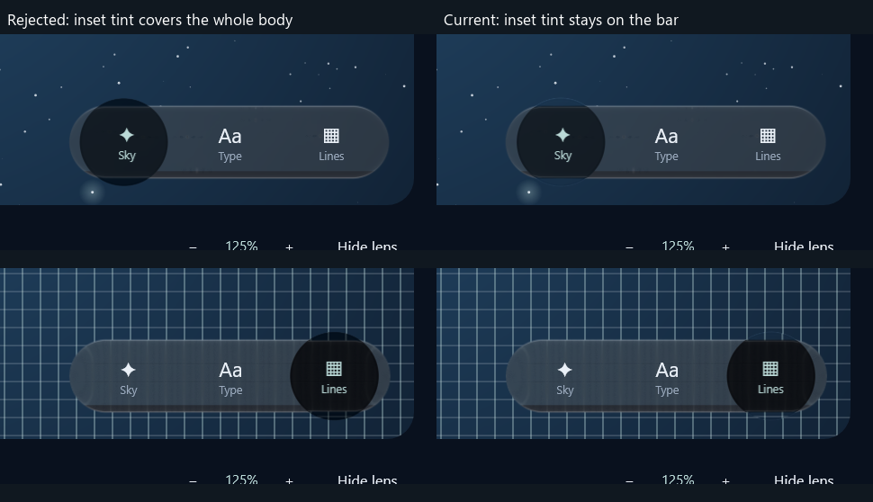

# Rejected dark caps and the substrate correction — 10 October 2026

The owner rejected the Atlas captures: the compressed selector looked like a dark disk
pasted over the bar. The earlier visual approval was wrong. Passing motion, selection and
layout tests did not establish that the material looked correct.

## Cause and correction

Optical formation fades while the body is still compressed and taller than the bar. The
resting inset's black tint and negative tonal lift were applied across that entire body,
including the page above and below the bar. Black original backdrops concealed this exterior
error; Atlas's coloured and grid backdrops exposed it.

The current implementation treats the inset as a tint of its substrate. It rasterizes the
actual bar shape into a cached alpha bitmap, with a transparent border, and samples that mask
through the inverse of the bar's shared press/pull transform. The mask limits tint and tonal
lift. Geometric coverage, refraction and rim lighting remain independent. The selector still
deforms; its caps retain the surrounding page instead of painting a dark fill over it.

This is enabled for Calm pose selectors. It uses the real `Shape` outline, including custom
paths, rather than a fixed capsule approximation. Layout, hit targets and motion parameters
are unchanged. The native bitmap coordinate mapping accounts for reduced render scale.
The pose shader reuses its otherwise-unused field input; ordinary path materials keep their
distance-field behavior. Both Android and JVM bind the additional affine uniforms.

## Rejected first attempt

The first correction stored the recorded bar alpha in a separate part of the dynamic input.
Synthetic shader tests passed, but native GPU cropping lost the left resting inset. That
attempt was rejected. Its images and patch remain local under `atlas-inset-mask-motion-v1`
and `inset-strip-rejected.patch`. The replacement uses an independent bitmap input, avoiding
that offscreen-storage dependency.

## Evidence and limits

The corrected native 21-phase replay passed selection and fixed-layout checks in 2m13s.
Rest, early/formed throws, both endpoints and recovery were inspected. The resting capture
is **pixel-identical** to the preceding unmasked resting capture. The protruding dark caps
are removed in the inspected endpoint images; a faint glass rim remains during recovery.

Small fixed exterior probes compare each throw image with its same-scene resting backdrop.
Mean absolute RGB differences change as follows (0–255 channels):

| Region | Rejected | Corrected |
| --- | ---: | ---: |
| Left top | 30.88 | 0.28 |
| Left bottom | 29.65 | 0.03 |
| Right top | 29.56 | 1.36 |
| Right bottom | 26.51 | 9.04 |

The right-bottom residual includes the recovering rim/grid sampling; it is retained rather
than described as exact background equality. These are narrow defect probes, not full optical
parity scores. Replays use real AWT scheduling and are separate snapshots, not identical-frame
video comparisons. [comparison.json](comparison.json) preserves the probe rectangles/results;
[events.csv](events.csv) and [capture.json](capture.json) preserve actual native timing and checks.

Focused tests passed: three material/coordinate regressions, two original bar-material checks
and shader-bundle agreement. The portable Skia suite passed all 20 tests plus strict TypeScript
consumer checks after regeneration. Verification is complete for this checkpoint: **329 library cases passed,27 optional exports
skipped,zero remaining failures; both Atlas tests passed and Android assembled**. The initial
full run (18m24s) had one stale uniform-list failure and an Android binding compile error.
The exact list and Android-only call were repaired; the affected shader class and platform tasks
passed in2m30s. All other full-run renderer results were retained instead of rerunning unchanged
code. [verification.json](verification.json) records this aggregation and source hashes.
The earlier326-pass motion suite remains historical. No full iOS parity or owner acceptance is claimed.

The remaining goal includes continuous optical agreement, all supplied gesture classes,
platform integrations, Atlas quality and the other open items in [PROGRESS.md](../../../PROGRESS.md).
