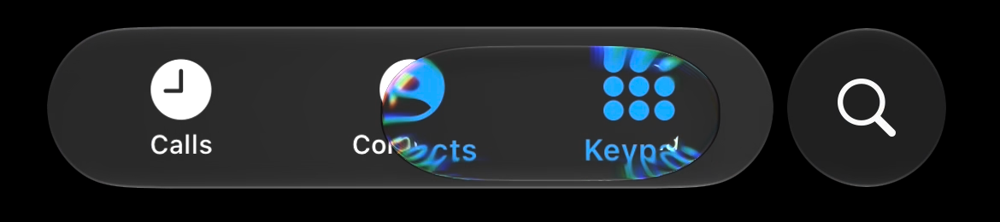
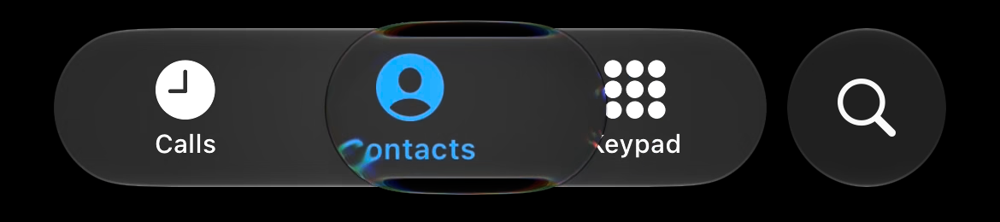
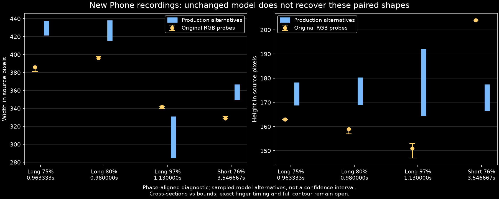

# Labelled Phone motion: original evidence and failing baseline

**Research in progress. No production tuning accepted from these videos yet.**
The [live log](../../../research/analysis/MOTION-2026-10-08.md) records every operation,
including rejected measurements, failed decodes and input uncertainty.

The owner identifies video1 as taps without sustained holds; video2 contains holds, early and
held throws, traverses and terminal impacts. This identifies classes, not exact finger times.
Raw recordings and call-list screenshots remain local. Published crops below have been inspected
and contain only the Phone controls on a clean background. Pixel dimensions are unscaled.

## What the new evidence changes

The long tap at native PTS588/600 has a measured 396×159px cross-section:



The shorter tap at native PTS2128/600 has a 329×204px cross-section, taller than the 186px bar:



That does not identify a pointer duration, but it rules out assuming that every frame the owner
calls a tap must be confined to the resting bar. The different width/height pairs also challenge
the independent shape responses in the current model.



The blue ranges cover three reference-body alternatives and authored press durations
40/80/116/160/240ms, including the adapter's hold acquisition at 120ms for the longer contacts.
They are not statistical confidence intervals. Each sample uses the nearest normalized centre
phase, not a fitted time shift. The model remains too wide early, too short late and has the wrong
paired height. Short-tap target centre479px is provisional. Model bounding dimensions and optical
cross-sections are different measurements; a complete contour comparison remains necessary.

## Data and reproduction

- `video{1,2}-catalogue.json` and `*-ink-signals.csv`: complete1751/1993-frame native-PTS indexes.
  Ink signals propose inspection windows; they are not finger events or selector centres.
- `video1-*-windows.json`: inspected edge-search windows chosen before model scoring.
- `video1-*-measurements.json`: every RGB/scanline probe, median, full range and quality flag.
  The long0.905/0.946667s vertical probes are explicitly rejected after visual inspection because
  the bar can own the stronger edge. Other ambiguous widths remain unresolved.
- `*-v2-index.json` / `*-v2-decode.json`: dense episode image hashes, exact PTS and decode command.
- `production-tap-baseline.csv`:2886 plain-retarget samples.
- `production-touch-baseline.csv`:14430 actual-controller samples across the declared durations.
- `baseline-comparison.json`: selected observations, every matched model sample and caveats.
- `baseline-model.json`: source/tool hashes and baseline identity.

Decode an episode into a **new private directory** (requires FFmpeg/FFprobe and Pillow):

```powershell
python tools/decode_phone_episode.py docs/1.MP4 --start 3.30 --duration 0.85 --output .local/my-short-tap
python tools/measure_phone_tap.py .local/my-short-tap review/atlas/new-motion-2026-10-08/video1-short-first-windows.json --output .local/my-short-measurement
```

The decoder trims original timestamps and verifies one-to-one correspondence with output images.
Its contact sheets are reduced inspection views; measurements use the full native crops. The owner
keeps originals at the supplied paths, excluded from Git and the documentation website.

`tools/PhoneTapProbe.java` calls the compiled production controller directly. Compile the library
through `tools/workspace.ps1 library :liquidglass:compileKotlinJvm`, then compile/run the probe with
JDK21, the resulting `liquidglass/build/classes/kotlin/jvm/main` directory and the matching
`kotlin-stdlib` JAR on the classpath. Pass a CSV output path; add `touch` for the duration sweep.
It does not require a window, physical device or a full renderer-suite rerun. It is a diagnostic
exporter, not a substitute for gesture/rendering tests after implementation changes.

```powershell
python tools/compare_phone_tap.py review/atlas/new-motion-2026-10-08 --plot
```

The optional plot requires Matplotlib. Source measurements require NumPy and Pillow.
Do not optimize against failed probe rows or label these four observations as a complete iOS fit.

## Next implementation decision

Test a coupled area/spine response and input formation against additional independent episodes,
then compare actual model contours at the same scanlines. The approximate capsule areas of the
short329×204 and long396×159 frames are similar (about58.2k/57.5k square pixels), while their
aspect ratios differ. This is a hypothesis for a better model, **not** a recovered Apple law or
proof that the optical contours are exact capsules. Held throws, wall impacts and whole-bar
deformation require their own measured sequences.
