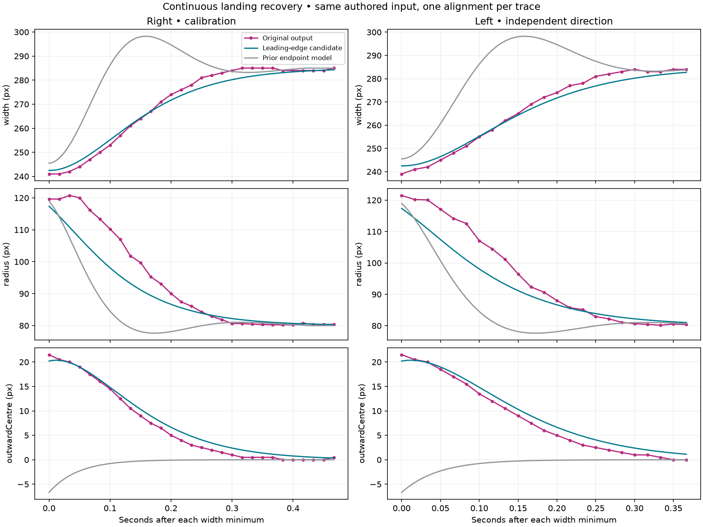
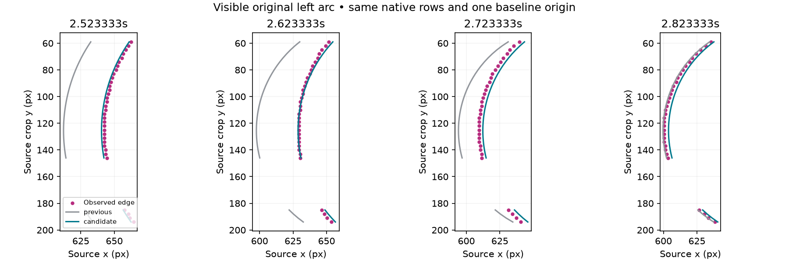
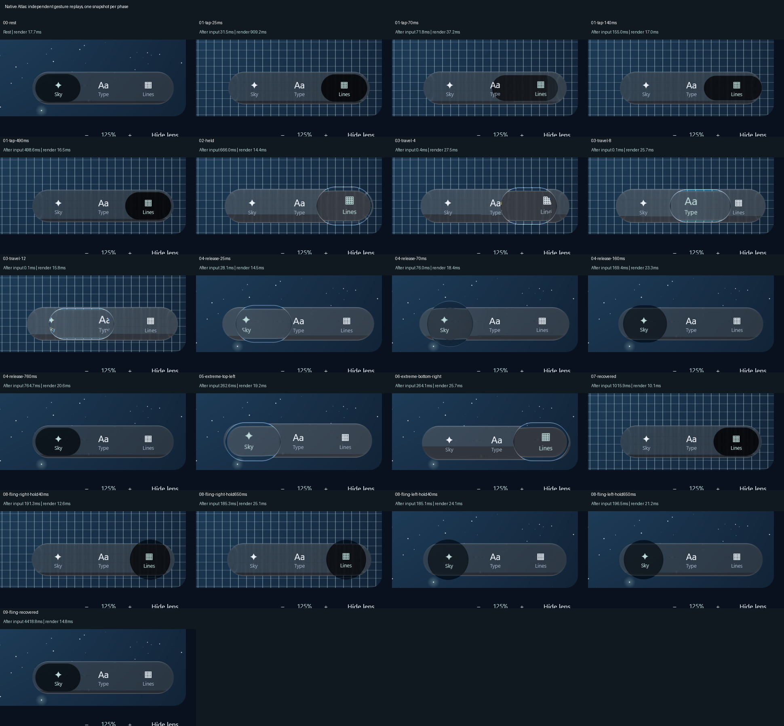

# Shape-aware endpoint recovery — 9 October 2026

**Visual rejection:** the owner rejected the native images below because the recovering
selector looks like a dark disk above and below the bar. The assistant's earlier visual
approval was incorrect and is withdrawn. Test results remain evidence of their stated
checks, not proof of optical quality. The subsequent [substrate correction](../inset-material-2026-10-10/README.md)
shows the new native result and its separate verification.

Calm endpoint landings now recover the leading edge while the capsule changes width. The
centre follows from that edge and the current shape. This corrects the previous detached
centre recovery: it keeps the endpoint-facing edge nearly still while the inner edge expands
back toward rest, as observed in both directions in the
[consecutive reference audit](../phone-landing-sequence-2026-10-09/README.md).

**Full 1:1 parity is not established.** Cap curvature still recovers too early. Original
finger-up times, force, full contours and optical agreement across all gestures remain open.



## Behavior and evidence

The controller seeds the leading edge's position and velocity from the current capsule.
It advances that coordinate toward the resting endpoint, then derives centre position and
velocity from the current half-width and its derivative. This preserves the actual pose at
release and re-grab. Deceleration transfers into spine compression; critically damped spine
recovery removes the earlier broad rebound. The response remains gated to a moving endpoint
release. Taps, stationary holds, middle landings and whole-bar squeeze retain their ownership.

The leading-edge coordinate applies only to the horizontal, unstrained Calm capsule. Other
pose models retain their centre/contact law. Applications select `GlassTabBarStyle.Calm()`;
they need no new per-screen gesture code. The preceding implementation remains an internal
comparison specification, `CalmEndpoint`.

Impact gain 4 and recovery rate 14/s with critical damping are **authored calibration**.
Area recovery rate 14/s and centre rate 24/s are inherited from the preceding Calm model.
These are not measured Apple spring constants. Layout and hit targets stay anchored.

| RMS diagnostic, pixels | Previous right | Candidate right | Previous left | Candidate left |
| --- | ---: | ---: | ---: | ---: |
| Width | 17.66 | 2.31 | 19.10 | 2.39 |
| Centre relative to rest | 11.53 | 1.08 | 12.77 | 1.28 |
| Partial-cap/model radius | 12.86 | 6.17 | 12.96 | 5.71 |

One authored 800ms hold / 100ms two-slot drag is used for both directions. Each output trace
is aligned once at its width minimum, with no time scaling or per-frame matching. The right
series is calibration; the left direction was checked without retuning. They share the same
recording. Width and centre have a stronger measurement basis than the partial-cap radius,
which varies with the visible arc window. Radius error still reaches 12.59px on the right and
11.58px on the left. These diagnostics compare optical cross-sections with model bounds,
not complete rendered contour equivalence.

## Direct visible-contour comparison



A partial-circle radius does not uniquely identify hidden body height. This second comparison
intersects the model capsule with every retained native edge-probe row, using the independently
measured bar centre 125.5px and one resting horizontal origin 741.5px for the entire sequence.
It does not realign each frame or refit the model to the arc.

Visible-arc RMS error improves **17.26 to 2.40px**, and maximum error **31.89 to 5.69px**.
All points, predictions and errors remain in [comparison.json](comparison.json). This covers
only the visible left arc of the rightward episode, not the complete silhouette or rendered
optical pixels. The left episode lacks accepted independent bar-centre probes and is not
assigned this score. The radius mismatch and uncertainty remain disclosed above.

## Rejected alternatives

The first 20-case sweep is retained in [candidate-sweep.csv](candidate-sweep.csv). Faster
recovery misses the width trajectory; slower recovery lingers below resting width. A second
36-case sweep varied area recovery separately. Slowing it to 10/s reduced cap error but widened
the minimum to 248.29px and increased width RMS to 4.25px. That alternative was rejected;
its scores remain in [rejected-area-scores.json](rejected-area-scores.json), with full traces
in the private research tree. The experimental area-rate field was removed. No original estimate
or test tolerance was rewritten to hide this tradeoff.

## Verification

Focused integration: **54 tests passed**, zero failures. Coverage includes consecutive bilateral
width/endpoint-edge recovery; centre velocity versus its position derivative; re-grab continuity;
early/formed throws; cadence; extreme inputs; reduced motion; old tap, held-travel, growth,
off-centre-grasp and generic-body checks. The new regression checks every 60Hz source sample
after one alignment, using authored 6px width and 2.5px leading-edge gates.

Full verification completed in **10m14s: 326 library tests passed, 27 optional showcase exports
skipped, zero failures/errors; both Atlas tests passed and Android assembled**. Native 21-phase
capture passed selection, recovery and fixed-layout checks. All images were inspected, including
both formed endpoint flings at native scale. Runtime remained frozen through verification.
[verification.json](verification.json) records exact totals and source hashes.




The static 1920×1051 Direct3D view shows continuous grid magnification and intact card/navigation
layout. 120 forced redraws after 10 warmups measured **6.593ms median / 9.009ms p95**, maximum
9.609ms. These are submission durations, not presented FPS; no speedup is inferred from earlier
uncontrolled runs. The first tap's redraw took 909.2ms, so its nominal 25ms label is not displayed
latency. [native-events.csv](native-events.csv) retains actual input, render and readback times.
Hosted checkpoint results remain separate. No physical-device validation was available.

## Reproduce

```powershell
./tools/workspace.ps1 library :liquidglass:jvmTest --tests '*GlassPhoneLandingSequenceTest*'
Copy-Item liquidglass/build/reports/atlas/phone-edge-candidates.csv <new-packet>/candidate-sweep.csv
python tools/compare_phone_edge_candidate.py <new-packet> --reference review/atlas/phone-landing-sequence-2026-10-09
```

The comparison needs NumPy and Matplotlib. Its JSON preserves aligned values, metrics and hashes.
The [live research log](../../../research/analysis/MOTION-2026-10-08.md) records experiments,
rejections and checks. Raw private recordings and left-side source images remain local.
