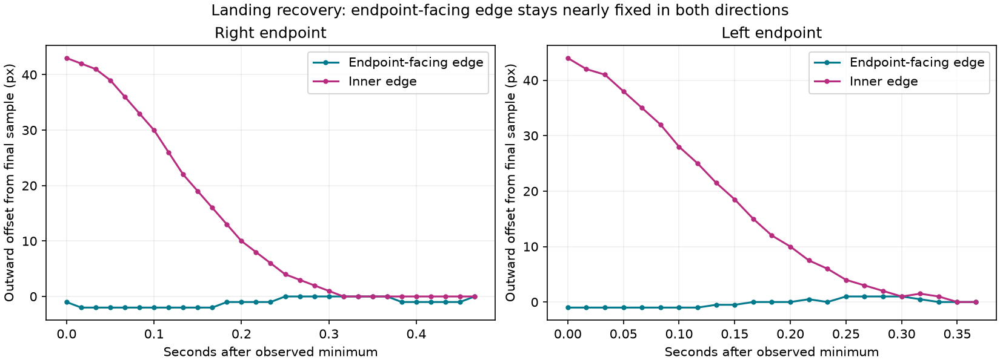
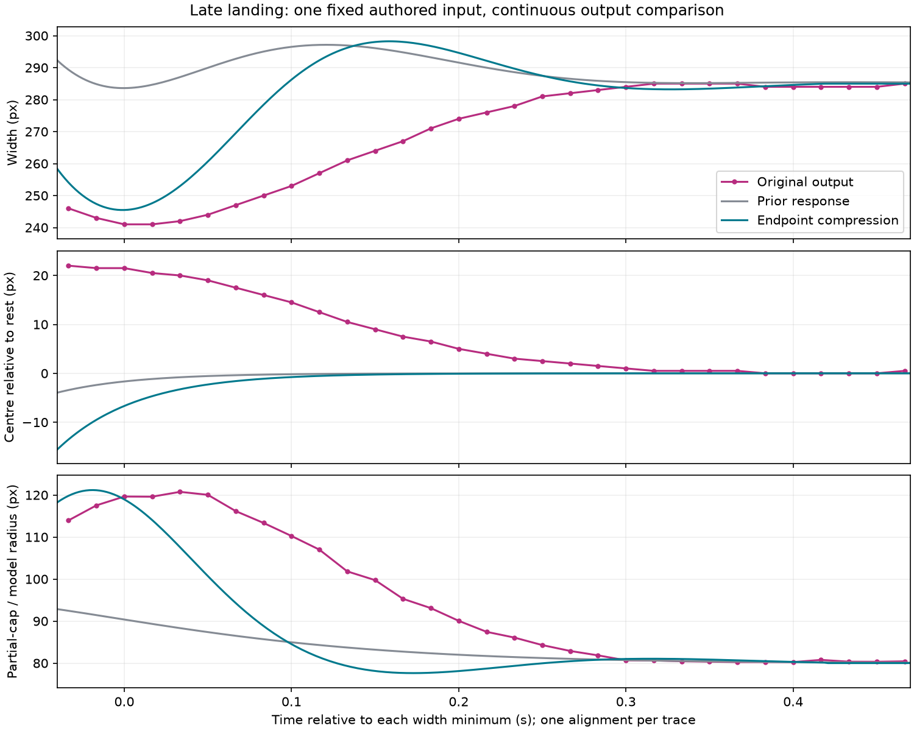

# Consecutive endpoint recovery — 9 October 2026

The preceding [landing checkpoint](../phone-throw-2026-10-09/README.md) improves a narrow-body,
large-cap pair. Consecutive original frames show why that pair is insufficient: recovery is
slower, the endpoint-facing edge stays almost fixed, and the body's visible centre moves as
its width changes. **The current controller does not yet reproduce this joint trajectory.**

No production parameter changed during this audit. The tested runtime remains `d3b8b25`.

## Two independent directions

Both windows come from the owner's second recording, SHA-256
`b1daa86ae7a6f9246fb56b19af9a82ec939ad2315c947954ee1e6869a8168006`.
Every crop is checked against its native-PTS decode hash. No frame-rate resampling is used.

| Observed recovery | Right endpoint | Left endpoint |
| --- | --- | --- |
| Native window after minimum | 2.523333–2.990000s | 4.573333–4.940000s |
| Consecutive accepted cross-sections | 29 | 23 |
| Minimum → final observed width | 241 → 285px | 239 → 284px |
| Endpoint-facing edge range | 882.5–884.5px | 74.5–76.5px |
| Inner edge range | 599.5–642.5px | 315.5–359.5px |



The two-pixel endpoint-edge ranges accompany43–44px inner-edge movement. The apparent centre
excursion is therefore consistent with compression against an endpoint. It does **not** by
itself establish an independently overshooting mass centre, finger force, or Apple's physics.
The graph uses each window's final sample as its origin; especially on the left, that does not
prove an exact settled equilibrium.

The right measurement window also includes two preceding frames:31total from2.49s. Its
unselected bar section remains186px tall throughout. On the left,94frames were decoded and
29lateframes probed. Two width estimates fail automatic gates; four more are rejected after
inspection because the outer bar and selector boundary overlap. All29left bar-height estimates
fail the quality gates because the background interferes. They remain in the data and are not
reported as measured heights. The independent left sequence confirms the endpoint-edge pattern,
not a general absence of whole-bar deformation.

## What the current model still misses



This uses the **existing frozen** production sweep for one authored800ms hold/100ms two-slot
drag. Each trace is aligned once at its width minimum. There is no time scaling or separate
best-frame matching. The29post-minimum original samples are compared with interpolated model
output. Optical cross-sections and partial-cap estimates are still compared with controller
bounds/radius, so these are diagnostics rather than final contour-validation tolerances.

| Diagnostic RMS error | Prior response | Endpoint checkpoint |
| --- | ---: | ---: |
| Width | 26.11px | 17.66px |
| Partial-cap/model radius | 16.30px | 12.86px |
| Centre relative to rest | 10.41px | 11.53px |

The new shape is closer at maximum compression but broadens too quickly, briefly exceeds its
resting width, and approaches the centre from inside. All six existing candidate input cases
in the saved matrix lack the original's post-minimum outward centre offset. This is evidence
about that input matrix, not proof that every possible input fails or that original release
timing has been recovered. [comparison.json](comparison.json) retains all aligned values and
the input-sensitivity matrix, including the worse centre result.

The next implementation experiment should couple endpoint contact with changing shape while
preserving velocity and re-grab continuity. Adding an arbitrary centre overshoot or fitting an
isolated width minimum would not address the nearly fixed leading edge. Any candidate still
needs early/formed throws, soft middle landings, held reversals, both walls and the existing
tap/growth/ownership regressions. Nothing in this audit completes full1:1 parity.

## Measurement uncertainty and publication

The cap fit is sensitive to which visible arc is used. Rightframe082 givesR116.14px from the
earlier rows48–204, versusR120.75px from fixed consecutive-series rows59–194. Both have small
residuals; neither observes the hidden top/bottom extent. The4.60px difference is preserved,
not used to erase the earlier estimate or silently enlarge its test tolerance. The left fit
excludes a larger band of background text and is another partial-arc estimate.

- [Right RGB probes, cap residuals and fixed windows](right-measurements.json)
- [Right overlay sheet1](right-probes-1.png), [sheet2](right-probes-2.png)
- [Right consecutive geometry plot](right-sequence.png)
- [Left numeric probes and rejected samples](left-measurements.json)
- [Left annotations](left-windows.json), [native index](left-index.json), [decode manifest](left-decode.json)
- [Verification and exact tool hashes](verification.json)

All overlays were inspected. The left source/overlays contain private background text and
remain local; only numeric probes, hashes and metadata are published. No raw recording is
included. Failed attempts stay in the private research tree and are recorded in the
[live log](../../../research/analysis/MOTION-2026-10-08.md).

## Reproduce

With NumPy, SciPy, Pillow and Matplotlib, using the existing decoded crops:

```powershell
python tools/measure_phone_landing_sequence.py <right-decode> --output <new-right-output>
python tools/measure_phone_landing_sequence.py <left-decode> --output <new-left-output> --annotations review/atlas/phone-landing-sequence-2026-10-09/left-windows.json
python tools/compare_phone_landing_sequence.py <new-right-output>/measurements.json review/atlas/phone-throw-2026-10-09/gain-sweep.csv --output <new-comparison-output>
```

The generalized measurement tool reproduced all31right widths, centres and cap radii exactly.
No library/desktop test or capture was repeated for these analysis-only changes. The completed
323library pass/27optional skips,2Atlas pass and Android assembly remain valid for unchanged code.
