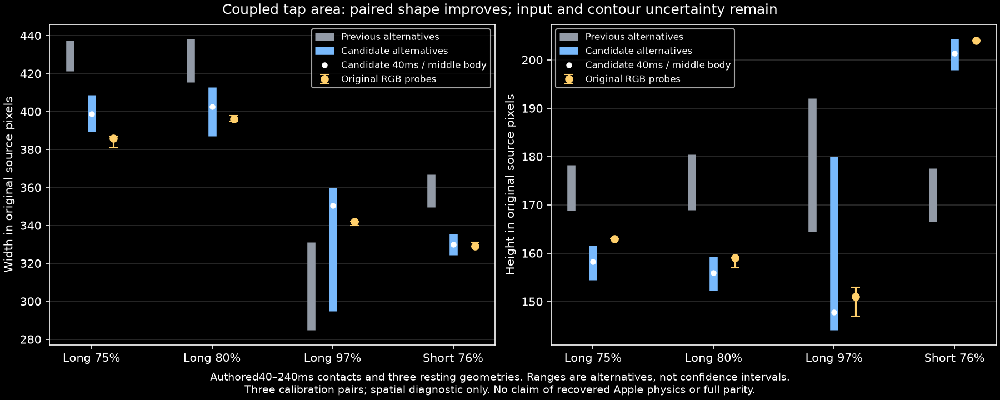
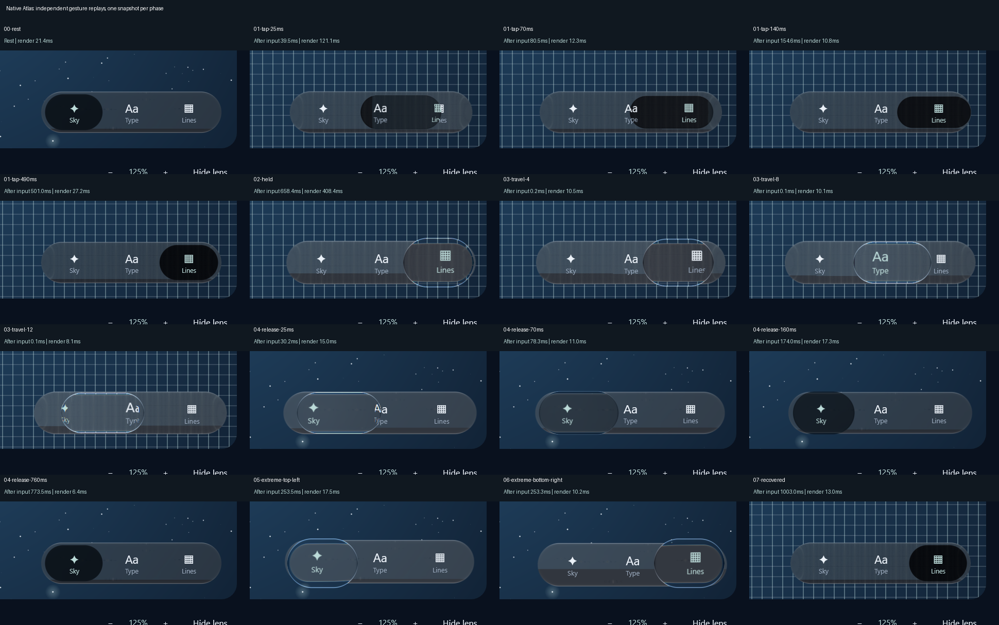

# Coupled tap shape — 2026-10-09

Working implementation, based on the owner's newly labelled Phone recordings. Full iOS parity is
not established. This packet keeps the [failing baseline](../new-motion-2026-10-08/README.md) intact.
Read the [live log](../../../research/analysis/MOTION-2026-10-08.md) for failed attempts and exact checks.

## Change and integration

The opt-in `GlassTabBarStyle.Calm()` selector springs projected area and derives its rounded radius
from the actual spine on every simulation step. Shorter trips become rounder; longer trips put more
of the area into horizontal extension. Arrival can exchange width for height before settling.
Applications using this style need no new animation, pointer or per-screen tuning code.

This changes selector **travel**, not whole-bar drag strain. Generic cards, the bar's anchored
material/ink transform, ordinary press growth and held/released parameters retain their earlier
values. `GlassPoseSpec()` keeps its zero coupling gain; the earlier independent Calm specification
is retained internally for regression comparison. No public type or function signature changes.

For a capsule with half-spine `a` and cap radius `r`, projected area is `A = pi*r*r + 4*a*r`.
The stable inverse `r = A / (sqrt(4*a*a + pi*A) + 2*a)` derives the radius after the spine step.
The area spring is seeded from actual geometry and its derivative on entry, preserving continuity
when a moving selector is interrupted. Tap distance is captured on retarget, not every redraw.
The demand is normalized by body width/travel distance, so it is not tied to Phone's pixel size.

All rates and gains are **authored spatial calibration**, not measured Apple spring parameters.
The extra bounded drive after two body widths also preserves the older five-slot references.
Coupled taps use at most 1/960s integration steps to keep the nonlinear drive consistent across
30/60/90/120Hz presentation. Historical/held paths retain 1/240s. This needs native performance
verification; the simulation step rate is not a claim about display frame rate.

A coupled tap cannot report idle with residual area. It finishes at exact rest after quiet,
subpixel contour criteria; a repeated-retarget test stops stepping as soon as the scheduler would.
Reduced motion and relayout clear transient coupling. The observed short tap rises outside the
resting bar, so an earlier blanket tap-containment assumption was removed. Existing paired-shape
tolerances were not widened.

## Spatial result and remaining mismatch



| Original native time | Original width × height | Candidate width × height |
| --- | --- | --- |
| 0.963333s, long ~75% | 386 × 163 | 398.80 × 158.24 |
| 0.980000s, long ~80% | 396 × 159 | 402.66 × 155.99 |
| 1.130000s, long ~97% | 342 × 151 | 350.50 × 147.82 |
| 3.546667s, short ~76% | 329 × 204 | 330.01 × 201.30 |

Candidate column uses an authored 40ms contact and the middle resting body, 278×167.5px. The three
selected regression pairs use predeclared tolerances of 12px horizontally and 6px vertically.
The earlier long frame remains 12.80px too wide; it is recorded rather than hidden by a new fit.
The plot includes all three resting-body and five press-duration alternatives. Longer contacts
cross the adapter's 120ms hold threshold; the owner's tap-only label does not reveal exact duration.
Ranges are alternatives, not confidence intervals. These observations informed development and
are not independent validation. Cross-sections versus full model bounds also limit the comparison.

Complete original contour/timing agreement, held throws/wall impacts, whole-bar asymmetry and
physical-device precision remain open. A smooth simulated trace does not prove native frame pacing.

## Reproduction and verification

`production-touch-candidate.csv` contains 14,430 production-controller samples. Compile/run
`tools/PhoneTapProbe.java` as described in the baseline packet, using a new output directory.
Never overwrite the frozen baseline exports. Then run:

```powershell
python tools/compare_phone_tap_candidate.py review/atlas/new-motion-2026-10-08 review/atlas/phone-tap-volume-2026-10-09 --plot
```

The JSON preserves every matched sample and hashes of its input trace and baseline comparison.
The plot requires Matplotlib; source video decoding/measurement is not repeated by this tool.

- Focused integration: **24 passed**, including old tap/held/growth references, new paired shapes,
  cadence/reversal/scale, interruption, reduced motion, relayout and sleep/wake behavior.
- Full library: **317 passed, 27 optional showcase exports skipped, zero failures/errors**.
  Summed testcase time 619.53s. Both Atlas tests passed (102.125s), Android debug assembly passed;
  full local command completed in 12m11s.
- Native candidate desktop: **passed** selection, held drag, extreme corners, recovery and fixed
  layout checks; 16 phase images inspected. The first attempt was rejected because window
  maximization changed the recorder's startup coordinates. The recorder now establishes a stable
  layout before input, retaining strict layout assertions during gestures.
- Hosted verification and final review remain separate from these local results.




Native Windows/Direct3D static capture: 1920×1051, 120 forced redraw submissions after 10 warmups,
median **13.386ms**, p95 **23.336ms**, maximum29.540ms. These are submission durations, not presented
FPS or input latency. Motion snapshots replay gestures independently; readback interrupts rendering.
The timing does not establish a sustained60fps result.

`controller-benchmark.csv` is a separate CPU-only diagnostic after native capture closed. At60Hz,
the median batch mean per advance is0.009460ms for coupled versus0.019889ms for independent; at120Hz,
0.003782ms versus0.009473ms. Each batch includes ten alternating one-second trips, including idle
tails; three warmups precede seven measured batches. This does not measure individual-frame tails,
UI rendering or end-to-end latency. Compile/run `tools/PhoneTapBenchmark.java` with the same production
classpath as the trace exporter. The result checks that finer tap integration is not automatically
a controller CPU regression; it is not a general application speedup claim.

`verification.json` records tested source hashes, native metadata and limits. The static timing JSON
and native event CSV retain measured values. Source comment corrections after the full suite do not
change library behavior; the desktop startup correction was verified by its native rerun.
