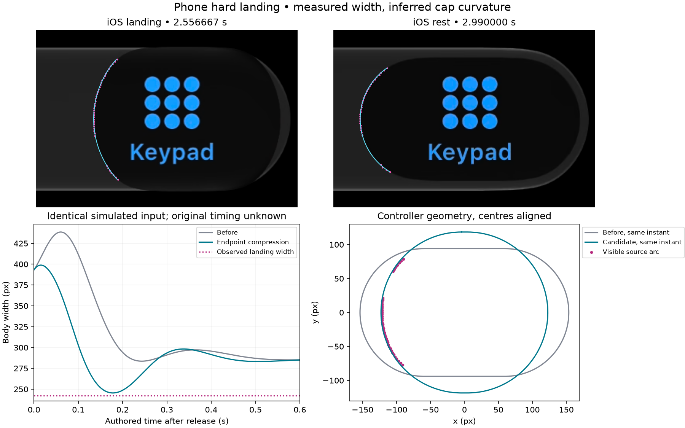
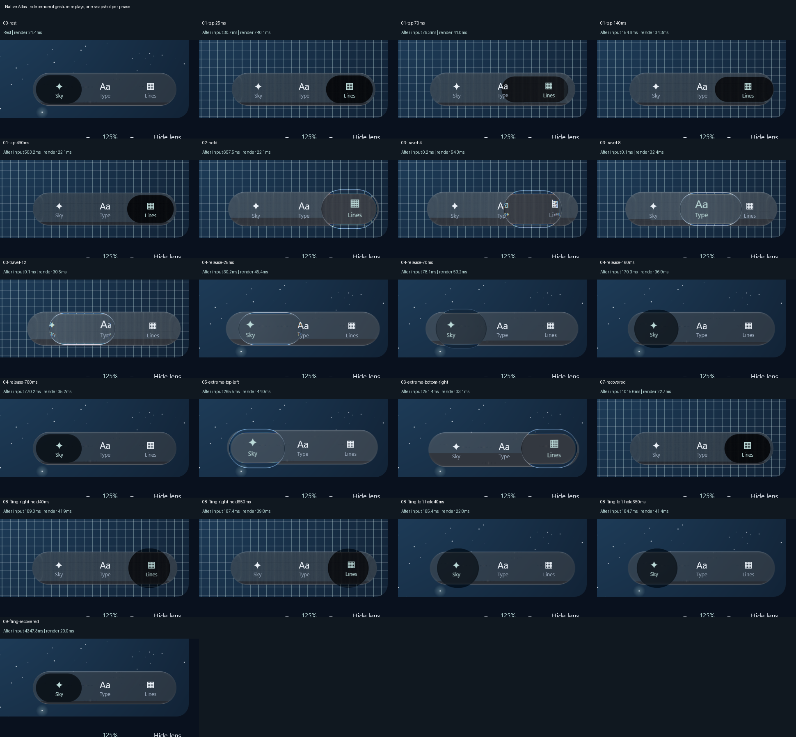

# Phone endpoint landing — 9 October 2026

Calm navigation now lets a moving selector compress near an endpoint and broaden its rounded
ends as it slows. The shared area response preserves material while the horizontal spine
shortens. Ordinary holds, middle-tab landings and perpendicular whole-bar squeeze keep their
separate responses. `GlassTabBarStyle.Calm()` selects this behavior; applications need no new
gesture code or per-screen spring settings.

This improves a measured spatial mismatch. **Full 1:1 motion and timing parity remains open.**
The source does not expose finger-up time or force, and the model does not reproduce its centre
overshoot. The original optical image and controller geometry below are labelled separately.

The later [consecutive audit](../phone-landing-sequence-2026-10-09/README.md) refines that centre
interpretation: both original endpoint-facing edges stay nearly fixed as width recovers. Apparent
centre excursion does not by itself prove mass-centre overshoot. Recovery trajectory remains open.



## Original evidence

The owner's `docs/2.MP4` is the primary held/throw recording. SHA-256:
`b1daa86ae7a6f9246fb56b19af9a82ec939ad2315c947954ee1e6869a8168006`.
The published crops contain only navigation controls, at native source rectangle `(0,420,1170,260)`.

| State | Native PTS / 600 | Cross-section width | Visible cap estimate |
| --- | --- | --- | --- |
| Endpoint compression | 1534 / 600 = 2.556667 s | 242px across all retained RGB probes | R116.14px, partial-circle fit RMS0.46px |
| Settled rest | 1794 / 600 = 2.990000 s | 285px, probe range284–285px | R80.43px, fit RMS0.37px; full visible height160px |

The compressed body merges into the black background at its top and bottom. Its visible188px
vertical separation is the bar boundary, **not a measurement of full body height**.
Cap curvature is estimated from the unoccluded left arc. Search windows exclude the label
before fitting; all points, residuals and hashes are in [comparison.json](comparison.json).
No whole-circle contour or hidden extent is claimed as observed.

[measurements.json](measurements.json) retains the RGB probes, including unusable earlier
frame073. Its faint/ambiguous boundary is rejected. An initially over-wide right search window
selected the outer bar; [edge-windows.json](edge-windows.json) preserves the corrected window.
The cap fit uses [cap-windows.json](cap-windows.json). Earlier label-contaminated fits were rejected.

## Implementation and calibration

The prior75-case authored throw sweep never narrowed below275.53px after formation fell below.15.
Its preserved CSV is local; the exporter is `tools/PhoneThrowProbe.java`.
[gain-sweep.csv](gain-sweep.csv) contains both the unchanged response and all tested gains for
the smaller controlled input matrix, including the selected2.25 gain.

The controller transfers lost horizontal centre speed into negative spine velocity. A Gaussian
proximity weight, using one quarter of resting body width, limits that transfer to the approach
to the selected endpoint. Projected area relaxes toward rest; radius is derived from actual spine
length. No perpendicular selector force or whole-bar displacement is introduced. The gain,
proximity width and integration rate are **authored**, not recovered Apple laws.

For one authored800ms hold/100ms two-slot drag, a single candidate frame reaches245.55px width
and118.47px cap radius. At the same simulated time and centre position, the old response is
307.33px wide with94.04px cap radius. The paired regression admits8px width/6px cap-radius error;
these spatial gates do not identify the original gesture or timing. The graph aligns centres
to compare shape; the original centre overshoot remains unmatched.

The first deceleration-only experiment compressed too early in flight and over-inflated the body.
It was rejected before adoption. Endpoint proximity corrected that failure. Larger gains remain
in the sweep for comparison; they are not production presets. A compression guard keeps the
doubled-angle spine from flipping vertically. Its tiny positive floor also avoids the legacy
geometry's exact-zero sentinel, which otherwise restores the reference capsule abruptly.

The internal `CalmVolume` baseline preserves the preceding tap implementation. Public Calm
enables endpoint compression; historical/default behavior retains zero gain. Re-grabbing clears
landing ownership while preserving pose and velocity. Turning reduced motion on now discards
stored deformation immediately as well as snapping the centre to the selected tab.

## Verification

Focused paired landing, UP continuity, reverse direction,30/60/90/120Hz presentation, re-grab,
middle/static release preservation and reduced-motion tests pass. Additional3/5-slot layouts,
0.5/1/2 scales and8/40/100/400ms outside-screen throws remain finite, continuous, inside the
allocated envelope and settle to idle. Existing tap/held/growth/dynamics gates pass.
Full verification completed in **10m21s**: **323 library tests passed, 27 optional showcase
exports skipped, zero failures/errors**; both Atlas tests passed and Android assembled.
The native **21-phase** capture passed selection, recovery and fixed-layout checks. All phases
were visually inspected; held and both endpoint states were also inspected at native scale.
The preceding7c09000 checkpoint passed all seven GitHub checks; this checkpoint's hosted result
is recorded separately from local verification in the progress tracker.



The endpoint frames show rounded vertical compression in both directions, followed by recovery
to the resting inset. Held frames retain refracted ink. These confirm native rendering of the
controller behavior, not a time-matched reproduction of the source recording. In particular,
the first tap's forced redraw took740ms; its nominal25ms label is not a displayed-frame timestamp.
The [input CSV](native-events.csv) preserves actual event/render times and readback costs.


The1920×1051 Direct3D static view shows continuous grid magnification and intact card/navigation
layout.120 forced redraws after10 warmups measured **19.526ms median /23.139ms p95**, maximum
23.533ms. These are GPU submission durations, not presented FPS or input latency. No speedup
is inferred from comparisons with earlier uncontrolled runs. [Verification](verification.json)
preserves report totals, source hashes, inspection scope and limits.

See [the live log](../../../research/analysis/MOTION-2026-10-08.md) for failed attempts and the
[progress tracker](../../../PROGRESS.md) for current status. Native phase captures are separate
real-input replays; neither snapshots nor forced redraw times establish presented FPS.
No physical device is available. Android assembly does not establish device parity.

## Reproduce

From the repository root, using the private wrapper on the owner's Windows machine:

```powershell
./tools/workspace.ps1 library :liquidglass:jvmTest --tests '*GlassPhoneThrowTest*'
Copy-Item liquidglass/build/reports/atlas/phone-throw-candidates.csv <new-packet>/gain-sweep.csv
python tools/build_phone_throw_review.py <packet-directory>
./tools/workspace.ps1 library :liquidglass:jvmTest --rerun :desktop:desktopTest :sample:assembleDebug
./tools/workspace.ps1 library :desktop:run '-Patlas.motionCapture=<absolute-new-output-directory>'
```

The plotter requires NumPy, SciPy, Pillow and Matplotlib. It reads the two clean source crops and
fixed annotations from this packet. Never overwrite historical baseline CSVs when exporting a
new candidate. The complete source recording remains private because other frames contain names.
